<!--START  🇬🇧English LANGUAGE BUTTON  -->
##### \[[🇧🇷 Português](README.pt_BR.md)\] \[**[🇬🇧 English](README.md)**\]   

<br><br>
<!--END 🇬🇧English LANGUAGE BUTTON  --  -


<!-- ======================================= Start Title ======================================= -->
# <p align="center">[Data Science & AI/ML]() 🎯 [Model Evaluation, Benchmarking & Selection]() ➝ [Research & Consulting Hub]()</p>

#### <p align="center">This repository presents a structured journey through **machine learning model evaluation, benchmarking, comparison, and selection**, combining theoretical foundations, hands-on experimentation, and practical decision-making across diverse datasets and real-world scenarios.</p>

<br><br>

<!-- ========= START SPONSOR BADGE ========= -->
<p align="center">
  <a href="https://github.com/sponsors/Mindful-AI-Research">
    
  </a>
</p>


<br><br>
<!-- ========= END SPONSOR BADGE ========= -->

<!-- ========= START TEASER ========= -->
###### <p align="center"><em>Train it. Break it. Stress it. Test it.</em></p>

###### <p align="center"><em>Good models learn. Great models survive evaluation.</em></p>

###### <p align="center"><em>Because “trust me, bro” is not evidence. “It works” is not a metric.</em></p>

###### <p align="center"><em>Reproduce it. Then we’ll talk.</em> 🔬</p>

### <p align="center">⚡️</p>

<br>

#

<br><br>
<!-- ========= END TEASER ========= -->


<!-- =========  START PUC HEADER GIF ========= -->
<p align="center">
   
 </p>

<br><br>
<!-- =========  END PUC HEADER GIF ========= -->
<!-- ======================================= Start nstitucional INFOR ===========================================  -->
[**Institution:**]() Pontifical Catholic University of São Paulo (PUC-SP)  <br>
[**School:**]() FACEI — Computer Science Department  <br>
[**Course:**]() BSc in Human-Centered AI & Data Science •  6th Semester • 2026 <br>
[**Subject:**]() Data Science  & Machine Learning — Model Evaluation, Benchmarking & Selection  <br>
[**Extensionist Projects:**]() Social projects with open-source software for community support <br>
**Professor:** [✨ Giovani Giulio Tristão Thibes Vieira]() <br>
**Author:** [Fabiana ⚡️ Campanari]() 


<br><br>

#

<br><br>
<!-- ======================================= SZEnd Institutional INFO ===========================================  -->

<!-- ========= START NOTE ========= -->
> [!WARNING]
>
> ⚠️ Projects may be publicly shared when permitted.  
> The focus is on applied, hands-on learning with real datasets in AI governance and security contexts.  
> All sensitive content remains protected in private repositories when required.
>

<br><br>

#

<br><br>
<!-- ========= END NOTE ========= -->


<br><br><br><br>

<!-- ========= End Confidentiality statement ========= -->
<!-- ========= START BADGES ========= -->
<p align="center">
  
  
  
  
  
  
</p>
<br><br><br><br>

<!-- ========= END BADGES ========= -->

## [Overview]()

This repository is the **master hub** for the 6th-semester course on model evaluation, model comparison, and methodological rigor in Data Science. It centralizes the full semester roadmap, weekly classes, references, extension-oriented project work, and links to future sub-repositories for labs, assignments, experiments, and project deliverables.

The course teaches how to evaluate machine learning models carefully and fairly. In simple words, it asks a very important question: **“How do we know a model is actually good?”** Instead of trusting accuracy alone, we learn how to inspect mistakes, compare alternatives, avoid data leakage, tune models properly, calibrate probabilities, and publish reproducible results.

This hub is designed to:

- organize all weekly course content in one place;
- serve as a navigation center for semester materials;
- link out to sub-repositories created for specific weekly topics or projects;
- document extension activities and public-impact work;
- preserve a professional academic record of the course journey.

<br><br>

<br><br>

## [Table of Contents]()

- [Repository Mission](#repository-mission)
- [Why This Course Matters](#why-this-course-matters)
- [Learning Goals](#learning-goals)
- [Semester Roadmap](#semester-roadmap)
- [Weekly Course Table](#weekly-course-table)
- [Advanced Evaluation — Agentic AI Systems](#advanced-evaluation--agentic-ai-systems)
- [Assessment Structure](#assessment-structure)
- [Extension Project](#extension-project)
- [Repository Architecture](#repository-architecture)
- [Suggested Sub-Repository Pattern](#suggested-sub-repository-pattern)
- [How to Use This Hub](#how-to-use-this-hub)
- [Recommended Tooling](#recommended-tooling)
- [AI Resources](#ai-resources)
- [Bibliographic References](#bibliographic-references)
- [Mermaid Overview](#mermaid-overview)
- [Final Notes](#final-notes)

<br><br>

## [Repository Mission]()

This repository works as the **central semester hub** for the course. Think of it like a map in a museum: it does not replace every room, but it helps you know where everything is, how the ideas connect, and where to go next.

As the semester evolves, each week or major topic can branch into:

- a dedicated sub-repository;
- a notebook collection;
- a practical lab folder;
- a project deliverable repository;
- a case-study or experiment archive.

<br><br>

## [Why This Course Matters]()

A machine learning model is not useful just because it runs. A model is useful when it is evaluated correctly, compared fairly, and deployed responsibly.

This discipline helps students move from “I trained a model” to “I can defend why this model should be trusted.” That difference is what turns experimentation into professional data science practice.

For a child-friendly explanation:

- A model is like a student taking a test.
- Evaluation metrics are the teacher’s grading rules.
- Validation checks whether the student really learned, or just memorized the homework.
- Comparative analysis helps us decide which student performed best in the fairest way.

<br><br>

## [Learning Goals]()

By the end of the semester, this course aims to help students:

- choose appropriate metrics for classification and regression tasks;
- apply hold-out, stratified cross-validation, group-based validation, temporal validation, and nested validation correctly;
- prevent leakage using `Pipeline` and `ColumnTransformer`;
- tune hyperparameters with exhaustive and randomized search;
- interpret validation curves and learning curves;
- compare and select models using principled criteria and statistical tests;
- adjust decision thresholds and calibrate probabilities;
- ensure reproducibility through seeds, serialized artifacts, and model cards;
- publish clear, reusable, and responsible results in public repositories when appropriate.

<br><br>

## [Semester Roadmap]()

[***From metrics to rigorous model selection***] <br>

The semester follows a logical progression:

1. Understand what “good performance” means.
2. Learn which metrics fit which type of problem.
3. Validate models properly.
4. Tune models without fooling yourself.
5. Diagnose underfitting and overfitting.
6. Compare candidate models fairly.
7. Improve decision quality with thresholds and calibration.
8. Extend evaluation principles to adaptive, tool-using, and non-deterministic AI systems.
9. Build reproducible end-to-end evaluation workflows.
10. Communicate findings and publish results professionally.

<br><br>


## [Weekly Course Map](#weekly-course-map)

> [!TIP]
> Use this table as the semester’s living index. Replace each **Planned link** with the future GitHub repository, folder, notebook, slides, or report created for that class. A relative path works well for folders in this hub; an absolute URL works well for independent repositories.

| Week | Topic summary | Core ideas and expected artifact | Notes / files |
|---:|---|---|---|
|  | 🧠 **Part I — Evaluation Foundations and Metrics** |  |  |
| 1 | **Fundamentals of Model Evaluation** | Generalization, overfitting, underfitting, bias–variance trade-off, and data leakage. Create a concept-and-diagnostics notebook. | `[Planned link](#)` |
| 2 | **Classification Metrics I** | Confusion matrix, accuracy, precision, recall, F1-score, and imbalanced classes. Extension project launch and group formation. | `[Planned link](#)` |
| 3 | **Classification Metrics II** | ROC-AUC, precision–recall curves, log loss, macro/micro/weighted averaging. Build a classifier evaluation report. | `[Planned link](#)` |
| 4 | **Regression Metrics** | MAE, MSE, RMSE, R², MAPE, and residual analysis. Deliver a regression diagnostics notebook. | `[Planned link](#)` |
|  | 🧪 **Part II — Validation and Hyperparameter Search** |  |  |
| 5 | **Hold-Out Validation and Safe Pipelines** | Train/validation/test roles; `Pipeline` and `ColumnTransformer` as protections against leakage. | `[Planned link](#)` |
| 6 | **Cross-Validation I** | K-fold, stratified K-fold, leave-one-out, and repeated cross-validation. Compare validation estimates. | `[Planned link](#)` |
| 7 | **Cross-Validation II** | Group-based, time-series, and nested cross-validation. Choose a validation strategy that respects the data-generating process. | `[Planned link](#)` |
| 8 | **Exhaustive Hyperparameter Search** | Define search spaces and use `GridSearchCV`. Extension project data milestone. | `[Planned link](#)` |
| 9 | **Randomized Search and AutoML Overview** | Use `RandomizedSearchCV`; compare exhaustive and random search trade-offs; introduce AutoML. | `[Planned link](#)` |
| 10 | **Validation Curves** | Read performance versus hyperparameter values; diagnose overfitting and underfitting. **Challenge 3 substitute.** | `[Planned link](#)` |
| 11 | **Learning Curves** | Interpret performance versus training-set size; reason about bias and variance. | `[Planned link](#)` |
| — | **Academic Week** | Institutional academic activities; no regular weekly topic listed in the official schedule. | `[Calendar / notes](#)` |
|  | ⚖️ **Part III — Comparative Analysis, Reliability, and Delivery** |  |  |
| 12 | **Model Selection and Comparison** | One-standard-error rule, paired tests, and McNemar-style comparison logic. Produce a fair comparison report. | `[Planned link](#)` |
| 13 | **Decision Thresholds and Calibration** | Threshold tuning, calibration curves, and Brier score. Evaluate probability quality, not only class labels. | `[Planned link](#)` |
| — | **Advanced Evaluation — Agentic AI Systems** | **Supplementary advanced module.** Extend model-evaluation principles to adaptive systems that plan, call tools, retrieve information, and may produce different execution paths across runs. Covers task success, robustness, failure analysis, trace evaluation, LLM-as-a-Judge, human review, and evaluation governance. | `[Planned link](#)` |
| 14 | **Advanced Leakage Prevention and Reproducibility** | Random seeds, `joblib`, experiment consistency, and model cards. | `[Planned link](#)` |
| 15 | **Feature Selection Inside Validation** | Run feature selection within the cross-validation workflow to avoid inflated results. | `[Planned link](#)` |


<br><br>


## [Assessment Structure]()

The course combines weekly practical activity, challenge-based evaluation, and an extension project.


| Component | Description | Weighting logic |
| :-- | :-- | :-- |
| P1 | Weekly activities + Challenges 1 and 2, with substitute Challenge 3 on 2026-10-06 | 30% activities + 70% challenges |
| P2 | Weekly activities + Challenges 4 and 5, with substitute Challenge 6 on 2026-11-24 | 30% activities + 70% challenges |
| PE | Extension project, combining group evaluation, self-evaluation, and peer evaluation | 40% group + 20% self + 40% peer |
| Final Average | Course average formula | `1.5 * P1 + 1.5 * P2 + PE` all divided by 4 conceptually in weighted composition |

[***Important note***] <br>
Activities and challenges are individual, while the extension project combines individual and group responsibility. This structure rewards both technical discipline and collaborative maturity.

<br><br>

## [Extension Project]()

A distinctive feature of this course is its **extensionist** dimension. The syllabus states that students are expected to apply model evaluation and selection skills in projects with community relevance, with partnership references including Hospital Santa Lucinda and social-facing initiatives.

That means this is not only a classroom subject. It is also a bridge between:

- academic learning,
- open-source practice,
- ethical responsibility,
- and real institutional or social needs.

Possible extension outputs may include:

- workshops,
- diagnostic studies,
- educational materials,
- public repositories,
- software artifacts,
- community-support tools.

<br><br>

## [Repository Architecture]()

A clean hub structure can look like this:

```text
Data-Science-Model-Evaluation-Comparative-Analysis-Hub/
├── README.md
├── assets/
│   ├── banners/
│   ├── diagrams/
│   └── badges/
├── weeks/
│   ├── week-01-model-evaluation-foundations/
│   ├── week-02-classification-metrics-1/
│   ├── week-03-classification-metrics-2/
│   └── ...
├── projects/
│   ├── extension-project/
│   └── case-studies/
├── references/
│   ├── papers/
│   ├── books/
│   ├── slides/
│   └── links.md
└── templates/
    ├── weekly-readme-template.md
    └── model-card-template.md
```

<br><br>

## [Suggested Sub-Repository Pattern]()

If you prefer separate repositories instead of folders, each weekly repository can follow a naming standard such as:

- `ds-model-eval-week-01-foundations`
- `ds-model-eval-week-02-classification-metrics`
- `ds-model-eval-week-08-grid-search`
- `ds-model-eval-project-extension`
- `ds-model-eval-case-study-final`

This makes the hub repository act like a **control tower**, while each sub-repository becomes a specialized workspace for code, notebooks, datasets, and reports.

<br><br>

## [How to Use This Hub]()

1. Start with the weekly table to understand the semester flow.
2. Open the relevant week repository or folder.
3. Study the concepts before coding.
4. Reproduce the lab or notebook.
5. Document findings in clear markdown.
6. Link outputs back to this master hub.
7. Publish responsibly, especially when datasets or partner organizations involve confidentiality.

<br><br>

## [Advanced Evaluation — Agentic AI Systems](#advanced-evaluation--agentic-ai-systems)

[***From evaluating a model to evaluating an AI system***] <br>

Traditional machine learning evaluation asks whether a model predicts accurately on unseen data. Agentic AI evaluation asks a broader question:

> **How do we establish that an AI system remains reliable when its behavior is adaptive, non-deterministic, tool-using, and autonomous?**

An agentic system may plan several steps, retrieve documents, call APIs, use external tools, hand work to another agent, recover from an error, or stop at the wrong moment. Therefore, evaluating only its final textual answer is often insufficient. We must also inspect whether the system completed the task safely, used the right tools, respected constraints, and produced a useful result.

This advanced module extends—not replaces—the course foundations in metrics, validation, comparative analysis, calibration, leakage prevention, reproducibility, and responsible publication.

```mermaid
%%{init:{
  'theme':'dark',
  'themeVariables':{
    'background':'#090d13',
    'primaryTextColor':'#F5F7FA',
    'lineColor':'#2dd4bf'
  }
}}%%

graph LR

TASKS["EVALUATION DATASET<br/>Tasks -  Constraints<br/>Expected Outcomes"]:::setup

AGENT["AGENT EXECUTION<br/>Planning -  Reasoning<br/>Tools -  Retrieval -  Actions"]:::llm

TRACE["TRACE CAPTURE<br/>Inputs -  Tool Calls<br/>Steps -  Outputs -  Latency"]:::silver

GRADERS["MULTI-LAYER GRADERS<br/>Code-Based -  LLM-as-a-Judge<br/>Human Review"]:::gold

ANALYSIS["EVALUATION ANALYSIS<br/>Success -  Groundedness -  Safety<br/>Robustness -  Cost -  Failures"]:::bronze

IMPROVE["IMPROVEMENT LOOP<br/>Prompts -  Tools -  Policies<br/>Regression Tests"]:::dash

TASKS --> AGENT
AGENT --> TRACE
TRACE --> GRADERS
GRADERS --> ANALYSIS
ANALYSIS --> IMPROVE
IMPROVE -. New benchmark cases .-> TASKS

classDef setup fill:#0d2137,stroke:#00d2ff,color:#F5F7FA,stroke-width:2.5px;
classDef bronze fill:#2a1512,stroke:#a85a4a,color:#F5F7FA,stroke-width:2.5px;
classDef silver fill:#1b2430,stroke:#b0b7c3,color:#F5F7FA,stroke-width:2.5px;
classDef gold fill:#2a2208,stroke:#e6c35a,color:#F5F7FA,stroke-width:2.5px;
classDef dash fill:#06363d,stroke:#2dd4bf,color:#F5F7FA,stroke-width:2.5px;
classDef llm fill:#231433,stroke:#b56cff,color:#F5F7FA,stroke-width:2.5px;
```

<br><br>





<br><br>


### [***Evaluation Beyond Deterministic Testing***](#advanced-evaluation--agentic-ai-systems)

A classical classifier usually receives the same input and returns a predictable type of output. An AI agent can take different routes even when it receives the same task. For this reason, evaluation should account for repeated runs, outcome quality, tool behavior, latency, cost, safety, and robustness.

A simple analogy: evaluating a traditional model is like grading the final answer to a math problem. Evaluating an agent is like observing whether a student understood the problem, chose appropriate tools, followed the rules, checked their work, and reached a correct answer without causing harm.

<br><br>

### [***Multidimensional Evaluation***](#advanced-evaluation--agentic-ai-systems)

| Evaluation dimension | Central question | Example evidence |
|---|---|---|
| Task success | Did the agent complete the requested task correctly? | Final answer, generated file, completed workflow, correct tool result |
| Groundedness | Is the answer supported by approved sources or tool outputs? | Citations, retrieved evidence, trace inspection |
| Tool-use quality | Did the agent select and use tools correctly? | Correct API call, valid parameters, successful execution |
| Robustness | Does the system behave reliably with difficult, incomplete, or adversarial inputs? | Edge-case suite, repeated runs, failure-rate report |
| Safety and governance | Did the agent respect permissions, privacy, scope, and human controls? | Guardrail logs, approval records, policy checks |
| Efficiency | Is the workflow practical in time, cost, and number of steps? | Latency, token usage, tool-call count, cost per task |
| Reproducibility | Can another person rerun and audit the evaluation? | Versioned dataset, prompt, model, rubric, trace, and code |

<br><br>

### [***Agentic Task Evaluation***](#advanced-evaluation--agentic-ai-systems)

An agent evaluation begins with a clear task specification. Each test case should state the input, constraints, expected outcome, available tools, success criteria, and—when possible—a reference answer or known-good solution.

```markdown
### Example Evaluation Case

**Task:** Find a public dataset suitable for a binary classification exercise.

**Constraints:**
- Use only public sources.
- Provide the dataset link and license information.
- Do not download restricted or personally identifiable data.

**Success criteria:**
- The selected dataset is public and accessible.
- The task is classification, not regression.
- The response identifies the target variable.
- The source and license are reported.
- No unsupported claim is presented as a fact.
```

High-quality task definitions make evaluation more consistent. Anthropic recommends unambiguous tasks with reference solutions where possible, while OpenAI’s agent-evaluation workflow emphasizes datasets, traces, graders, and repeatable evaluation runs. [6][4]

<br><br>

### [***Robustness and Failure Analysis***](#advanced-evaluation--agentic-ai-systems)

A strong evaluation suite does not test only easy “happy path” examples. It should include ambiguous requests, missing information, conflicting instructions, unavailable tools, malformed inputs, safety-sensitive requests, and tasks requiring the agent to stop and ask for clarification.

Useful failure categories include:

- Incorrect final result despite a plausible explanation.
- Hallucinated sources, tool outputs, citations, or files.
- Incorrect tool selection or malformed tool parameters.
- Unsafe execution beyond the user’s intended scope.
- Infinite or unnecessarily long execution loops.
- Failure to recognize uncertainty or request needed clarification.
- Leakage of confidential, private, or restricted information.
- High variance across repeated executions of the same task.

<br><br>

### [***Evaluation Pipelines and Trace Analysis***](#advanced-evaluation--agentic-ai-systems)

An evaluation pipeline should preserve enough evidence to make a result auditable. For an agent, this commonly means storing the task input, model and prompt versions, tool calls, intermediate outputs, final answer, evaluator result, runtime, and cost.

A trace records an end-to-end agent run, including model calls, tool calls, guardrails, and handoffs. Inspecting traces helps identify where failures happen: planning, retrieval, tool use, routing, final synthesis, or safety controls. [4]

```mermaid
%%{init:{'theme':'dark','themeVariables':{'background':'#090d13','primaryTextColor':'#F5F7FA','lineColor':'#2dd4bf'}}}%%
graph LR

A["EVALUATION DATASET<br/>Tasks -  Constraints<br/>Expected Outcomes"]:::setup
B["AGENT EXECUTION<br/>Planning -  Tools<br/>Retrieval -  Actions"]:::llm
C["TRACE CAPTURE<br/>Inputs -  Steps -  Tools<br/>Outputs -  Latency"]:::silver
D["GRADERS<br/>Code -  LLM Judge<br/>Human Review"]:::gold
E["ANALYSIS<br/>Success -  Safety -  Cost<br/>Robustness -  Failure Modes"]:::bronze
F["IMPROVEMENT LOOP<br/>Prompts -  Tools -  Policies<br/>Regression Tests"]:::dash

A --> B --> C --> D --> E --> F
F --> A

classDef setup fill:#0d2137,stroke:#00d2ff,color:#F5F7FA,stroke-width:2.5px;
classDef bronze fill:#2a1512,stroke:#a85a4a,color:#F5F7FA,stroke-width:2.5px;
classDef silver fill:#1b2430,stroke:#b0b7c3,color:#F5F7FA,stroke-width:2.5px;
classDef gold fill:#2a2208,stroke:#e6c35a,color:#F5F7FA,stroke-width:2.5px;
classDef dash fill:#06363d,stroke:#2dd4bf,color:#F5F7FA,stroke-width:2.5px;
classDef llm fill:#231433,stroke:#b56cff,color:#F5F7FA,stroke-width:2.5px;
```



<br><br>

### [***Benchmark Design***](#advanced-evaluation--agentic-ai-systems)

 benchmark is a curated set of test cases used to compare versions of an AI system. Start small with realistic tasks, especially tasks based on real failures or important user scenarios. Expand the benchmark as the project matures.

| Benchmark component | What to document |
|---|---|
| Task ID | Stable identifier, such as `agent-eval-001` |
| Task scenario | User goal, context, and expected difficulty |
| Input and constraints | Full request, tools allowed, policies, and boundaries |
| Reference outcome | Expected answer, expected tool call, or acceptance criteria |
| Grader | Code-based, model-based, human, or hybrid |
| Metrics | Success rate, groundedness, safety, latency, cost, and consistency |
| Versioning | Dataset, agent, prompt, tool schema, model, and rubric versions |
| Regression status | Whether the case must continue passing in future releases |

<br><br>

### [***LLM-as-a-Judge***](#advanced-evaluation--agentic-ai-systems)

LLM-as-a-Judge means using a language model to score, classify, or compare outputs from another AI system. It is helpful for open-ended qualities such as clarity, completeness, relevance, groundedness, and rubric compliance.

However, an LLM judge is not an unquestionable authority. It can be inconsistent, biased toward particular writing styles, or wrong about specialized content. Use it with explicit rubrics, preserve the judge prompt and model version, test agreement with human reviewers, and prefer deterministic code-based checks whenever the expected answer can be verified objectively. Agent-evaluation guidance commonly combines code-based, model-based, and human graders rather than relying on a single method. [6][4]

```markdown
### Example LLM-as-a-Judge Rubric

Score the agent response from 0 to 2 for each criterion:

1. Correctness — Is the final answer factually and procedurally correct?
2. Groundedness — Are claims supported by the provided context or tool results?
3. Constraint compliance — Did the agent follow the user’s explicit restrictions?
4. Safety — Did the agent avoid unauthorized, harmful, or privacy-violating actions?
5. Completeness — Did the answer fully satisfy the requested task?

Return:
- Total score
- One-sentence justification per criterion
- A list of critical failures, if any
```

<br><br>

### [***Human-in-the-Loop Validation***](#advanced-evaluation--agentic-ai-systems)

Human review remains essential when tasks are high-stakes, subjective, context-dependent, or difficult to verify automatically. Human evaluators are especially valuable for calibrating LLM judges, reviewing borderline cases, identifying user-experience failures, and deciding whether an agent’s behavior is acceptable in a real organizational context.

For projects involving health, education, public services, vulnerable populations, or confidential organizational data, a human approval checkpoint should be designed before consequential actions are taken.

<br><br>

### [***Reproducibility and Evaluation Governance***](#advanced-evaluation--agentic-ai-systems)

Agent evaluation must be treated like any other scientific experiment: someone else should be able to understand what was tested, reproduce the setup as closely as possible, and audit the conclusion.

For each evaluation run, record:

- Agent version, model version, system prompt, and generation parameters.
- Task-dataset version and evaluation-case identifiers.
- Tool schemas, tool versions, permissions, and external dependencies.
- Grader type, rubric, judge-model version, and scoring prompt.
- Raw traces or appropriately redacted summaries of tool use and intermediate steps.
- Final metrics, failure categories, cost, latency, and known limitations.
- Human-review decisions and calibration notes when applicable.

<br><br>

### [***Suggested Advanced Sub-Repository***](#advanced-evaluation--agentic-ai-systems)


```text
ds-model-eval-advanced-agentic-ai-evaluation/
├── README.md
├── datasets/
│   ├── benchmark-tasks.jsonl
│   └── task-schema.md
├── agents/
│   └── baseline-agent/
├── graders/
│   ├── code-graders/
│   ├── llm-judge-rubrics/
│   └── human-review-template.md
├── traces/
│   └── .gitkeep
├── reports/
│   ├── benchmark-results.md
│   └── failure-analysis.md
├── notebooks/
│   └── agent-evaluation-analysis.ipynb
└── reproducibility/
    ├── environment.yml
    └── evaluation-manifest.yaml
```

<br><br>

### [***Key Takeaway***](#advanced-evaluation--agentic-ai-systems)

A traditional model is often judged by whether it predicts well. An agentic system must also be judged by **how reliably it completes a task, uses tools, handles uncertainty, respects boundaries, and remains auditable over time**.


<br><br>


## [Recommended Tooling]()

This course naturally aligns with a practical Python-based workflow.

**Core stack**

- Python
- Jupyter Notebook / JupyterLab
- scikit-learn
- pandas
- numpy
- matplotlib / seaborn / plotly
- Git + GitHub

**Good engineering practices**

- `Pipeline`
- `ColumnTransformer`
- versioned notebooks and scripts
- reproducible train/validation/test splits
- fixed random seeds
- serialized artifacts with `joblib`
- model cards and experiment logs

<br><br>

## [AI Resources]()

> [!TIP]
> \#\#\# 🦾👽🪽 AI/ML & Data Science Resources
>
> High-signal resources for learning, evaluating, comparing, and improving machine learning systems.
>
> **Core Reading**
> - [*Hands-On Machine Learning with Scikit-Learn, Keras \& TensorFlow* — Aurélien Géron](https://github.com/Mindful-AI-Assistants/1-AI-MachineLearning_Main_Repository-PUCSP/blob/592fb02bd2868e9342d8584d57dcded7c15f41d1/Hands%20On%20Machine%20Learning%20with%20Scikit%20Learn%20and%20TensorFlow.pdf)
> - [*Artificial Intelligence: A Modern Approach* — Stuart Russell \& Peter Norvig](https://github.com/Mindful-AI-Assistants/1-AI_Machine-Learning_Hub/blob/67b85178e068072f89a4b6d0fc2d58daba0c08b4/AI_MLPapers_%20Books_Etc/AI_A_Modern_Approach-Peter-Norvig_Stuart-Russell.pdf)
> - [*Introduction to Data Science and Machine Learning*](https://www.intechopen.com/books/introduction-to-data-science-and-machine-learning)
> - [*Automated Machine Learning* — Hutter, Kotthoff, Vanschoren](https://link.springer.com/book/10.1007/978-3-030-05318-5)
>
> <br>
>
> **🔗 References**
> - [scikit-learn — Model Selection](https://scikit-learn.org/stable/model_selection.html)
> - [scikit-learn — Metrics and Scoring](https://scikit-learn.org/stable/modules/model_evaluation.html)
> - [scikit-learn — Calibration](https://scikit-learn.org/stable/modules/calibration.html)
> - [Google Developers — Machine Learning Glossary](https://developers.google.com/machine-learning/glossary)
> - [CS229: Machine Learning — Stanford](https://cs229.stanford.edu)
> - [StatQuest — Machine Learning playlists](https://www.youtube.com/@statquest)
> - [Kaggle Learn](https://www.kaggle.com/learn)
>
> **🛠 Tools**
> - [Teachable Machine](https://teachablemachine.withgoogle.com)
> - [Google Colab](https://colab.research.google.com)
> - [Jupyter](https://jupyter.org)
> - [Weights \& Biases](https://wandb.ai/site)
>
> <br><br>
>
> [_Signal]() > noise. [Rigor]() > hype. [Reproducibility]() > guesswork.
> ***Good models are trained. Great models are also evaluated carefully.*** <br>
> ***Clear experiments turn confusion into evidence.*** <br>
> ⚡️
>
> <br>

<br><br>


<br><br>
<br><br>
<br><br>
<br><br>
<br><br>
<br><br>
<br><br>
<br><br>
<br><br>
<br><br>
<br><br>
<br><br>
<br><br>


## 💌 [Let the data flow... Ping Me !](mailto:fabicampanari@proton.me)

<br>


#### <p align="center">  🛸๋ My Contacts [Hub](https://linktr.ee/fabianacampanari)


<br>

### <p align="center"> 


<br><br>

<p align="center">  ────────────── ⊹🔭๋ ──────────────

<!--
<p align="center">  ────────────── 🛸๋*ੈ✩* 🔭*ੈ₊ ──────────────
-->

<br>

<p align="center"> ➣➢➤ <a href="#top">Back to Top </a>
  

  
#
 
##### <p align="center">Copyright 2026 Mindful-AI-Assistants. Code released under the  [MIT license.](https://github.com/Mindful-AI-Research/model-evaluation-hub/blob/cf8bf0392253d4d1c9b187eac7b55527efae4c9e/LICENSE)
