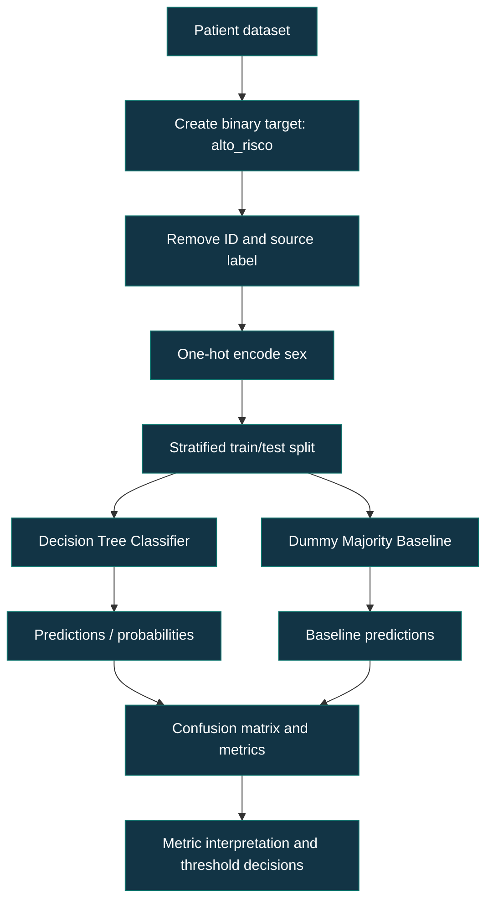

# [Class 2]: Classification Metrics I / Metabolic Risk Screening

[](https://www.python.org/)
[](https://scikit-learn.org/)
[](https://pandas.pydata.org/)
[](https://jupyter.org/)

> **Repository name:** `class-13-ai-ml-classification-metrics-1`  
> **GitHub About:** A practical study of classification metrics, threshold trade-offs, and imbalanced data using metabolic-risk screening.

**Suggested GitHub topics:** `ai`, `artificial-intelligence`, `machine-learning`, `data-science`, `python`, `scikit-learn`, `classification`, `model-evaluation`, `classification-metrics`, `imbalanced-data`, `decision-trees`

<br><br>

## [Table of Contents]()

1. [Overview](#overview)
2. [Learning Objectives](#learning-objectives)
3. [Class Scope and Status](#class-scope-and-status)
4. [Dataset and Task](#dataset-and-task)
5. [Mathematical Foundations](#mathematical-foundations)
6. [Workflow](#workflow)
7. [Implementation](#implementation)
8. [Observed Evaluation Results](#observed-evaluation-results)
9. [Interpreting Thresholds](#interpreting-thresholds)
10. [Installation and Usage](#installation-and-usage)
11. [Limitations and Responsible Use](#limitations-and-responsible-use)
12. [Recommended Extensions](#recommended-extensions)
13. [References](#references)

<br><br>

## [Overview]()

This repository documents a hands-on class on **binary classification evaluation**. The class uses metabolic-risk screening to show why a model cannot be judged by accuracy alone, particularly when the positive class is relatively rare.

The implemented laboratory transforms the multiclass `riscometabolico` label into the binary target `altorisco`: `1` when the original label is `alto`, and `0` for `baixo` or `moderado`. A depth-limited decision tree is evaluated against a majority-class dummy baseline using a stratified train/test split.

The class centers on the confusion matrix, accuracy, precision, recall, F1, class imbalance, `classification_report`, and the decision threshold. The supplied materials characterize this as a teaching exercise, not a clinical decision-support system.

## [Learning Objectives]()

By completing the notebook, learners should be able to:

- Read a binary confusion matrix in terms of true negatives (TN), false positives (FP), false negatives (FN), and true positives (TP)
- Compute and interpret accuracy, precision, recall, specificity, F1, and the F-beta family
- Explain why accuracy can obscure failure on a minority class
- Compare a learned model with a no-skill majority-class baseline
- Use stratification to preserve class proportions in train/test splits
- Generate a scikit-learn `classification_report`
- Explain how changing a probability threshold changes the precision–recall balance
- Choose an evaluation priority according to the cost of FP and FN errors

## [Class Scope and Status]()

| Item | Status in supplied materials |
|---|---|
| Binary target engineering | **Implemented** in the notebook |
| Stratified 70/30 train/test split | **Implemented** in the notebook |
| Decision tree (`max_depth=4`, `random_state=0`) | **Implemented** in the notebook |
| Dummy majority-class comparison | **Implemented** in the notebook |
| Confusion matrix and metric computation | **Implemented** in the notebook |
| Threshold comparison | **Demonstrated** in the notebook and review handout |
| Clinical deployment or diagnostic validation | **Not provided** |
| External validation, calibration, ROC-AUC, or PR-AUC | **Not provided**; ROC/PR metrics are scheduled as later course content |

## [Dataset and Task]()

The supplied CSV contains 850 patient records and includes demographic, anthropometric, laboratory, and clinical variables such as age, sex, BMI, abdominal circumference, fasting glucose, HbA1c, lipids, blood pressure, TSH, vitamin D, smoking status, family history of diabetes, and `riscometabolico`.

The class derives the target as follows:

```python
pac["altorisco"] = (pac["riscometabolico"] == "alto").astype(int)
```

The supplied materials report 128 high-risk examples out of 850, or about 15%. With `test_size=0.30` and `stratify=y`, the held-out test split contains 255 examples, including 38 high-risk cases.

### [Conceptual ML workflow]()



This is a **conceptual representation of the notebook workflow**, not a deployed application architecture.

## [Mathematical Foundations]()

For a binary target where the positive class is high metabolic risk:

| Actual / Predicted | Negative | Positive |
|---|---:|---:|
| Negative | TN | FP |
| Positive | FN | TP |

The core metrics are:

\[
\text{Accuracy} = \frac{TP + TN}{TP + TN + FP + FN}
\]

\[
\text{Precision} = \frac{TP}{TP + FP}
\]

\[
\text{Recall} = \frac{TP}{TP + FN}
\]

\[
\text{Specificity} = \frac{TN}{TN + FP}
\]

\[
F_1 = 2\cdot\frac{\text{Precision}\cdot\text{Recall}}{\text{Precision}+\text{Recall}}
\]

\[
F_\beta = (1+\beta^2)\cdot\frac{P\cdot R}{\beta^2P+R}
\]

`F1` gives precision and recall equal weight. When missing a positive case is more costly, \(\beta > 1\) gives recall more weight; the handout uses F2 as an example.

### [Why accuracy is insufficient]()

Accuracy counts all correct classifications. In an imbalanced dataset, a classifier that always predicts the majority class can obtain high accuracy while detecting no positive cases. The notebook makes this concrete: the dummy baseline reaches 0.851 accuracy but has 0.000 recall for high risk.

## [Workflow]()

### [Preparation]()

- Load the patient CSV with pandas
- Create `altorisco` from `riscometabolico`
- Drop `id`, the original multiclass label, and the derived target from the feature matrix
- One-hot encode `sexo` with `drop_first=True`
- Split data with `train_test_split(..., test_size=0.30, stratify=y, random_state=0)`

### [Training and baseline]()

The notebook trains `DecisionTreeClassifier(max_depth=4, random_state=0)`. Limiting tree depth is an implemented design choice intended in the class to control complexity. A `DummyClassifier` predicts the majority class as a baseline.

### [Evaluation]()

The evaluation uses the held-out test set. The confusion matrix exposes the error types; scalar metrics answer different questions:

- Use **precision** when false alarms are especially costly
- Use **recall** when missed positives are especially costly
- Use **F1** when both precision and recall matter and a single balance measure is useful
- Use **accuracy** cautiously, especially for minority-positive problems

## [Implementation]()

The following block faithfully consolidates the setup used in the supplied lab. Use the dataset filename present in this repository.

```python
import numpy as np
import pandas as pd
import matplotlib.pyplot as plt

from sklearn.model_selection import train_test_split
from sklearn.tree import DecisionTreeClassifier
from sklearn.dummy import DummyClassifier
from sklearn.metrics import (
    confusion_matrix,
    ConfusionMatrixDisplay,
    accuracy_score,
    precision_score,
    recall_score,
    f1_score,
    classification_report,
)

pac = pd.read_csv("1_pacientes_datasdet.csv")
pac["altorisco"] = (pac["riscometabolico"] == "alto").astype(int)

X = pd.get_dummies(
    pac.drop(columns=["id", "riscometabolico", "altorisco"]),
    columns=["sexo"],
    drop_first=True,
)
y = pac["altorisco"]

X_train, X_test, y_train, y_test = train_test_split(
    X,
    y,
    test_size=0.30,
    stratify=y,
    random_state=0,
)

model = DecisionTreeClassifier(max_depth=4, random_state=0)
model.fit(X_train, y_train)
y_pred = model.predict(X_test)

print(classification_report(y_test, y_pred))

cm = confusion_matrix(y_test, y_pred)
ConfusionMatrixDisplay(
    confusion_matrix=cm,
    display_labels=["not_high_risk", "high_risk"],
).plot()
plt.show()

baseline = DummyClassifier(strategy="most_frequent", random_state=0)
baseline.fit(X_train, y_train)
y_dummy = baseline.predict(X_test)

print("Decision tree recall:", recall_score(y_test, y_pred, zero_division=0))
print("Dummy recall:", recall_score(y_test, y_dummy, zero_division=0))
```

Expected behavior: the code creates the binary target, preserves the positive-class share across splits, trains the tree, prints per-class metrics, plots a confusion matrix, and contrasts learned-model recall with a majority-class baseline.

### [Threshold exploration]()

A classifier can return positive-class probabilities. A decision threshold converts each probability into a class label. The class correctly treats threshold selection as a **validation decision**: choose it using validation data, then measure the already-fixed choice once on test data.

```python
proba = model.predict_proba(X_test)[:, 1]

for threshold in [0.50, 0.30, 0.20, 0.70]:
    predicted = (proba >= threshold).astype(int)
    precision = precision_score(y_test, predicted, zero_division=0)
    recall = recall_score(y_test, predicted, zero_division=0)
    f1 = f1_score(y_test, predicted, zero_division=0)
    print(
        f"threshold={threshold:.2f} "
        f"precision={precision:.2f} recall={recall:.2f} f1={f1:.2f}"
    )
```

Do not select a threshold by repeatedly inspecting the test set. Doing so adapts the system to test data and weakens the credibility of the final estimate.

## [Observed Evaluation Results]()

The following values are **demonstrated class outputs** from the provided notebook and handouts. They are specific to the supplied split, preprocessing, model configuration, and test set; they must not be generalized as clinical performance.

### [Decision tree at default threshold]()

| Test-set quantity | Value |
|---|---:|
| Test examples | 255 |
| Actual high-risk examples | 38 |
| Confusion matrix (TN, FP, FN, TP) | 205, 12, 22, 16 |
| Accuracy | 0.867 (handout) |
| Positive-class precision | 0.571 |
| Positive-class recall | 0.421 |
| Positive-class F1 | 0.485 |
| Specificity | 0.945 |

The model correctly identifies 16 of 38 high-risk examples but misses 22. In a screening framing, those false negatives merit explicit attention because the class is defined as the event of interest.

### [Baseline comparison]()

| Model | Accuracy | Positive-class recall |
|---|---:|---:|
| Dummy majority classifier | 0.851 | 0.000 |
| Decision tree | 0.867 | 0.421 |

This comparison is the class’s central accuracy-trap demonstration. Accuracy changes only slightly, whereas recall distinguishes a model that detects no high-risk patients from one that detects some.

### [Classification report interpretation]()

The supplied report gives class 0 a precision of 0.90, recall of 0.94, and F1 of 0.92; class 1 has 0.57 precision, 0.42 recall, and 0.49 F1. Its macro averages are 0.74 precision, 0.68 recall, and 0.70 F1, while weighted averages are 0.85, 0.87, and 0.86 respectively.

Macro averaging gives every class equal weight; weighted averaging weights each class by support. In an imbalanced setting, macro averages therefore make weak minority-class performance more visible.

## [Interpreting Thresholds]()

The class demonstrates the following threshold behavior on the patient test set:

| Threshold | Recall | Precision | Interpretation |
|---:|---:|---:|---|
| 0.50 | 0.42 | 0.57 | Default decision cutoff shown in the class |
| 0.30 | 0.61 | 0.47 | More high-risk cases found, with more false alarms |
| 0.20 | 0.61 | 0.47 | Same demonstrated values as 0.30 for this tree’s probabilities |
| 0.70 | 0.39 | 0.65 | More conservative positive calls: higher precision, lower recall |

Lowering the threshold tends to increase recall because more examples are labeled positive; it can reduce precision because the additional positive predictions include more false positives. Raising it generally has the opposite effect. The preferred choice depends on the error cost, operational capacity, and use case—not on a universal threshold.

## [Installation and Usage]()

The supplied materials are a Jupyter notebook and CSV dataset. A requirements file was **not provided**. Install the libraries used by the notebook in an isolated environment:

```bash
python -m venv .venv
source .venv/bin/activate
pip install numpy pandas matplotlib scikit-learn jupyter
```

On Windows PowerShell:

```powershell
.venv\Scripts\Activate.ps1
pip install numpy pandas matplotlib scikit-learn jupyter
```

Start Jupyter and open the supplied notebook:

```bash
jupyter notebook
```

Keep `1_pacientes_datasdet.csv` available in the notebook’s working directory, or update the `pd.read_csv(...)` path to match your repository layout.

## [Limitations and Responsible Use]()

- The materials provide a classroom dataset and teaching results, not evidence for real clinical diagnosis or patient care.
- The positive class is minority-sized, so metric uncertainty may be substantial; confidence intervals and external validation were not provided.
- A single train/test split is demonstrated. Cross-validation is not implemented in this class.
- Threshold results are tied to the given decision tree and split; a threshold must be selected according to a defined operational objective and validation protocol.
- No fairness evaluation across demographic groups, calibration analysis, privacy assessment, or model monitoring is provided.
- Features related to health are sensitive. Any real-world use would require governance, privacy protection, domain expertise, appropriate validation, and compliance with applicable law and institutional policy.

## [Recommended Extensions]()

The following are **future engineering and learning extensions**, not existing project features:

- Add a validation split or cross-validation workflow for threshold selection and model comparison
- Report confidence intervals or repeated-resampling variability for the metrics
- Study ROC-AUC, precision–recall curves, log loss, calibration, and decision curves where appropriate
- Compare interpretable baseline models and tune models using a predeclared objective
- Evaluate subgroup performance and data quality before any high-stakes application
- Package the notebook logic into reproducible scripts with pinned dependencies and automated tests
- Add experiment tracking, versioned data access, and monitoring only after a valid deployment context has been established

## [References]()

- Supplied course handout: *Classification Metrics I — Confusion Matrix, Accuracy, Precision, Recall, F1 and Imbalanced Classes*.
- Supplied course handout: *Classroom Review — Threshold, Precision/Recall Trade-off, and F1 Harmonic Mean*.
- Supplied notebook: *Classification Metrics I Lab Answerers*.
- [scikit-learn documentation: Metrics and scoring](https://scikit-learn.org/stable/modules/model_evaluation.html)
- [scikit-learn documentation: `classification_report`](https://scikit-learn.org/stable/modules/generated/sklearn.metrics.classification_report.html)
- [scikit-learn documentation: `DecisionTreeClassifier`](https://scikit-learn.org/stable/modules/generated/sklearn.tree.DecisionTreeClassifier.html)

---

This class establishes that model evaluation is not simply the search for the largest single score. It is the disciplined interpretation of errors, class prevalence, decision thresholds, and application-specific consequences. The implemented lab provides a practical starting point for later course topics in ROC/PR analysis, validation, model selection, calibration, and reproducible ML evaluation.
