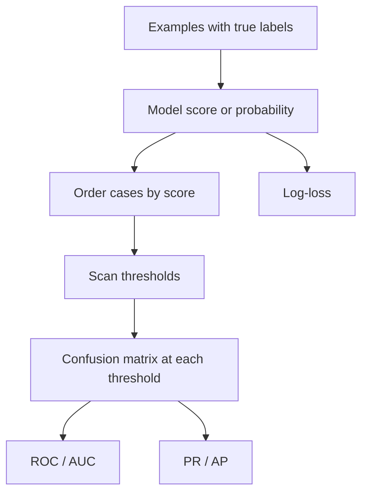

🎯 3. [Data Science & AI/ML  - Model Evaluation, Benchmarking & Selection]() - [Class 3]() ➝ [Classification Metrics II]()

 

## Table of contents

- [Overview](#overview)
- [Learning objectives](#learning-objectives)
- [Key concepts](#key-concepts)
- [Mathematical foundations](#mathematical-foundations)
- [Conceptual pipeline](#conceptual-pipeline)
- [Evaluation guidance](#evaluation-guidance)
- [Class boundaries](#class-boundaries)
- [Bilingual presentation](#bilingual-presentation)
- [Recommended extensions](#recommended-extensions)
- [References](#references)

## Overview

The class extends threshold-based classification evaluation from the previous lesson. Instead of inspecting one operating threshold, it studies model scores across thresholds using a spam-filter example. The central distinction is between ranking quality and the quality of a fixed-threshold decision.

The class covers:

- Receiver Operating Characteristic (ROC) curves and ROC-AUC.
- Precision–Recall (PR) curves and Average Precision (AP).
- Binary log-loss as a measure of probabilistic quality.
- Metric selection according to the evaluation question.

## Learning objectives

- Explain why a prediction score is not yet a binary decision.
- Interpret true-positive rate and false-positive rate.
- Understand AUC as a threshold-independent ranking summary.
- Identify why PR/AP is more informative when the positive class is rare.
- Explain why log-loss penalizes confident mistakes.
- Select metrics based on ranking, rare-positive detection, or probability reliability.

## Key concepts

### Score, ranking, and threshold

A classifier can assign each example a score from 0 to 100, or a probability-like value from 0 to 1. The score orders cases by suspicion. A threshold converts that score into a binary prediction. Different thresholds generate different confusion matrices.

### ROC and AUC

A ROC curve plots recall/TPR against FPR while the threshold varies. It describes how many positives are captured as the false-alarm rate increases. AUC summarizes ranking quality independently of one selected threshold. In the class example, AUC = 0.80 means that a randomly selected spam receives a higher score than a randomly selected legitimate email in 80% of pairs.

### Precision–Recall and AP

A PR curve plots precision against recall across thresholds. It concentrates on the correctness and coverage of predicted positives. The handout recommends PR/AP when positives are rare because ROC can appear optimistic in the presence of many easy negatives.

### Log-loss

Log-loss evaluates the quality of probability scores. It penalizes an incorrect prediction more severely when the model is highly confident. Thus, it answers a different question from ROC-AUC: not only whether cases are ordered correctly, but whether probability values are trustworthy.

## Mathematical foundations

Using TP/VP for true positives, TN/VN for true negatives, FP for false positives, and FN for false negatives:

$$\mathrm{TPR}=\mathrm{Recall}=\frac{TP}{TP+FN}$$

$$\mathrm{FPR}=\frac{FP}{FP+TN}$$

$$\mathrm{Precision}=\frac{TP}{TP+FP}$$

For one binary observation, the log-loss is:

$$\ell(y,p)=-\left[y\log(p)+(1-y)\log(1-p)\right]$$

where $y\in\{0,1\}$ is the true label and $p$ is the predicted probability for class 1. Lower is better. For an evaluation set, the usual aggregate is the mean of the individual losses.

## Conceptual pipeline

This is a conceptual evaluation workflow extracted from the class. A training or deployment pipeline was not supplied.

## Evaluation guidance

| Evaluation question | Metric emphasized in class | Interpretation |
|---|---|---|
| Does the model rank positives above negatives without a fixed threshold? | ROC-AUC | Higher indicates better pairwise ranking; 0.5 is chance and 1.0 is perfect ordering. |
| Are rare positives important and costly? | PR/AP and recall | Focuses on positive coverage and the correctness of positive alarms. |
| Are predicted probabilities reliable? | Log-loss | Penalizes confident errors; lower is better. |
| Does a chosen threshold produce acceptable decisions? | Precision, recall, and F1 | Threshold-dependent measures introduced in the previous class. |

A high AUC does not guarantee that a particular threshold is appropriate. Ranking evaluation and operating-point evaluation should be treated separately.

## Class boundaries

- **Demonstrated:** Conceptual spam-filter scoring, score ordering, thresholding, confusion-matrix interpretation, ROC, PR, AUC, AP, and log-loss examples.
- **Conceptual:** The generalization to disease, fraud, and credit.
- **Not provided in the supplied class materials:** Dataset files, model-training code, notebooks, reproducible scripts, dependency files, executed experiments, test results, deployment, or production infrastructure.

No numerical benchmark beyond the illustrative values explicitly shown in the handout is claimed.

## Bilingual presentation

Open `index.html` locally in a browser. The single-file React presentation includes:

- `🇬🇧 English` and `🇧🇷 Português` language buttons.
- No-reload language switching.
- Keyboard navigation with arrow keys, Space, Home, and End.
- Responsive dark visual system with turquoise accents.
- Conceptual visual cards for ROC, PR, and log-loss.

The file is presentation material, not a model implementation.

## Recommended extensions

These items were not implemented in the supplied materials:

1. Add a versioned labeled dataset and a reproducible evaluation script.
2. Compute ROC-AUC, AP, precision, recall, F1, and log-loss on held-out data.
3. Select a threshold using explicit false-positive and false-negative costs.
4. Add calibration curves and calibration error when probabilities drive decisions.
5. Use stratified, grouped, temporal, or nested validation when appropriate to the data.
6. Add automated tests for metric calculations and edge cases.

## References

- Supplied source material: *Métricas de classificação II — Curvas ROC e PR, AUC, log-loss*, Aula 03, 18/08/2026.
- [scikit-learn: ROC AUC](https://scikit-learn.org/stable/modules/generated/sklearn.metrics.roc_auc_score.html).
- [scikit-learn: Average Precision](https://scikit-learn.org/stable/modules/generated/sklearn.metrics.average_precision_score.html).
- [scikit-learn: Log Loss](https://scikit-learn.org/stable/modules/generated/sklearn.metrics.log_loss.html).
- [scikit-learn: Model evaluation](https://scikit-learn.org/stable/modules/model_evaluation.html).
