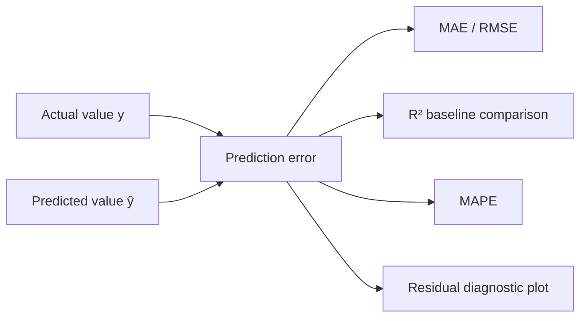

<div align="center">

# 🎯 [Data Science & AI/ML — Model Evaluation, Benchmarking & Selection]() - [Class 04]() — [Regression Metrics]()

[]()
[]()
[]()
[]()

</div>

<br><br>

## [Repository Identity]()

| Field | Value |
|---|---|
| Repository name | `class-04-regression-metrics-ii` |
| Professional class title | **Class 04 — Regression Metrics II** |
| GitHub About | Regression-model evaluation concepts and demonstrated examples: MAE, RMSE, R², MAPE, and residual diagnostics. |
| Suggested GitHub topics | `regression`, `model-evaluation`, `machine-learning`, `data-science`, `mae`, `rmse`, `r-squared`, `mape`, `residual-analysis` |

<br><br>

## [Overview]()

This single-file repository document records **Class 04 — Regression Metrics II**, from *Consultoria Especializada em Ciência de Dados 1* (25 August 2026). The supplied lecture material explains how regression evaluation differs from classification evaluation: when a model predicts a continuous value, the key question is no longer simply whether it was correct, but **how far the prediction was from the actual value**.<br><br>

The lecture uses delivery-time estimation as its demonstrated scenario and covers error definition, MAE, RMSE, R², MAPE, residual diagnostics, metric selection, limitations, and good practices. The concepts also apply to other continuous targets such as price, demand, and temperature.<br><br>

> **Source boundary:** No executable source code, notebook, dataset, trained model, experiment pipeline, benchmark, API, deployment, external URL, or external citation was provided in the supplied class materials.

<br><br>

## [Table of Contents]()

- [Learning Objectives](#learning-objectives)
- [Conceptual Evaluation Flow](#conceptual-evaluation-flow)
- [Key Concepts](#key-concepts)
- [Metrics and Mathematics](#metrics-and-mathematics)
- [Demonstrated Delivery Example](#demonstrated-delivery-example)
- [Residual Diagnostics](#residual-diagnostics)
- [Metric Selection](#metric-selection)
- [Evidence Status](#evidence-status)
- [Limitations and Good Practices](#limitations-and-good-practices)
- [Repository Structure](#repository-structure)
- [Future Extensions](#future-extensions)
- [References](#references)
- [Conclusion](#conclusion)

<br><br>

## [Learning Objectives]()

By the end of this class, the learner should be able to:<br><br>

- Define a regression error as the difference between the actual and predicted values.<br><br>
- Interpret a positive error as underestimation and a negative error as overestimation.<br><br>
- Use MAE to communicate typical prediction error in the target unit.<br><br>
- Explain why RMSE penalizes large errors more strongly than MAE.<br><br>
- Interpret R² using the baseline of always predicting the target mean.<br><br>
- Identify the small-denominator problem in MAPE.<br><br>
- Inspect residual patterns for bias, growing variance, and systematic model misspecification.<br><br>
- Select an evaluation metric according to the practical cost of an error.

<br><br>

## [Conceptual Evaluation Flow]()



**Conceptual** — This is a teaching diagram derived from the lecture relationships. It does not represent an implemented software architecture or a supplied machine-learning pipeline.<br><br>

A regression model produces a continuous value. Therefore, classification accuracy is not the relevant main metric; evaluation focuses on the size and pattern of prediction errors.

<br><br>

## [Key Concepts]()

### [Regression Error]()

For an observation \(i\), the class defines error as:<br><br>

\[
e_i = y_i - \hat{y}_i
\]

Where:<br><br>

- \(y_i\) is the actual value.<br><br>
- \(\hat{y}_i\) is the predicted value.<br><br>
- \(e_i\) is the prediction error.<br><br>

A positive error means the actual value exceeded the prediction, so the model underestimated. A negative error means the actual value was below the prediction, so the model overestimated.<br><br>

### [Mean-Prediction Baseline]()

The R² metric compares a model against a simple baseline: predict the target mean \(\bar{y}\) for every case. This baseline is useful because it distinguishes a model that captures predictive information from one that is worse than a constant prediction.

<br><br>

## [Metrics and Mathematics]()

| Metric | Mathematical definition | What it measures | Why it matters | Main limitation in the lecture |
|---|---|---|---|---|
| MAE | \(\mathrm{MAE}=\frac{1}{n}\sum_{i=1}^{n}|y_i-\hat{y}_i|\) | Average absolute error | Directly communicates typical error in target units | Does not disproportionately emphasize extreme errors |
| RMSE | \(\mathrm{RMSE}=\sqrt{\frac{1}{n}\sum_{i=1}^{n}(y_i-\hat{y}_i)^2}\) | Root mean squared error | Makes severe prediction mistakes carry more weight | Sensitive to outliers by design |
| R² | \(R^2=1-\frac{\sum_i(y_i-\hat{y}_i)^2}{\sum_i(y_i-\bar{y})^2}\) | Performance relative to mean baseline | Establishes whether the model beats predicting the mean | Unitless; should not be reported alone |
| MAPE | \(\mathrm{MAPE}=\frac{1}{n}\sum_i\left|\frac{y_i-\hat{y}_i}{y_i}\right|\times100\%\) | Mean absolute percentage error | Expresses relative error as a percentage | Unstable when actual values are near zero |

<br><br>

### [MAE — Mean Absolute Error]()

**What it is:** the mean of absolute prediction errors.<br><br>

**How it works:** the absolute value removes the sign, preventing underestimates and overestimates from canceling each other out.<br><br>

**Why it matters:** MAE remains in the target unit. With delivery time as the target, it can be read directly as “the model is typically wrong by X minutes.”<br><br>

**Limitation:** an unusually large delay enters linearly rather than being extra-penalized.

<br><br>

### [RMSE — Root Mean Squared Error]()

**What it is:** the square root of the mean of squared errors.<br><br>

**How it works:** each error is squared before averaging, so large errors have a much stronger impact. The final square root restores the metric to the original target unit.<br><br>

**Why it matters:** it is appropriate when severe delays or misses are especially harmful.<br><br>

**Limitation:** a small number of extreme errors can dominate the value, which may or may not reflect the intended business cost.

<br><br>

### [R² — Coefficient of Determination]()

**What it is:** a unitless score comparing the model’s squared errors with the squared deviations from the actual-value mean.<br><br>

**How it works:** it evaluates whether the model improves on always predicting the mean.<br><br>

**Why it matters:** it provides baseline-relative context that MAE and RMSE do not provide by themselves.<br><br>

**Interpretation shown in class:**<br><br>

- \(R^2=1.0\): perfect prediction.<br><br>
- \(R^2=0\): equivalent to the mean-prediction baseline.<br><br>
- \(R^2<0\): worse than the mean-prediction baseline.<br><br>

**Limitation:** R² is not measured in minutes or another target unit. It should be reported together with MAE or RMSE. It is also not directly comparable across arbitrary problems with different target variance.

<br><br>

### [MAPE — Mean Absolute Percentage Error]()

**What it is:** average absolute error normalized by each actual value and expressed as a percentage.<br><br>

**How it works:** it scales error by the actual target value before averaging.<br><br>

**Why it matters:** it enables relative interpretation such as “average error is 15%.”<br><br>

**Limitation:** when actual values approach zero, the denominator creates very large and unstable percentage errors. The lecture illustrates this with an actual value of 5 minutes and an error of 5 minutes, producing 100% error.

<br><br>

## [Demonstrated Delivery Example]()

**Demonstrated** — The following five delivery orders are a classroom example from the supplied slides. They are not the output of a supplied dataset, codebase, or benchmark run.<br><br>

| Order | Predicted time | Actual time | Error \(y - \hat{y}\) |
|---:|---:|---:|---:|
| #1 | 30 min | 35 min | +5 min |
| #2 | 25 min | 22 min | −3 min |
| #3 | 40 min | 38 min | −2 min |
| #4 | 20 min | 26 min | +6 min |
| #5 | 30 min | 74 min | +44 min — motorcycle broke |

<br><br>

### [Demonstrated MAE Calculation]()

The absolute errors are \(5, 3, 2, 6, 44\).<br><br>

\[
\mathrm{MAE}=\frac{5+3+2+6+44}{5}=\frac{60}{5}=12\text{ minutes}
\]

The lecture interprets this value as a typical error of 12 minutes for the demonstrated delivery scenario.

<br><br>

### [Demonstrated RMSE Interpretation]()

The extreme delivery error is squared:<br><br>

\[
44^2=1936
\]

This single quantity heavily influences the squared-error total. The class reports \(\mathrm{RMSE}\approx20\) minutes, compared with MAE = 12 minutes. The gap demonstrates why RMSE is more sensitive to unusually large delays.

<br><br>

### [Demonstrated R² Calculation]()

The mean of the actual delivery times is 39 minutes. The slides provide:<br><br>

\[
\sum_i(y_i-\hat{y}_i)^2=2010
\]

\[
\sum_i(y_i-\bar{y})^2=1700
\]

\[
R^2=1-\frac{2010}{1700}\approx-0.18
\]

The negative R² means that, for this specific demonstrated example, the model is worse than always predicting 39 minutes for every delivery order.

<br><br>

## [Residual Diagnostics]()

A scalar metric summarizes error, but residual diagnostics show where and how the model fails.<br><br>

| Residual pattern | Interpretation described in the class |
|---|---|
| Pattern-free cloud around zero | Good sign: comparable error behavior for short and long deliveries |
| Funnel shape | Error variance grows as predicted time increases; the model is more reliable for short orders |
| Clear curve | Systematic pattern; the model may be too simple for a non-linear relationship |
| Errors mostly on one side of zero | Bias: the model consistently underestimates or overestimates |

<br><br>

## [Metric Selection]()

| Decision question | Metric indicated by the lecture | Rationale |
|---|---|---|
| What is the typical error in minutes? | MAE | Direct, target-unit interpretation |
| Should severe delays be penalized strongly? | RMSE | Squaring emphasizes large errors |
| Is the model better than mean prediction? | R² | Explicit mean-baseline comparison |
| What is the average relative error? | MAPE | Percentage interpretation, if values are not near zero |

<br><br>

**Recommended** — The lecture advises reporting a pair of measures: MAE or RMSE in target units plus R² for baseline-relative context.

<br><br>

## [Evaluation]()

### [Methodology]()

**Demonstrated** — The lecture performs hand calculations using five delivery observations. It calculates absolute errors, interprets squared errors, compares the model against a mean baseline, and discusses percentage error and residual patterns.<br><br>

### [Metrics]()

The class introduces MAE, RMSE, R², and MAPE.<br><br>

### [Experiments]()

Not provided in the supplied class materials.<br><br>

### [Results]()

The only numerical outputs provided are classroom demonstration values:<br><br>

- MAE = **12 minutes**.<br><br>
- RMSE ≈ **20 minutes**.<br><br>
- R² = **−0.18**.<br><br>

These are not benchmark results, validation results, test-set results, or performance claims about an implemented system.

<br><br>

## [Evidence Status]()

| Category | Status | Evidence available in supplied materials |
|---|---|---|
| Implemented | Not provided | No code, notebook, package, API, service, or executable repository content |
| Demonstrated | Present | Five-order delivery example; MAE, RMSE, and R² calculations |
| Conceptual | Present | Metric definitions, formulas, baseline comparison, MAPE caveat, and residual patterns |
| Recommended | Present in class guidance | Pair MAE/RMSE with R²; inspect residuals; validate before final test use |
| Dataset | Not provided | Example values appear in slides only; no dataset file was supplied |
| Independent experiments | Not provided | No train/validation/test process or model comparison was supplied |

<br><br>

## [Limitations and Good Practices]()

### [Limitations]()

- Reporting only R² omits the meaningful target-unit error.<br><br>
- MAPE should not be used with targets near zero.<br><br>
- Aggregate metrics do not replace residual diagnostics.<br><br>
- MAE and RMSE should not be compared directly across targets with incompatible scales.<br><br>
- R² values from problems with substantially different target variance are not automatically comparable.

<br><br>

### [Good Practices]()

- Report MAE or RMSE together with R².<br><br>
- Inspect errors and residual patterns.<br><br>
- Select metrics according to the practical cost of error.<br><br>
- Measure during validation and reserve final testing for the end.

<br><br>

## [Implementation]()

**Implemented:** Not provided in the supplied class materials.<br><br>

No code, notebook, package configuration, dependency list, command, model training procedure, or library-specific implementation was supplied. Therefore, this README intentionally does not fabricate installation steps, usage commands, code snippets, technologies, or expected runtime output.

<br><br>

## [Repository Structure]()

```text
class-04-regression-metrics-ii/
└── README.md
```

This deliverable intentionally consolidates repository documentation into one `README.md` file. The original supplied source material is `CD1_Aula04_slides_vfinal.pdf` and should be retained alongside the repository when appropriate.<br><br>

## [Applications]()

**Conceptual** — The slides use delivery-time prediction as the running example and explicitly indicate that the same evaluation ideas apply to other continuous targets, including:<br><br>

- Price.<br><br>
- Demand.<br><br>
- Temperature.<br><br>

No specific production application, model, deployment, or dataset was provided.

<br><br>

## [Future Extensions]()

**Future Extension — not implemented and not provided in the supplied materials.**<br><br>

- Implement the five-order calculations in a reproducible notebook.<br><br>
- Add validation and final-test workflows as the course later introduces them.<br><br>
- Generate residual plots from an actual fitted model.<br><br>
- Compare candidate models using a metric that matches the application’s error-cost structure.<br><br>
- Document metric aggregation across validation folds once cross-validation is covered.

<br><br>

## [References]()

- Supplied source material: `CD1_Aula04_slides_vfinal.pdf` — *Consultoria Especializada em Ciência de Dados 1*, Aula 04, “Métricas de regressão,” 25/08/2026.<br><br>

No external references, URLs, datasets, code repositories, or citations were supplied in the class material.

<br><br>

## [Conclusion]()

Regression evaluation should answer more than one question. MAE communicates typical deviation in meaningful units; RMSE highlights the cost of severe misses; R² indicates whether a model improves over predicting the mean; MAPE offers a relative percentage only when its denominator is safe; and residual inspection exposes systematic failure patterns hidden by a single number.<br><br>

