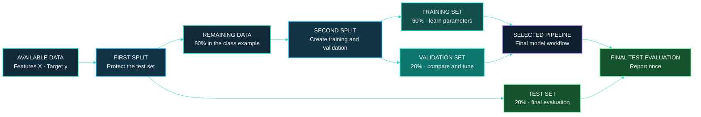
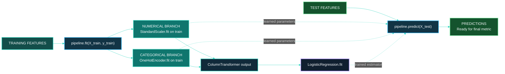

# [Class 05]: [Hold-Out Validation and Leakage-Safe Scikit-learn Pipelines]()

> **Course context:** Data Science & Machine Learning — Model Evaluation, Benchmarking & Selection  
> **Institution:** Pontifical Catholic University of São Paulo (PUC-SP)  
> **School:** FACEI — Computer Science Department  
> **Programme:** BSc in Human-Centered AI & Data Science · 6th Semester · 2026  
> **Professor:** ✨ Giovani Giulio Tristão Thibes Vieira  
> **Author:** Fabiana ⚡️ Campanari

<p align="center">
  
  
  
  
  
  
</p>

<p align="center">
  <a href="<ADD_URL_HERE>"></a>
  <a href="<ADD_URL_HERE>"></a>
  <a href="<ADD_URL_HERE>"></a>
</p>

<br><br>

## [Repository Identity]()

- **Repository name:** `class-05-ai-ml-holdout-pipeline-validation`
- **GitHub About:** Hold-out validation, leakage prevention, and reproducible scikit-learn pipelines for honest model evaluation.
- **Suggested GitHub topics:** `ai`, `machine-learning`, `data-science`, `python`, `scikit-learn`, `model-evaluation`, `holdout-validation`, `data-leakage`, `pipeline`, `columntransformer`, `cross-validation`, `mlops`

<br><br>

## [Overview]()

This repository documents **Class 05 — Hold-Out Validation and Pipeline**. The class explains how to create separate training, validation, and test partitions so that a model is evaluated honestly, and how to use a scikit-learn `Pipeline` to prevent information from leaking from evaluation data into preprocessing.

The central lesson is simple but foundational: a model must learn from training data, decisions must be made with validation data, and the final test set must remain protected until the final evaluation. If the test set influences scaling, imputation, feature selection, hyperparameter tuning, or repeated model choices, the reported performance becomes overly optimistic.

The supplied material presents this progression:

**Split data safely** → **train and compare on the right partitions** → **fit preprocessing only on training data** → **encapsulate transformations and the estimator in a `Pipeline`** → **keep the workflow consistent in evaluation and production**.

<br><br>

## [Table of Contents]()

- [Repository Identity](#repository-identity)
- [Overview](#overview)
- [Class Scope](#class-scope)
- [Learning Objectives](#learning-objectives)
- [Core Concepts](#core-concepts)
- [Hold-Out Workflow](#hold-out-workflow)
- [Data Leakage](#data-leakage)
- [Leakage-Safe Pipeline](#leakage-safe-pipeline)
- [Class Code Patterns](#class-code-patterns)
- [Production Context](#production-context)
- [What Was Demonstrated](#what-was-demonstrated)
- [Recommended Repository Structure](#recommended-repository-structure)
- [Setup and Usage](#setup-and-usage)
- [Limitations and Good Practice](#limitations-and-good-practice)
- [Responsible AI and Data Governance](#responsible-ai-and-data-governance)
- [Future Extensions](#future-extensions)
- [References](#references)
- [Conclusion](#conclusion)

<br><br>

## [Class Scope]()

[***Official class topic: Hold-Out Validation and Pipeline***]()

The supplied handout identifies this as **Class 05**, focused on separating data into **training**, **validation**, and **test** sets, then using `Pipeline` and `ColumnTransformer` to ensure preprocessing is learned only from the training portion.

The materials also connect this class to the wider course sequence:

| Course stage | Relationship to this class |
|---|---|
| Classification and regression metrics | Metrics tell us how to score a model once predictions exist. |
| Hold-out validation | This class establishes a fair partitioning strategy before selection decisions are made. |
| Cross-validation | The next classes address the instability that can arise from relying on one random split. |
| Hyperparameter search | Tuning belongs on validation data or within cross-validation, not on the protected test set. |
| Model selection and calibration | Later classes build on the trustworthy evaluation workflow established here. |
| Reproducibility | Fixed seeds, repeatable splits, and complete pipelines are early reproducibility practices. |

<br><br>

## [Learning Objectives]()

By the end of this class, the learner should be able to:

- Explain the distinct roles of training, validation, and test data.
- Create chained train/validation/test splits with `train_test_split`.
- Use stratification in classification tasks to preserve class proportions across partitions.
- Use a fixed `random_state` so that an experiment can be reproduced.
- Identify preprocessing leakage caused by fitting transformations on all available data.
- Distinguish `fit`—learning parameters—from `transform`—applying learned parameters.
- Build a `ColumnTransformer` for numerical and categorical columns.
- Combine preprocessing and an estimator in a scikit-learn `Pipeline`.
- Explain the distinction between train–production skew and data drift.
- Recognize when time-based hold-out is more appropriate than random splitting.

<br><br>

## [Core Concepts]()

### [***Three datasets, three responsibilities***]()

A hold-out workflow separates the available observations into partitions with different jobs:

| Partition | Purpose | How often it should influence decisions |
|---|---|---|
| **Training set** | The model learns parameters from this data. | Many times during fitting. |
| **Validation set** | Candidate models and hyperparameters are compared here. | Many times during development and selection. |
| **Test set** | The selected final workflow is assessed under protected conditions. | Ideally once, at the end. |

A useful class analogy is that training data are practice exercises, validation data are mock exams, and test data are the sealed final exam. The sealed exam is valuable because it estimates performance on data the development process did not repeatedly inspect.

### [***Why stratification matters***]()

In a classification problem, `stratify=y` asks the split procedure to preserve the overall class distribution across partitions. This is especially important when one class is rare. Without stratification, a small validation or test set can accidentally contain too few positive examples, making estimates unreliable.

### [***Why a random seed matters***]()

`random_state` fixes the random splitting process. It does not make a model universally reproducible by itself, but it makes this specific split repeatable. Reproducibility lets another person inspect the same partitions, rerun the workflow, and understand whether changes in results came from code changes rather than a different random draw.

<br><br>

## [Hold-Out Workflow]()

[***Reserve the final test set before model development***]()

The class material demonstrates a two-stage split. First, it separates the test set. Then it splits the remaining data into training and validation sets. In the illustrated proportions, the result is 60% training, 20% validation, and 20% test data.

\[
\text{Dataset} = \text{Training} \cup \text{Validation} \cup \text{Test}
\]

\[
60\% + 20\% + 20\% = 100\%
\]

The exact proportions may differ by problem, dataset size, class balance, and evaluation design. The key principle is role separation—not a universal ratio.



### [***Correct decision flow***]()

1. Train candidate models using the training set.
2. Compare candidates and adjust hyperparameters using the validation set.
3. Select one final workflow.
4. Evaluate that selected workflow once on the protected test set.
5. Report the test result together with the methodology, dataset scope, metric definitions, and limitations.

The test set should not become a repeated feedback channel. If it is repeatedly checked while choices are still being made, the development process gradually adapts to it, even if the model was never explicitly trained on its rows.

<br><br>

## [Data Leakage]()

[***Leakage makes evaluation look better than it truly is***]()

Data leakage occurs when information unavailable at the point of prediction affects training, preprocessing, model selection, or evaluation. In this class, the central example is **preprocessing leakage**: fitting a scaler, imputer, or feature selector using both training and test data.

For example, a standard scaler learns a mean \(\mu\) and standard deviation \(\sigma\):

\[
z = \frac{x - \mu}{\sigma}
\]

If \(\mu\) and \(\sigma\) are calculated using the full dataset, the test set has already influenced the transformation. Even though the target values may not have been used, the test feature distribution has crossed the evaluation boundary.

### [***The golden rule***]()

> Learn transformations from training data only. Apply the already learned transformations to validation, test, and future production data without refitting them.

| Component | What `fit` learns | Safe fitting location |
|---|---|---|
| `StandardScaler` | Feature means and standard deviations | Training data only |
| Imputer | Replacement statistic or learned strategy | Training data only |
| Encoder | Category mapping | Training data only |
| Feature selector | Which features to retain | Training data only, inside each validation fold when using cross-validation |
| Model estimator | Predictive parameters | Training data only |

### [***Unsafe versus safe preprocessing***]()

```python
from sklearn.preprocessing import StandardScaler

# UNSAFE: the scaler learns statistics from training and test observations.
scaler = StandardScaler().fit(X)

# SAFE: the scaler learns statistics from training observations only.
scaler = StandardScaler().fit(X_train)
X_test_ready = scaler.transform(X_test)
```

The difference is not cosmetic. `fit` means “learn from data”; `transform` means “apply what was learned.” The test set can be transformed, but it should not participate in fitting.

<br><br>

## [Leakage-Safe Pipeline]()

[***A pipeline keeps transformations and prediction in the right order***]()

A scikit-learn `Pipeline` chains preprocessing steps and an estimator into one object. When the pipeline receives `fit(X_train, y_train)`, every learned preprocessing step is fitted using only the training subset passed to that call. When the pipeline receives `predict(X_test)`, it applies those learned transformations to the test data and then generates predictions.

`ColumnTransformer` is used when columns need different treatments. The class example standardizes numerical columns and one-hot encodes categorical columns before passing the prepared representation to logistic regression.



### [***Why the Pipeline is important***]()

- It reduces the risk that preprocessing is accidentally fitted on the wrong data.
- It keeps training and inference transformations consistent.
- It makes cross-validation safer because each fold can fit preprocessing using that fold’s training portion only.
- It packages the workflow as one reusable object, which supports reproducibility and later deployment.

A pipeline is not a guarantee against every possible leakage source. It cannot automatically detect a target-derived feature, a future timestamp used in a past prediction, or an incorrect business-data join. It protects the sequencing of the transformations that are placed inside it.

<br><br>

## [Class Code Patterns]()

[***Code shown in the supplied class handout***]()

The following blocks preserve the implementation patterns demonstrated in the class material, translated into English variable names where needed for readability.

### [***1. Chained train, validation, and test split***]()

```python
from sklearn.model_selection import train_test_split

# First: protect the test set.
X_remaining, X_test, y_remaining, y_test = train_test_split(
    X,
    y,
    test_size=0.20,
    stratify=y,
    random_state=0,
)

# Second: split the remaining 80% into 60% training and 20% validation.
X_train, X_val, y_train, y_val = train_test_split(
    X_remaining,
    y_remaining,
    test_size=0.25,
    stratify=y_remaining,
    random_state=0,
)
```

Because 25% of the remaining 80% becomes validation data, this yields 20% validation data overall. The remaining 60% is training data. This pattern is appropriate for a classification task with a target vector `y`; stratification should be reconsidered for regression or other data structures.

### [***2. Column-aware preprocessing***]()

```python
from sklearn.compose import ColumnTransformer
from sklearn.preprocessing import OneHotEncoder, StandardScaler

preprocessor = ColumnTransformer(
    transformers=[
        ("num", StandardScaler(), numerical_columns),
        ("cat", OneHotEncoder(), categorical_columns),
    ]
)
```

This code creates two preprocessing branches. Numeric columns are standardized; categorical columns are converted into indicator variables. The variables `numerical_columns` and `categorical_columns` must be defined from the actual dataset schema. No dataset schema was provided in the supplied handout.

### [***3. Pipeline with logistic regression***]()

```python
from sklearn.linear_model import LogisticRegression
from sklearn.pipeline import Pipeline

model = Pipeline(
    steps=[
        ("prep", preprocessor),
        ("clf", LogisticRegression()),
    ]
)

model.fit(X_train, y_train)
predictions = model.predict(X_test)
```

The class uses `LogisticRegression()` as the estimator in a pipeline demonstration. The material does not provide a dataset, fitted coefficients, evaluation metric, or numerical result. Therefore, this repository documents the workflow and must not claim a model score unless an accompanying notebook or experiment produces one.

### [***4. Validation-first model selection pattern***]()

```python
# Conceptual workflow: use the validation partition for development decisions.
model.fit(X_train, y_train)
validation_predictions = model.predict(X_val)

# Compute appropriate validation metrics here, compare candidate workflows,
# and choose the final configuration before opening the test set.

# Final evaluation should happen only after selection is complete.
final_test_predictions = model.predict(X_test)
```

The exact metrics are task-dependent. Earlier course classes cover classification metrics such as precision, recall, F1-score, ROC-AUC, precision–recall curves, and log loss, as well as regression metrics such as MAE, RMSE, \(R^2\), and residual analysis.

<br><br>

## [Production Context]()

[***The class connects evaluation discipline to production reliability***]()

The handout distinguishes two operational problems that occur at different moments:

| Concept | When it appears | Meaning | Practical defense |
|---|---|---|---|
| **Train–production skew** | At deployment | Training and production process data differently. | Use the same validated pipeline in both contexts. |
| **Data drift** | Over time | Production data changes away from the training distribution. | Monitor incoming data and retrain or revise the system when needed. |

The class expresses the difference clearly: skew is a **space** problem—training and production are not aligned now—while drift is a **time** problem—the world changes after the model is deployed.

### [***Time-based hold-out***]()

For temporal data, a random split can place future observations in the training set and past observations in the test set, which is usually unrealistic. The class recommends training on earlier periods and testing on later periods:

\[
\text{Past observations} \rightarrow \text{training}; \quad \text{future observations} \rightarrow \text{test}
\]

A time-aware split is appropriate when the intended use is to forecast or make decisions about future observations. The split design must match the real decision point.

### [***Global holdout for product evaluation***]()

The handout also introduces a different meaning of “global holdout.” In this context, the goal is not to validate a predictive model but to measure whether the **product** improves over time. A small percentage of users remains on an older version, while the remaining users receive changes. Business outcomes—such as retention or revenue per user—can then be compared.

This is conceptually different from the train/validation/test split used for model development. The shared term “holdout” should not hide the difference in purpose.

<br><br>

## [What Was Demonstrated]()

| Classification | Content status |
|---|---|
| **Demonstrated in class material** | Chained hold-out splitting with `train_test_split`, `stratify`, and `random_state`; leakage examples involving `StandardScaler`; `ColumnTransformer`; `Pipeline`; and a `LogisticRegression` pipeline pattern. |
| **Explained conceptually** | Training/validation/test roles, leakage prevention, validation-first selection, time hold-out, global holdout, skew, drift, and why cross-validation can produce a more stable estimate than one split. |
| **Not provided in the supplied material** | A specific dataset, full notebook, completed exercise, model comparison, fitted results, metrics, benchmark values, accuracy, visualizations, deployment, API, dashboard, database, or cloud infrastructure. |
| **Recommended for a future repository extension** | A reproducible notebook using an identified dataset, automated tests, cross-validation experiments, a requirements file, environment lockfile, model persistence, monitoring strategy, and a model card. |

<br><br>

## [Recommended Repository Structure]()

[***Recommended structure — not confirmed as an existing implementation***]()

```text
class-05-ai-ml-holdout-pipeline-validation/
├── README_MASTER.md
├── README.md
├── notebooks/
│   └── holdout_pipeline_validation.ipynb
├── src/
│   ├── data_split.py
│   ├── preprocessing.py
│   └── train_pipeline.py
├── tests/
│   ├── test_splits.py
│   └── test_pipeline.py
├── docs/
│   ├── class-handout.pdf
│   └── notes.md
├── assets/
│   └── diagrams/
├── requirements.txt
└── LICENSE
```

This is a recommended organizational pattern for turning the class into a maintainable repository. The supplied materials do not establish that these folders or files already exist.

<br><br>

## [Setup and Usage]()

[***No runnable repository package was supplied***]()

The supplied material contains code excerpts, not a complete executable project. Therefore, no verified `requirements.txt`, dataset download command, repository URL, or notebook path can be documented as already available.

For a future implementation based on the demonstrated snippets, the minimum Python packages would likely include:

```text
scikit-learn
pandas
numpy
```

A future repository can use this standard local-environment pattern after a real `requirements.txt` has been created:

```bash
git clone <YOUR_REPOSITORY_URL>
cd class-05-ai-ml-holdout-pipeline-validation

python -m venv .venv
source .venv/bin/activate

pip install -r requirements.txt
```

On Windows PowerShell, activate the environment with:

```powershell
.venv\Scripts\Activate.ps1
```

Replace placeholders only after the repository, environment specification, and dataset instructions exist. Do not commit credentials, private datasets, or partner-sensitive materials.

<br><br>

## [Limitations and Good Practice]()

### [***Limitations of a single hold-out split***]()

A single train/test split is sensitive to the random partition. One split may happen to be easier or harder than another, producing an unstable performance estimate. The class explicitly introduces cross-validation as the next topic because it evaluates across multiple splits and aggregates the results.

Hold-out validation can still be appropriate when:

- The dataset is large enough that each partition remains representative.
- A final untouched test set is required for a final report.
- The split reflects a realistic deployment setting, especially in time-based data.
- Development requires a simple, fast baseline before more extensive validation.

### [***Common mistakes documented in the class***]()

- Scaling or imputing before separating training and test data.
- Choosing hyperparameters while looking at test-set performance.
- Measuring the model on the test set repeatedly during development.
- Keeping learned preprocessing outside the pipeline.

### [***Good practices documented in the class***]()

- Set aside the test split before development activity.
- Put learned preprocessing inside the `Pipeline`.
- Make choices with validation data; evaluate on test data only at the end.
- Stratify classification splits when appropriate and fix the random seed.

<br><br>

## [Responsible AI and Data Governance]()

Although this class is primarily methodological, its practices support responsible AI work:

- **Honest reporting:** Leakage-free evaluation reduces the risk of presenting inflated performance as real capability.
- **Reproducibility:** Fixed seeds, explicit splitting procedures, and pipelines make experiments easier to audit.
- **Privacy-aware handling:** Data partitions, features, and preprocessing must be designed without exposing restricted information. Sensitive datasets should not be uploaded to public repositories without authorization.
- **Deployment consistency:** Using the same preprocessing logic in training and production reduces silent failures caused by inconsistent transformations.
- **Appropriate temporal design:** Future information must not be used to evaluate a past decision scenario.

These principles do not replace a complete privacy, fairness, security, or governance assessment. They are a necessary foundation for trustworthy model evaluation.

<br><br>

## [Future Extensions]()

[***Recommended future work — not implemented in the supplied material***]()

1. Add a notebook that applies the class workflow to a named, documented dataset.
2. Compare a simple hold-out result against stratified K-fold cross-validation.
3. Add evaluation metrics aligned with the problem type and class balance.
4. Place imputers, encoders, scalers, selectors, and estimators inside a single pipeline.
5. Add unit tests confirming that the test partition never appears in preprocessing `fit` operations.
6. Add time-series validation examples using an ordered temporal split.
7. Add experiment tracking that records data version, random seed, preprocessing, estimator settings, metrics, and runtime.
8. Create a model card that documents intended use, data scope, evaluation protocol, limitations, and known risks.
9. Define monitoring checks for feature drift and prediction behavior after deployment.

<br><br>

## [References]()

### [***Supplied class material***]()

- Vieira, Giovani Giulio Tristão Thibes. *Consultoria Especializada em Ciência de Dados 1 — Validação hold-out e Pipeline*. Class 05 handout, 1 September 2026. Supplied PDF.

### [***Official technical documentation***]()

- [scikit-learn — `train_test_split`](https://scikit-learn.org/stable/modules/generated/sklearn.model_selection.train_test_split.html)
- [scikit-learn — `Pipeline`](https://scikit-learn.org/stable/modules/generated/sklearn.pipeline.Pipeline.html)
- [scikit-learn — `ColumnTransformer`](https://scikit-learn.org/stable/modules/generated/sklearn.compose.ColumnTransformer.html)
- [scikit-learn — Common pitfalls and recommended practices](https://scikit-learn.org/stable/common_pitfalls.html)
- [scikit-learn — Cross-validation: evaluating estimator performance](https://scikit-learn.org/stable/modules/cross_validation.html)

### [***Foundational reading***]()

- Kuhn, Max, and Kjell Johnson. *Applied Predictive Modeling*. Springer, 2013.
- Géron, Aurélien. *Hands-On Machine Learning with Scikit-Learn, Keras, and TensorFlow*. 3rd ed., O’Reilly Media, 2022.

<br><br>

## [Conclusion]()

Class 05 establishes a core discipline of professional machine learning: **evaluation must remain separate from development decisions**. Training data teach the model; validation data support comparison and tuning; the protected test set estimates final performance honestly.

The class also demonstrates why this separation must include preprocessing. A scaler, imputer, encoder, or feature selector can leak information if it is fitted using the entire dataset. `ColumnTransformer` and `Pipeline` provide a practical scikit-learn pattern for keeping transformations and prediction steps together, in the correct order, with learned parameters derived from training data only.

This is the foundation for the next stages of the course: cross-validation, hyperparameter optimization, fair model comparison, calibration, reproducibility, and integrated evaluation workflows.

<br><br>

> [!NOTE]
> This documentation was derived from the supplied Class 05 handout. It intentionally distinguishes demonstrated classroom patterns from recommended future implementation work and does not claim unprovided datasets, metrics, experiments, or results.
