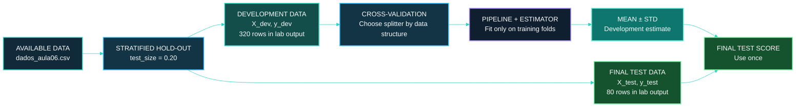
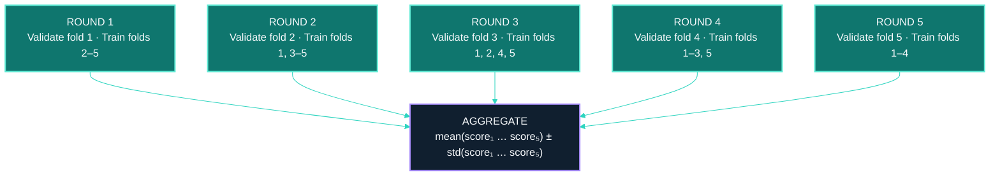
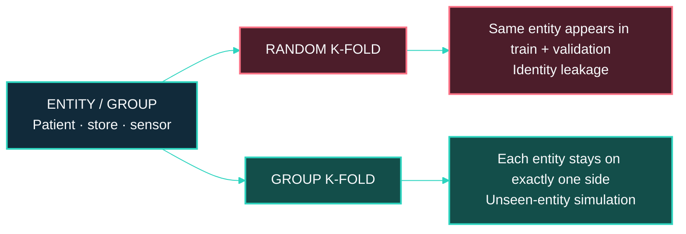
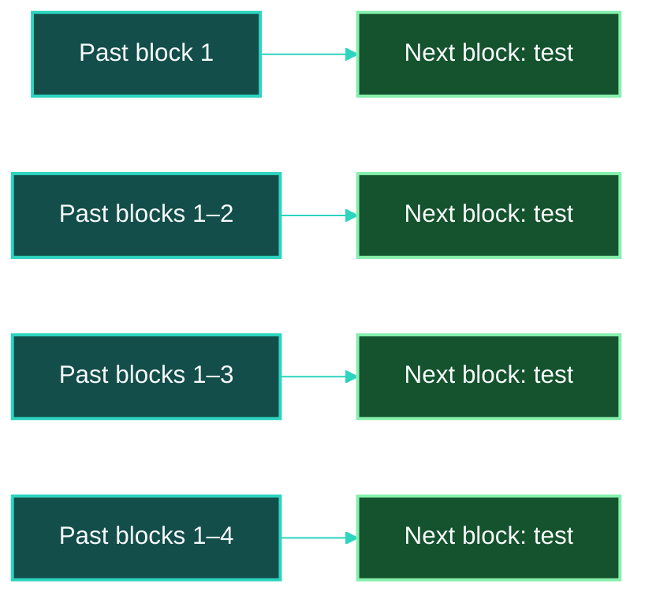
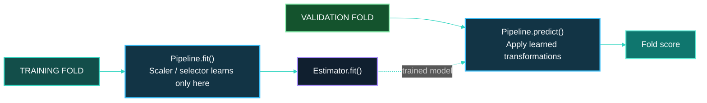

# [Class 06]: [Cross-Validation — From Rotation to the Right Scheme]()

> **Course context:** Data Science & Machine Learning — Model Evaluation, Benchmarking & Selection  
> **Institution:** Pontifical Catholic University of São Paulo (PUC-SP)  
> **School:** FACEI — Computer Science Department  
> **Programme:** BSc in Human-Centered AI & Data Science · 6th Semester · 2026  
> **Professor:** ✨ Giovani Giulio Tristão Thibes Vieira  
> **Author:** Fabiana ⚡️ Campanari

<p align="center">
  
  
  
  
  
  
</p>

<p align="center">
  <a href="<ADD_URL_HERE>"></a>
  <a href="<ADD_URL_HERE>"></a>
  <a href="<ADD_URL_HERE>"></a>
</p>

<br><br>

## [Repository Identity]()

- **Repository name:** `class-06-ai-ml-cross-validation-correct-scheme`
- **GitHub About:** Cross-validation, stratification, group-aware and time-aware splits, and leakage-safe scikit-learn pipelines for stable model evaluation.
- **Suggested GitHub topics:** `ai`, `machine-learning`, `data-science`, `python`, `scikit-learn`, `cross-validation`, `model-evaluation`, `kfold`, `stratifiedkfold`, `groupkfold`, `timeseriessplit`, `pipeline`, `data-leakage`, `reproducibility`

<br><br>

## [Overview]()

This repository documents **Class 06 — Cross-Validation: From Rotation to the Right Scheme**. The class advances from a single hold-out split to a more stable evaluation procedure: rather than trusting one random training/validation partition, the development data are evaluated through several rotations and summarized with a mean and standard deviation.

The central lesson is that **a validation strategy must reproduce the real prediction scenario**. Ordinary independent examples, imbalanced classes, repeated observations from the same person or device, and time-ordered data do not have the same splitting requirements. A random split that is acceptable for one situation can create misleadingly optimistic performance in another.

The supplied materials establish this progression:

**Protect the final test set** → **evaluate the development data across folds** → **report mean ± standard deviation** → **choose a splitter that respects classes, groups, or time** → **keep preprocessing inside the cross-validation pipeline** → **fit the final workflow and evaluate the test set once**.

<br><br>

## [Table of Contents]()

- [Repository Identity](#repository-identity)
- [Overview](#overview)
- [Class Scope](#class-scope)
- [Learning Objectives](#learning-objectives)
- [Core Concepts](#core-concepts)
- [Evaluation Workflow](#evaluation-workflow)
- [K-Fold Cross-Validation](#k-fold-cross-validation)
- [Choosing k](#choosing-k)
- [Stratification and Rare Classes](#stratification-and-rare-classes)
- [Leave-One-Out and Repeated CV](#leave-one-out-and-repeated-cv)
- [Group-Aware Validation](#group-aware-validation)
- [Time-Aware Validation](#time-aware-validation)
- [Leakage-Safe Pipelines](#leakage-safe-pipelines)
- [Class Code Patterns](#class-code-patterns)
- [Demonstrated Lab Results](#demonstrated-lab-results)
- [What Was Demonstrated](#what-was-demonstrated)
- [Recommended Repository Structure](#recommended-repository-structure)
- [Setup and Usage](#setup-and-usage)
- [Limitations and Good Practice](#limitations-and-good-practice)
- [Responsible AI and Data Governance](#responsible-ai-and-data-governance)
- [Future Extensions](#future-extensions)
- [References](#references)
- [Conclusion](#conclusion)

<br><br>

## [Class Scope]()

[***Official class topic: Cross-validation — from rotation to the correct scheme***]()

The supplied handout identifies this as **Class 06**, covering the mechanics of cross-validation and the selection of a suitable splitter for each data structure. The class focuses on:

- Standard `KFold` evaluation and the meaning of fold-level scores.
- Reporting the cross-validation mean and standard deviation.
- `StratifiedKFold` for classification and class imbalance.
- The practical limit imposed by a rare positive class.
- Leave-One-Out (LOO) for very small datasets.
- Repeated cross-validation using `RepeatedStratifiedKFold`.
- `GroupKFold` when rows repeat across people, stores, sensors, or other entities.
- `TimeSeriesSplit` when the prediction task moves from past to future.
- `Pipeline`-based cross-validation to prevent preprocessing and feature-selection leakage.
- A protected final test set that remains outside cross-validation.

The class introduces the **winner’s curse** and **Nested CV** as material for **Class 07**. They are not implemented in the supplied Class 06 notebook.

| Course stage | Relationship to this class |
|---|---|
| Hold-out validation and pipelines | Class 05 establishes a protected final test set and leakage-safe preprocessing principles. |
| Cross-validation | Class 06 replaces the fragility of one development split with multiple evaluation rotations. |
| Splitter selection | The validation method must preserve the meaningful structure of classes, entities, and time. |
| Hyperparameter search | The next class treats model selection bias and nested validation. |
| Reproducibility | Fixed seeds, documented splitters, and a complete pipeline make experiments inspectable. |

<br><br>

## [Learning Objectives]()

By the end of this class, the learner should be able to:

- Explain why a single train/validation split can produce a variable performance estimate.
- Describe the k-fold rotation mechanism: each fold is used for validation once and training \(k-1\) times.
- Compute and report a cross-validation result as mean ± standard deviation.
- Use `cross_val_score` without manually separating fold-level train and validation data.
- Compare practical trade-offs between \(k=5\) and \(k=10\).
- Use `StratifiedKFold` to preserve class proportions in a classification task.
- Recognize that stratification distributes rare examples but does not create more examples.
- Apply the practical constraint \(k \leq\) the number of examples in the rarest class.
- Explain the cost and fold-level instability of Leave-One-Out validation.
- Use `RepeatedStratifiedKFold` to average over multiple randomized fold assignments.
- Identify group leakage and use `GroupKFold` to ensure that an entity is only on one side of a split.
- Identify temporal leakage and use `TimeSeriesSplit` to train on the past and test on the future.
- Put preprocessing and feature selection inside a `Pipeline` so every fold fits transformations using training data only.
- Keep the final test set separate and evaluate it only after the final workflow is chosen.

<br><br>

## [Core Concepts]()

### [***One split is not the full story***]()

A single hold-out split produces one evaluation number, but that number depends on the particular partition. A validation subset may be relatively easy or difficult by chance, especially with limited data or class imbalance. The handout describes this as the “luck of the cut.”

Cross-validation does not guarantee that every evaluation is perfect; it provides a more informative estimate by measuring a model across several train/validation rotations.

\[
\text{Cross-validation estimate} = \frac{1}{k}\sum_{i=1}^{k}\text{score}_i
\]

The standard deviation of the fold scores indicates how much the score varies among the folds:

\[
\sigma_{\text{folds}} = \sqrt{\frac{1}{k}\sum_{i=1}^{k}(\text{score}_i - \bar{s})^2}
\]

In the lab code, `scores.std()` is used to calculate the reported standard deviation.

### [***The basic vocabulary***]()

| Term | Meaning in this class |
|---|---|
| **Development data** | The block of data used for cross-validation, model development, and comparison. |
| **Fold** | One partition of the development data in a k-fold procedure. |
| **Training fold(s)** | The \(k-1\) folds used to fit one temporary model in a round. |
| **Validation fold** | The one held-out fold used to score that temporary model. |
| **Final test set** | A separate set that does not enter cross-validation and is evaluated once at the end. |
| **Splitter** | An object that defines how rows become training and validation subsets, for example `StratifiedKFold` or `TimeSeriesSplit`. |
| **Leakage** | Information crosses an evaluation boundary in a way that would not be available in the real prediction scenario. |

### [***The core reporting rule***]()

> Do not report a cross-validation result as a disconnected single score. Report the **mean ± standard deviation** and document the splitter that generated the folds.

The mean expresses the average score across folds. The standard deviation expresses how much the score moved across those fold assignments. Neither value alone fully describes the observed cross-validation behavior.

<br><br>

## [Evaluation Workflow]()

[***Separate final testing from cross-validation***]()

The notebook first reads `dados_aula06.csv`, separates the feature matrix and target vector, and creates a stratified 80/20 development/test split. Cross-validation then operates on the development block only.

```python
import numpy as np, pandas as pd
from sklearn.model_selection import train_test_split

# Data pattern demonstrated in the supplied notebook.
df = pd.read_csv('dados_aula06.csv')
X = df.drop(columns='target').values
y = df['target'].values

X_dev, X_test, y_dev, y_test = train_test_split(
    X,
    y,
    test_size=0.2,
    stratify=y,
    random_state=0,
)
```

The executed notebook output reports:

```text
dev: (320, 8) | test: (80, 8) | positives in dev: 34
```

This is an **implemented and demonstrated** setup in the supplied notebook. The CSV file itself was referenced by the notebook but was not included among the supplied files.



### [***Correct decision flow***]()

1. Reserve a final test set before cross-validation and development decisions.
2. Select a cross-validation splitter based on the actual structure of the development data.
3. Fit preprocessing and the estimator within each training fold.
4. Aggregate fold scores as mean ± standard deviation.
5. Choose the final workflow based on the development procedure.
6. Fit the selected final pipeline on the complete development set.
7. Evaluate on the protected test set only once.

<br><br>

## [K-Fold Cross-Validation]()

[***Every fold is validation once***]()

In k-fold cross-validation, the development data are divided into \(k\) partitions. Each round uses one fold for validation and the remaining \(k-1\) folds for training. When all rounds finish, every observation has been used for validation once and for model training \(k-1\) times.



### [***The handout example***]()

The handout presents a five-fold illustration with accuracies:

| Fold | 1 | 2 | 3 | 4 | 5 |
|---|---:|---:|---:|---:|---:|
| Accuracy | 0.80 | 0.90 | 0.70 | 0.85 | 0.75 |

\[
\text{mean} = \frac{0.80 + 0.90 + 0.70 + 0.85 + 0.75}{5} = 0.80
\]

The handout reports an approximate standard deviation of 0.07, summarized as:

\[
0.80 \pm 0.07
\]

This is a **conceptual handout illustration**, not the result from the supplied notebook execution.

### [***Cross-validation in scikit-learn***]()

The core notebook pattern uses `cross_val_score` with a logistic regression estimator and accuracy scoring:

```python
from sklearn.linear_model import LogisticRegression
from sklearn.model_selection import cross_val_score

model = LogisticRegression(random_state=0, solver='liblinear')
scores = cross_val_score(
    model,
    X_dev,
    y_dev,
    cv=5,
    scoring='accuracy',
)

print(f'Accuracies of the 5 folds: {scores}')
print(f'Mean: {scores.mean():.4f}')
print(f'Standard deviation: {scores.std():.4f}')
```

`cross_val_score` receives the development data and the cross-validation configuration. It controls the fold rotations internally; the notebook does not manually create five separate train/validation datasets for this evaluation.

<br><br>

## [Choosing k]()

[***k controls training-set size per fold and computation cost***]()

The handout presents \(k=5\) and \(k=10\) as practical common choices.

| Property | \(k = 5\) | \(k = 10\) |
|---|---|---|
| Training share in each round | 80% | 90% |
| Validation share in each round | 20% | 10% |
| Number of model fits | 5 | 10 |
| Computational cost | Lower | Higher |
| Handout framing | A common balance for many cases | More training data per round, but more expensive |

The notebook executed both settings with the same `LogisticRegression(random_state=0, solver='liblinear')` configuration:

```text
K=5: Mean = 0.8938 ± 0.0117
K=10: Mean = 0.8938 ± 0.0286
```

These values are **demonstrated results from the supplied notebook**. They should not be generalized as a universal ranking of 5-fold versus 10-fold validation; they describe this specific development dataset, model, scoring rule, and execution.

<br><br>

## [Stratification and Rare Classes]()

[***Classification folds should preserve class composition***]()

When the target is imbalanced, random folds can concentrate positive examples unevenly. A validation fold with too few—or zero—positive examples makes classification metrics such as recall, precision, and F1 less meaningful or undefined for that fold.

`StratifiedKFold` aims to preserve the class distribution in each fold.

```python
from sklearn.model_selection import KFold, StratifiedKFold

kf = KFold(n_splits=5, shuffle=True, random_state=0)
skf = StratifiedKFold(n_splits=5, shuffle=True, random_state=0)
```

### [***Notebook demonstration: positive counts per test fold***]()

The executed notebook counted the positive target examples in each test fold:

| Splitter | Fold 1 | Fold 2 | Fold 3 | Fold 4 | Fold 5 |
|---|---:|---:|---:|---:|---:|
| `KFold` | 10 | 12 | 4 | 4 | 4 |
| `StratifiedKFold` | 6 | 7 | 7 | 7 | 7 |

The result illustrates the class objective: stratification does not make the class balanced overall, but it distributes the existing positive cases more consistently across folds.

### [***The rare-class limit***]()

Stratification cannot create positive examples. The class gives the practical rule:

\[
k \leq \text{number of examples in the rarest class}
\]

The notebook constructs a small demonstration with four positive observations and tests `StratifiedKFold` with \(k=3\), \(k=5\), and \(k=10\):

```text
Total positives in the rare set: 4

StratifiedKFold with k = 3:
 Fold 1: 2 positives
 Fold 2: 1 positives
 Fold 3: 1 positives

StratifiedKFold with k = 5:
 Error: n_splits=5 cannot be greater than the number of members in each class.
```

The \(k=10\) attempt also errors in the notebook because the requested number of folds exceeds the number of samples in the constructed eight-row rare-class subset.

### [***Practical implication***]()

If the rarest class has fewer observations than the intended number of folds, reduce \(k\), obtain more labeled data, or rethink the evaluation design. Repeated stratified validation can repeat viable fold assignments, but it does not solve the absence of examples in a class.

<br><br>

## [Leave-One-Out and Repeated CV]()

### [***Leave-One-Out (LOO)***]()

Leave-One-Out cross-validation uses one observation as validation at a time:

\[
\text{LOO} = \text{k-fold with } k = n
\]

It maximizes the number of examples used for training in each run, but it requires \(n\) fits and each fold-level classification score is based on a single example—therefore often 0 or 1 for accuracy.

The notebook demonstrates LOO using a 40-row subset:

```python
from sklearn.model_selection import LeaveOneOut, cross_val_score

n_subset = 40
X_loo = X_dev[:n_subset]
y_loo = y_dev[:n_subset]

loo = LeaveOneOut()
model = LogisticRegression(random_state=0, solver='liblinear')
scores_loo = cross_val_score(model, X_loo, y_loo, cv=loo, scoring='accuracy')
```

Executed output:

```text
Number of rounds (samples in X_loo): 40
First 10 scores (0 or 1): [1. 0. 1. 1. 1. 1. 1. 1. 1. 1.]
Mean accuracy: 0.9000
```

This is a **demonstrated lab result** for the selected 40-row subset, not a universal recommendation to use LOO.

### [***Repeated stratified cross-validation***]()

Repeated CV runs the k-fold procedure multiple times using different shuffled assignments. The supplied notebook uses `RepeatedStratifiedKFold` with five folds and ten repetitions:

```python
from sklearn.model_selection import RepeatedStratifiedKFold

model = LogisticRegression(random_state=0, solver='liblinear')
rskf = RepeatedStratifiedKFold(
    n_splits=5,
    n_repeats=10,
    random_state=0,
)

scores_rskf = cross_val_score(
    model,
    X_dev,
    y_dev,
    cv=rskf,
    scoring='accuracy',
)
```

Executed output:

```text
Mean accuracies (50 rounds): 0.8944
Standard deviation of accuracies (50 rounds): 0.0131
```

This procedure generated \(5 \times 10 = 50\) scores. It is useful when the practitioner wants an estimate that is less tied to a single shuffled assignment, subject to the increased computational cost.

<br><br>

## [Group-Aware Validation]()

[***Do not let the model see the same entity on both sides***]()

Rows can be statistically related because they belong to the same entity: repeated measurements of a patient, interactions from a user, sensor readings from a device, or sales records from a store. If random cross-validation places some rows from the entity in training and other rows from the same entity in validation, the model can exploit entity-specific patterns instead of learning the intended general signal.

`GroupKFold` keeps each group entirely in training or entirely in validation within a round.

```python
from sklearn.model_selection import GroupKFold

gkf = GroupKFold(n_splits=5)
```



### [***Notebook demonstration***]()

The supplied notebook creates synthetic group labels by assigning blocks of five rows to one group:

```python
n_samples = len(X_dev)
groups = np.repeat(np.arange(n_samples // 5), 5)[:n_samples]
```

It then checks whether training and test folds share groups. The executed output shows that random `KFold` produces overlapping groups in every fold, whereas `GroupKFold` produces no overlap in each of the five folds.

```text
KFold (leakage):
 Fold 1: ... (43 groups)
 Fold 2: ... (42 groups)
 Fold 3: ... (43 groups)
 Fold 4: ... (48 groups)
 Fold 5: ... (42 groups)

GroupKFold (no leakage):
 Fold 1: No group leakage.
 Fold 2: No group leakage.
 Fold 3: No group leakage.
 Fold 4: No group leakage.
 Fold 5: No group leakage.
```

The group identities in this exercise are **constructed for demonstration**. They are not confirmed real patient identifiers or a real clinical dataset.

<br><br>

## [Time-Aware Validation]()

[***Never train on future observations to predict the past***]()

When the data have chronological order, random splitting can mix future observations into the training data for predictions evaluated on earlier observations. This is temporal leakage because the evaluation scenario no longer resembles forecasting or future decision-making.

`TimeSeriesSplit` creates expanding training windows and later validation windows:

```python
from sklearn.model_selection import TimeSeriesSplit

tscv = TimeSeriesSplit(n_splits=5)
```



### [***Notebook verification***]()

The notebook confirms the time ordering by asserting that the largest training index is smaller than the smallest testing index in each fold:

```python
for fold, (train_index, test_index) in enumerate(tscv.split(X_dev)):
    assert train_index.max() < test_index.min()
```

The executed output provides these fold sizes and boundaries:

| Fold | Maximum train index | Minimum test index | Train rows | Test rows |
|---|---:|---:|---:|---:|
| 1 | 54 | 55 | 55 | 53 |
| 2 | 107 | 108 | 108 | 53 |
| 3 | 160 | 161 | 161 | 53 |
| 4 | 213 | 214 | 214 | 53 |
| 5 | 266 | 267 | 267 | 53 |

The notebook uses row order to demonstrate temporal splitting. A production time-series workflow must ensure that the data are correctly ordered by the relevant timestamp before applying a temporal splitter.

### [***One temporal hold-out or several temporal splits***]()

The handout distinguishes:

| Scheme | Description | Trade-off |
|---|---|---|
| **Temporal hold-out** | Train on an earlier period and reserve a later period for testing. | Simple and realistic, but one held-out period can be atypical. |
| **`TimeSeriesSplit`** | Repeatedly train on the past and validate on the next future segment. | Produces several temporal estimates, but requires multiple fits and early observations may only be used for training. |

After a model and workflow are approved, the handout explains that the final model can be refitted using all available historical data before predicting the next future period.

<br><br>

## [Leakage-Safe Pipelines]()

[***Every learned transformation belongs inside cross-validation***]()

Preprocessing is not merely a formatting step. Standardization, imputation, encoding, feature selection, and any other transformation that learns values from data must be fitted only on the training portion of each fold.

The core `Pipeline` pattern shown in the handout is:

```python
from sklearn.pipeline import Pipeline
from sklearn.preprocessing import StandardScaler

pipe = Pipeline([
    ('prep', StandardScaler()),
    ('clf', model),
])

cross_val_score(pipe, X, y, cv=5)
```

When a pipeline is passed to cross-validation, each fold calls `fit` on the pipeline using that fold’s training data. The scaler’s means and standard deviations are learned from the training fold only, then applied to the corresponding held-out fold.

### [***Feature-selection leakage demonstration***]()

The notebook makes leakage visible by appending 200 columns of pure random noise and comparing feature selection before versus inside CV:

```python
from sklearn.feature_selection import SelectKBest, f_classif
from sklearn.pipeline import Pipeline

# UNSAFE: SelectKBest sees all development data, including future validation folds.
selector_pre_cv = SelectKBest(f_classif, k=5)
X_dev_selected_pre_cv = selector_pre_cv.fit_transform(X_dev_noisy, y_dev)
scores_pre_cv = cross_val_score(model, X_dev_selected_pre_cv, y_dev, cv=skf)

# SAFE: feature selection is refitted only on each fold's training portion.
pipeline_cv = Pipeline([
    ('selector', SelectKBest(f_classif, k=5)),
    ('classifier', LogisticRegression(random_state=0, solver='liblinear')),
])
scores_in_cv = cross_val_score(pipeline_cv, X_dev_noisy, y_dev, cv=skf)
```

Executed notebook output:

```text
Scenario 1: Feature selection BEFORE CV (data leakage)
 Mean (pre-CV): 0.8906 ± 0.0140

Scenario 2: Feature selection INSIDE the Pipeline (no leakage)
 Mean (inside Pipeline): 0.8812 ± 0.0125
```

The notebook explicitly identifies the first score as artificially optimistic because selection had access to all development rows before validation folds were scored.



A `Pipeline` protects the order of operations that it contains. It cannot automatically identify every leakage source, such as a target-derived business field, an invalid data join, or a timestamp that reveals future information. The split design and feature semantics remain the practitioner’s responsibility.

<br><br>

## [Class Code Patterns]()

[***Code shown and executed in the supplied notebook***]()

### [***1. Imports***]()

```python
import numpy as np, pandas as pd
from sklearn.model_selection import (
    train_test_split, cross_val_score, KFold,
    StratifiedKFold, LeaveOneOut, RepeatedStratifiedKFold,
    GroupKFold, TimeSeriesSplit,
)
from sklearn.pipeline import Pipeline
from sklearn.preprocessing import StandardScaler
from sklearn.linear_model import LogisticRegression
from sklearn.metrics import accuracy_score

np.random.seed(0)
```

### [***2. Single-split variability demonstration***]()

```python
accuracies = []
for i in range(5):
    X_train, X_val, y_train, y_val = train_test_split(
        X_dev,
        y_dev,
        test_size=0.2,
        stratify=y_dev,
        random_state=i,
    )
    model = LogisticRegression(random_state=0, solver='liblinear')
    model.fit(X_train, y_train)
    y_pred = model.predict(X_val)
    accuracy = accuracy_score(y_val, y_pred)
    accuracies.append(accuracy)
    print(f'Accuracy with seed {i}: {accuracy:.4f}')

print(f'\nMean accuracy: {np.mean(accuracies):.4f}')
print(f'Standard deviation of accuracies: {np.std(accuracies):.4f}')
```

### [***3. Cross-validation through `cross_val_score`***]()

```python
model = LogisticRegression(random_state=0, solver='liblinear')
scores = cross_val_score(
    model,
    X_dev,
    y_dev,
    cv=5,
    scoring='accuracy',
)

print(f'Accuracies of the 5 folds: {scores}')
print(f'Mean: {scores.mean():.4f}')
print(f'Standard deviation: {scores.std():.4f}')
```

### [***4. Group-aware cross-validation***]()

```python
from sklearn.model_selection import GroupKFold, cross_val_score

gkf = GroupKFold(n_splits=5)

# `groups` is the group identifier vector.
scores = cross_val_score(
    model,
    X,
    y,
    cv=gkf,
    groups=groups,
)
```

### [***5. Final test evaluation with a pipeline***]()

```python
pipeline_final = Pipeline([
    ('scaler', StandardScaler()),
    ('classifier', LogisticRegression(random_state=0, solver='liblinear')),
])

pipeline_final.fit(X_dev, y_dev)
y_pred_test = pipeline_final.predict(X_test)
final_accuracy = accuracy_score(y_test, y_pred_test)

print(f'Final accuracy on the test set: {final_accuracy:.4f}')
```

The code blocks above are grounded in the supplied Class 06 notebook. They are not a complete production application, data-ingestion system, or deployment package.

<br><br>

## [Demonstrated Lab Results]()

[***Executed values from the supplied answers notebook***]()

| Exercise / procedure | Demonstrated result | Interpretation boundary |
|---|---|---|
| Five random train/validation seeds | 0.8906, 0.8750, 0.8906, 0.8750, 0.9219 | Shows split-dependent variability for this development dataset and logistic regression configuration. |
| Mean and standard deviation of five single-split runs | `0.8906 ± 0.0171` | Describes those five seed-based splits, not the protected test set. |
| 5-fold `cross_val_score` | Scores: `[0.90625, 0.90625, 0.890625, 0.875, 0.890625]` | Cross-validation on `X_dev, y_dev`. |
| 5-fold result | `0.8938 ± 0.0117` | Development-set estimate under the demonstrated settings. |
| 10-fold result | `0.8938 ± 0.0286` | Development-set estimate under the demonstrated settings. |
| `RepeatedStratifiedKFold` | `0.8944 ± 0.0131` across 50 rounds | 5 folds × 10 repetitions; still development-set evaluation. |
| LOO on 40-row subset | Mean accuracy `0.9000` | Subset-specific demonstration; 40 rounds. |
| `KFold` positives per fold | `10, 12, 4, 4, 4` | Demonstrates uneven positive distribution. |
| `StratifiedKFold` positives per fold | `6, 7, 7, 7, 7` | Demonstrates more consistent distribution. |
| Feature selection before CV | `0.8906 ± 0.0140` | Marked in the notebook as optimistic due to leakage. |
| Feature selection inside `Pipeline` | `0.8812 ± 0.0125` | Leakage-safe CV demonstration. |
| Final held-out test accuracy | `0.8875` | Obtained once after fitting the final scaler + logistic regression pipeline on all development data. |

> [!IMPORTANT]
> These numeric results belong to the supplied notebook execution. They must not be represented as a benchmark for other datasets, a comparison against external models, or a general accuracy claim for logistic regression.

<br><br>

## [What Was Demonstrated]()

| Classification | Content status |
|---|---|
| **Implemented and executed in the supplied notebook** | Stratified development/test split; `LogisticRegression`; `cross_val_score`; 5-fold and 10-fold CV; `KFold`; `StratifiedKFold`; rare-class split attempts; `LeaveOneOut`; `RepeatedStratifiedKFold`; group-overlap checks with `KFold` and `GroupKFold`; `TimeSeriesSplit`; `SelectKBest`; `StandardScaler`; `Pipeline`; and final held-out test accuracy. |
| **Explained conceptually in the handout** | Why a single split is unstable; k-fold rotation; reporting mean ± deviation; choice of k; class-preserving splits; rare-class constraints; group leakage; temporal leakage; temporal hold-out versus repeated temporal validation; and the decision table for selecting a scheme. |
| **Explicitly deferred to Class 07** | Winner’s curse and Nested CV for hyperparameter adjustment. |
| **Referenced but not supplied as an accessible project file** | `dados_aula06.csv`, which the notebook reads during execution. |
| **Not provided in the supplied material** | A repository URL, hosted notebook URL, package lockfile, `requirements.txt`, API, database, cloud deployment, trained model artifact, experiment tracker, dashboard, external benchmark, or production monitoring implementation. |
| **Recommended for a future repository extension** | Reproducible environment files, documented data provenance, automated tests, parameter search inside CV, nested CV, experiment tracking, model cards, data validation, and monitoring. |

<br><br>

## [Recommended Repository Structure]()

[***Recommended structure — not confirmed as an existing implementation***]()

```text
class-06-ai-ml-cross-validation-correct-scheme/
├── README_MASTER.md
├── README.md
├── notebooks/
│   └── 1B_class_6_Cross_Validation_from_Rotation_to_Correct_SchemaSchema_ANSWERS.ipynb
├── data/
│   └── dados_aula06.csv                 # Referenced by notebook; verify availability
├── docs/
│   ├── 2-Handout.pdf
│   └── presentation.html
├── src/
│   ├── splitters.py
│   ├── evaluation.py
│   └── pipelines.py
├── tests/
│   ├── test_group_isolation.py
│   ├── test_temporal_order.py
│   └── test_pipeline_leakage.py
├── requirements.txt
└── LICENSE
```

This is a **recommended organization** for converting the class materials into a maintainable repository. The supplied files do not establish that all directories, source modules, tests, or environment files already exist.

<br><br>

## [Setup and Usage]()

[***Notebook execution depends on a referenced dataset file***]()

The supplied notebook imports `numpy`, `pandas`, and `scikit-learn`, then reads a local file named `dados_aula06.csv`. The file is referenced in code but was not included with the supplied materials. Therefore, the notebook cannot be claimed as self-contained until that CSV is made available in the expected working directory or the input path is updated.

### [***Minimum package set implied by the notebook***]()

```text
numpy
pandas
scikit-learn
```

### [***Future local environment pattern***]()

The following is a recommended setup pattern after a real repository and `requirements.txt` have been created:

```bash
git clone <YOUR_REPOSITORY_URL>
cd class-06-ai-ml-cross-validation-correct-scheme

python -m venv .venv
source .venv/bin/activate

pip install -r requirements.txt
jupyter notebook
```

For Windows PowerShell:

```powershell
.venv\Scripts\Activate.ps1
```

Then open the notebook and ensure `dados_aula06.csv` is available where the notebook expects it:

```text
1B_class_6_Cross_Validation_from_Rotation_to_Correct_SchemaSchema_ANSWERS.ipynb
dados_aula06.csv
```

> [!NOTE]
> The commands above are a **recommended future repository workflow**, not a verified setup instruction for an already published repository. Replace placeholders only after actual repository and dependency files exist.

<br><br>

## [Limitations and Good Practice]()

### [***Limitations documented by the class***]()

- A single split may be easy or difficult by chance, producing a variable estimate.
- Cross-validation increases computational cost because the estimator is fitted repeatedly.
- A larger \(k\) means more model fits.
- LOO can be expensive because it requires \(n\) fits and has one observation per validation fold.
- Stratification cannot solve a lack of rare-class examples.
- `GroupKFold` is necessary when entity repetition exists; random splitting can otherwise inflate performance.
- `TimeSeriesSplit` is necessary when future information cannot be allowed in past training data.
- A pipeline prevents leakage only for the transformations placed inside it.
- A final test result is not a license to repeatedly tune based on that test set.

### [***Common mistakes in the handout***]()

- Reporting one split without cross-validation.
- Scaling or imputing before cross-validation.
- Applying random k-fold validation to grouped or temporal data.
- Selecting and measuring a model using the same validation evidence without accounting for selection bias.
- Forgetting to report the standard deviation of fold scores.

### [***Good practices in the handout***]()

- Use cross-validation with \(k=5\) or \(k=10\) as a practical starting point.
- Use stratification for classification when it is appropriate.
- Keep preprocessing inside a `Pipeline`.
- Use group-aware splitting for repeated entity observations.
- Use temporal splitting for time-ordered data.
- Report mean ± standard deviation.
- Preserve a final test set outside development cross-validation.
- Use Nested CV for hyperparameter adjustment, as introduced in the next class.

<br><br>

## [Responsible AI and Data Governance]()

Cross-validation is an evaluation method, but evaluation discipline is also part of responsible AI practice:

- **Honest performance claims:** Leakage-safe splits reduce the risk of reporting performance that cannot be reproduced on truly new cases.
- **Representation awareness:** Stratification helps preserve the observed class composition across folds; it does not solve underlying data imbalance, label scarcity, or sampling bias.
- **Entity privacy:** Group labels can represent people, devices, stores, or accounts. Their handling must respect privacy requirements and access controls.
- **Temporal integrity:** A model should not be evaluated using information that was unavailable at the historical decision point.
- **Reproducibility:** Record random seeds, splitter type, number of splits, scoring metric, preprocessing steps, estimator settings, and dataset version.
- **Scope discipline:** Metrics are valid only for the data, target definition, splitter, and decision context under which they were measured.

These practices are necessary foundations, not substitutes for a full assessment of fairness, privacy, security, human impact, model governance, and deployment risk.

<br><br>

## [Future Extensions]()

[***Recommended future work — not implemented in the supplied Class 06 materials***]()

1. Add `requirements.txt` or a lockfile that pins tested package versions.
2. Include and document `dados_aula06.csv`, or replace it with a clearly licensed and versioned dataset source.
3. Add a reusable evaluation module that accepts an estimator, a splitter, a scoring function, and optional group labels.
4. Add tests asserting that `GroupKFold` never shares a group across train and validation indices.
5. Add tests asserting temporal ordering for each `TimeSeriesSplit` fold.
6. Add checks that feature selection, imputation, encoding, and scaling are nested inside the pipeline.
7. Compare evaluation metrics beyond accuracy when class imbalance makes accuracy insufficient for the decision context.
8. Implement hyperparameter tuning inside cross-validation and evaluate it using Nested CV, as introduced in Class 07.
9. Store fold-level scores, random seeds, model configurations, and data versions in an experiment log.
10. Add a model card that records intended use, data limitations, validation design, metrics, risks, and known failure modes.
11. Add monitoring design for feature drift, target drift, prediction distribution changes, and performance decay after deployment.

<br><br>

## [References]()

### [***Supplied class materials***]()

- Vieira, Giovani Giulio Tristão Thibes. *Consultoria Especializada em Ciência de Dados 1 — Validação cruzada: do rodízio ao esquema certo*. Class 06 handout, 8 September 2026. Supplied PDF.
- *CD1 — Class 06 · Lab: Cross-validation*. Supplied answers notebook: `1B_class_6_Cross_Validation_from_Rotation_to_Correct_SchemaSchema_ANSWERS.ipynb`.

### [***Official technical documentation***]()

- [scikit-learn — Cross-validation: evaluating estimator performance](https://scikit-learn.org/stable/modules/cross_validation.html)
- [scikit-learn — `cross_val_score`](https://scikit-learn.org/stable/modules/generated/sklearn.model_selection.cross_val_score.html)
- [scikit-learn — `KFold`](https://scikit-learn.org/stable/modules/generated/sklearn.model_selection.KFold.html)
- [scikit-learn — `StratifiedKFold`](https://scikit-learn.org/stable/modules/generated/sklearn.model_selection.StratifiedKFold.html)
- [scikit-learn — `GroupKFold`](https://scikit-learn.org/stable/modules/generated/sklearn.model_selection.GroupKFold.html)
- [scikit-learn — `TimeSeriesSplit`](https://scikit-learn.org/stable/modules/generated/sklearn.model_selection.TimeSeriesSplit.html)
- [scikit-learn — `Pipeline`](https://scikit-learn.org/stable/modules/generated/sklearn.pipeline.Pipeline.html)
- [scikit-learn — Common pitfalls and recommended practices](https://scikit-learn.org/stable/common_pitfalls.html)

### [***Foundational reading***]()

- Kohavi, Ron. “A Study of Cross-Validation and Bootstrap for Accuracy Estimation and Model Selection.” *International Joint Conference on Artificial Intelligence*, 1995.
- Kuhn, Max, and Kjell Johnson. *Applied Predictive Modeling*. Springer, 2013.
- Géron, Aurélien. *Hands-On Machine Learning with Scikit-Learn, Keras, and TensorFlow*. 3rd ed., O’Reilly Media, 2022.

<br><br>

## [Conclusion]()

Class 06 establishes that trustworthy machine-learning evaluation depends on more than selecting a metric. A score is meaningful only when the validation procedure respects the conditions under which the model will face new data.

A single split can fluctuate with the random partition. Cross-validation replaces that fragile point estimate with several train/validation rotations and reports **mean ± standard deviation**. But k-fold is not a one-size-fits-all tool: classification benefits from stratification, repeated entity observations require group isolation, and time-ordered problems require past-to-future validation.

The class also reinforces the rule from hold-out validation: all learned preprocessing must occur inside the evaluation boundary. A scikit-learn `Pipeline` ensures that scaling and feature selection are fitted on the training portion of each fold rather than on the whole development dataset.

The final discipline is clear: **choose the splitter that matches the data, preserve the test set, fit transformations safely, and report the uncertainty around the estimate**. This creates the foundation for the next step in the course—hyperparameter search and Nested CV.

<br><br>

> [!NOTE]
> This documentation was derived from the supplied Class 06 handout and answers notebook. It intentionally distinguishes executed notebook results, conceptual teaching material, externally referenced dataset files, and recommended future repository work. It does not claim unprovided infrastructure, datasets, benchmarks, deployments, or implementations.
