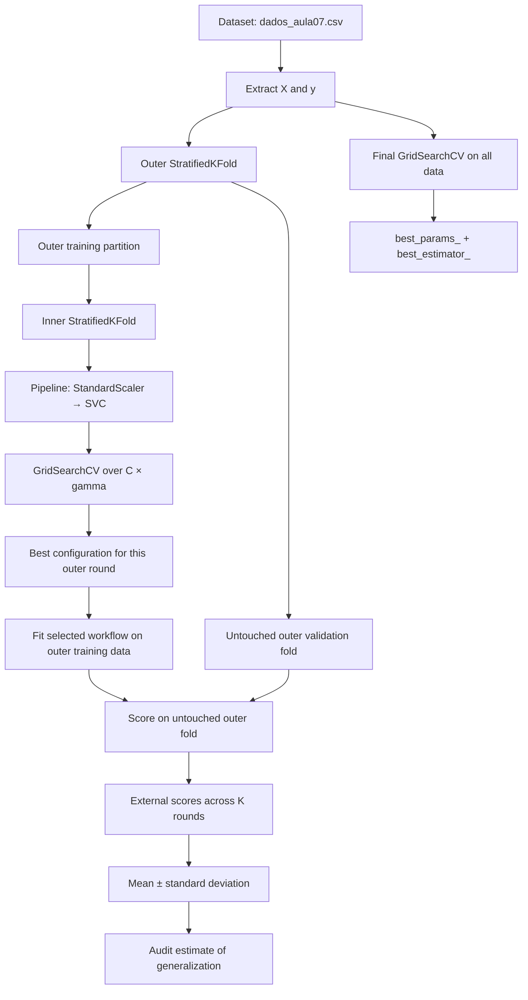
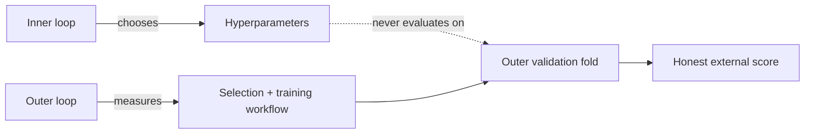

# [Class 7](): [Nested Cross-Validation — Honest Hyperparameter Selection and Evaluation]()

> **Course context:** Data Science & Machine Learning — Model Evaluation, Benchmarking & Selection  
> **Institution:** Pontifical Catholic University of São Paulo (PUC-SP)  
> **School:** FACEI — Computer Science Department  
> **Programme:** BSc in Human-Centered AI & Data Science · 6th Semester · 2026  
> **Professor:** ✨ Giovani Giulio Tristão Thibes Vieira  
> **Author:** Fabiana ⚡️ Campanari  
> **Class status:** Implemented laboratory and conceptual lecture material

<p align="center">
  
  
  
  
  
  
</p>

<p align="center">
  <a href="<ADD_URL_HERE>"></a>
  <a href="<ADD_URL_HERE>"></a>
  <a href="<ADD_URL_HERE>"></a>
</p>

<br><br>

## [Repository Identity]()

| Field | Value |
|---|---|
| **Repository name** | `class-13-ai-ml-nested-cross-validation` |
| **GitHub About** | Nested cross-validation with GridSearchCV, SVC pipelines, hyperparameter selection, optimism auditing, and unbiased model evaluation. |
| **Suggested topics** | `ai`, `machine-learning`, `data-science`, `python`, `scikit-learn`, `cross-validation`, `nested-cross-validation`, `gridsearchcv`, `hyperparameter-optimization`, `model-evaluation`, `model-selection`, `support-vector-machines`, `pipeline`, `reproducibility` |
| **Primary notebook** | `1A_class_7_Lab_Nested_Cross_Validation_RESPOSTAS.ipynb` |
| **Input dataset** | `dados_aula07.csv` |

<br><br>

## [Overview]()

This repository documents a laboratory on **Nested Cross-Validation (Nested CV)** for model evaluation after hyperparameter tuning. The class addresses a common evaluation mistake: using the best score produced by a hyperparameter search as the reported estimate of performance on new data.

`GridSearchCV` evaluates several hyperparameter combinations and returns the best observed configuration. Its `best_score_` is therefore the maximum among multiple validation estimates. Even when all candidate configurations have comparable true performance, selecting the largest observed value introduces selection bias: the winner benefits partly from random validation noise. The class calls this effect the **winner’s curse**.

Nested CV separates the two responsibilities:

- The **inner loop** searches for hyperparameters using only the training partition of an outer round.
- The **outer loop** evaluates the complete selection-and-training procedure on a fold that the inner search never observed.

The resulting external fold scores are summarized as mean ± standard deviation. This number estimates how the **model-selection process** is expected to generalize, rather than claiming that one chosen configuration is universally optimal.

<br><br>

## [Table of Contents]()

- [Repository Identity](#repository-identity)
- [Overview](#overview)
- [Class Scope](#class-scope)
- [Learning Objectives](#learning-objectives)
- [The Evaluation Problem](#the-evaluation-problem)
- [Core Definitions](#core-definitions)
- [GridSearchCV and Nested CV](#gridsearchcv-and-nested-cv)
- [Conceptual Architecture](#conceptual-architecture)
- [Implemented Technology Stack](#implemented-technology-stack)
- [Dataset and Experimental Setup](#dataset-and-experimental-setup)
- [Mathematical Foundations](#mathematical-foundations)
- [Implementation](#implementation)
- [Manual Outer-Loop Reconstruction](#manual-outer-loop-reconstruction)
- [Demonstrated Results](#demonstrated-results)
- [Interpretation](#interpretation)
- [Final Model Selection](#final-model-selection)
- [When to Use Nested CV](#when-to-use-nested-cv)
- [Advantages and Limitations](#advantages-and-limitations)
- [Responsible AI and Reproducibility](#responsible-ai-and-reproducibility)
- [Recommended Production Evolution](#recommended-production-evolution)
- [References](#references)
- [Conclusion](#conclusion)

<br><br>

## [Class Scope]()

The supplied class handout and completed notebook establish the following scope:

- Hyperparameters versus model parameters.
- `GridSearchCV` as a hyperparameter-selection mechanism.
- Why a search’s `best_score_` is not an unbiased generalization estimate.
- The winner’s curse caused by selecting the maximum among repeated noisy measurements.
- Nested CV with an inner selection loop and an outer evaluation loop.
- `Pipeline`-based scaling and SVC training without preprocessing leakage.
- `StratifiedKFold` for both inner and outer classification splits.
- Manual reconstruction of the outer loop to reveal what `cross_val_score(GridSearchCV(...))` does internally.
- Computational-cost comparison between search alone and Nested CV.
- Repeated-seed experiments to measure optimism.
- Comparison with repeated hold-out evaluation.
- A final `GridSearchCV` fitted on all available data to obtain the deployable model.

The class does **not** implement a deployed API, frontend, database, cloud environment, model registry, or production monitoring system. Those topics appear only in the recommended evolution section and are explicitly labeled as future work.

<br><br>

## [Learning Objectives]()

By the end of this class, the learner should be able to:

- Distinguish a learned model parameter from a user-defined hyperparameter.
- Explain why the maximum score from several candidate configurations is optimistic.
- Describe the winner’s curse in hyperparameter search.
- Explain the responsibilities of Nested CV’s inner and outer loops.
- Build a leakage-safe `Pipeline` containing `StandardScaler` and `SVC`.
- Configure `GridSearchCV` over a parameter grid.
- Pass a `GridSearchCV` object to `cross_val_score` to perform Nested CV.
- Report the external mean and standard deviation instead of reporting `best_score_` as final performance.
- Reconstruct the outer loop manually with `StratifiedKFold.split`.
- Explain why selected hyperparameters can differ across outer folds.
- Quantify the computational cost of Nested CV.
- Explain the distinct roles of the Nested CV estimate and the final search fitted on all data.

<br><br>

## [The Evaluation Problem]()

### [***The winner’s curse***]()

Assume several candidate configurations have the same true expected score. Each validation score still contains sampling noise. If the experiment retains only the largest observed score, the selected configuration is likely to include favorable noise.

The notebook simulates measurements around a true score of 0.80 with standard deviation 0.04. The sample mean remains close to 0.80 as the number of attempts grows, while the maximum becomes increasingly optimistic:

| Number of attempts | Mean simulated score | Maximum simulated score |
|---:|---:|---:|
| 9 | 0.809 | 0.852 |
| 100 | 0.801 | 0.880 |
| 1,000 | 0.798 | 0.923 |

The important conclusion is not that all searches are invalid. Search is necessary to choose a configuration. The conclusion is that the **best validation score is a selection statistic**: it is useful for deciding, but it should not automatically be reported as an estimate of unseen-data performance.

### [***The golden rule***]()

> **Who chooses must not measure on the same data.**

A measurement used to select hyperparameters has influenced the decision. A separate measurement is required to audit that decision. Nested CV applies this separation repeatedly across outer folds.

<br><br>

## [Core Definitions]()

| Concept | Meaning in this class |
|---|---|
| **Model parameter** | A value learned automatically during `fit`, such as model weights or decision boundaries. |
| **Hyperparameter** | A value selected before model fitting that controls how the algorithm learns, such as SVC `C` or `gamma`. |
| **Grid search** | Exhaustive evaluation of a predefined grid of hyperparameter combinations. |
| **Inner CV** | Cross-validation used inside the outer training partition to choose hyperparameters. |
| **Outer CV** | Cross-validation used to measure the selected workflow on an untouched partition. |
| **Nested CV** | An evaluation design in which hyperparameter selection occurs inside each outer training fold. |
| **`best_score_`** | The best mean internal-validation score observed by `GridSearchCV`; useful for selection, potentially optimistic for reporting. |
| **External score** | The score measured on the outer fold that did not participate in that round’s search. |
| **Final search** | A single `GridSearchCV` fitted on all available development data after Nested CV has audited the process. |

<br><br>

## [GridSearchCV and Nested CV]()

### [***GridSearchCV selects and delivers***]()

`GridSearchCV` evaluates every parameter combination using cross-validation on the data provided to `.fit()`. It returns:

- `best_params_`: the winning configuration.
- `best_estimator_`: the estimator refitted using the best configuration.
- `best_score_`: the highest mean validation score found during the search.

This makes it the correct tool for producing a final model configuration. However, `best_score_` is the maximum among tested candidates and is therefore not automatically an honest performance estimate.

### [***Nested CV audits the selection process***]()

Nested CV does not replace `GridSearchCV`; it places the entire search inside an outer evaluation loop.

- In each outer round, a fresh search chooses hyperparameters using only the outer training subset.
- The chosen workflow is scored on the outer validation subset.
- The external scores are aggregated as mean ± standard deviation.

Nested CV produces an audit estimate, not a final deployable estimator. The model to deliver still comes from one final search on all available data.

| Question | Appropriate mechanism | Output |
|---|---|---|
| Which configuration should be fitted for delivery? | Final `GridSearchCV` on all development data | `best_params_`, `best_estimator_` |
| How reliable is the selection-and-training procedure? | Nested CV | External-score mean ± standard deviation |

<br><br>

## [Conceptual Architecture]()



### [***Responsibility separation***]()



The outer validation fold remains outside its round’s entire selection process. This is the structural reason that the external score is suitable for evaluation.

<br><br>

## [Implemented Technology Stack]()

| Category | Technology | Role in the supplied notebook |
|---|---|---|
| Programming | Python | Notebook implementation language |
| Numerical computing | NumPy | Random simulation, arrays, aggregates |
| Tabular analysis | Pandas | CSV loading and `cv_results_` tables |
| Visualization | Matplotlib | Seed-based score comparison plots |
| ML framework | scikit-learn | Pipelines, splitters, SVC, grid search, scoring |
| Preprocessing | `StandardScaler` | Fold-local feature standardization |
| Classification model | `SVC` | Support Vector Classifier under tuning |
| Model selection | `GridSearchCV` | Inner-loop hyperparameter selection |
| Evaluation | `cross_val_score`, `StratifiedKFold` | Nested external evaluation |

No external service, database, frontend framework, API, deployment platform, or MLOps platform was implemented in the supplied material.

<br><br>

## [Dataset and Experimental Setup]()

### [***Data source***]()

The notebook reads a local file:

```python
df = pd.read_csv("dados_aula07.csv")
X = df.drop(columns="target").values
y = df["target"].values
```

The supplied materials do not provide a dataset card, feature names, source provenance, license, or domain description for `dados_aula07.csv`. Therefore, this README does not infer those facts.

### [***Model pipeline***]()

The lab defines a fresh pipeline for each search:

```python
from sklearn.pipeline import Pipeline
from sklearn.preprocessing import StandardScaler
from sklearn.svm import SVC


def novo_pipe():
    """Create a new leakage-safe pipeline for each fitting procedure."""
    return Pipeline([
        ("esc", StandardScaler()),
        ("svc", SVC())
    ])
```

`StandardScaler` is inside the `Pipeline`, so its statistics are fitted only on the training partition of each fold. This avoids preprocessing leakage into validation data.

### [***Hyperparameter grid***]()

```python
GRADE = {
    "svc__C": [0.1, 1, 10],
    "svc__gamma": [0.01, 0.1, 1]
}
```

The experiment evaluates 3 values of `C` and 3 values of `gamma`, yielding:

\[
3 \times 3 = 9
\]

candidate SVC configurations.

### [***Splitters***]()

```python
from sklearn.model_selection import StratifiedKFold

interno = StratifiedKFold(5, shuffle=True, random_state=0)
externo = StratifiedKFold(5, shuffle=True, random_state=0)
```

Both loops use 5-fold stratified splitting. Stratification is relevant because this is a classification task and helps preserve class proportions in each fold.

<br><br>

## [Mathematical Foundations]()

### [***External Nested CV estimate***]()

Let \(s_1, s_2, \ldots, s_K\) be the scores obtained on the outer validation folds after the inner loop has selected hyperparameters independently in each outer round. The Nested CV mean is:

\[
\bar{s}_{\text{outer}} = \frac{1}{K}\sum_{k=1}^{K}s_k
\]

The population-form standard deviation reported by the notebook is:

\[
\sigma_{\text{outer}} = \sqrt{\frac{1}{K}\sum_{k=1}^{K}(s_k - \bar{s}_{\text{outer}})^2}
\]

The report format is:

\[
\bar{s}_{\text{outer}} \pm \sigma_{\text{outer}}
\]

This summarizes the measured behavior of the full selection process across outer splits.

### [***Search cost***]()

For \(G\) hyperparameter combinations, \(K_{\text{inner}}\) inner folds, and \(K_{\text{outer}}\) outer folds:

\[
\text{fits}_{\text{search}} = G \times K_{\text{inner}}
\]

\[
\text{fits}_{\text{nested}} = G \times K_{\text{inner}} \times K_{\text{outer}}
\]

For the demonstrated setup:

\[
G = 9,\quad K_{\text{inner}} = 5,\quad K_{\text{outer}} = 5
\]

\[
\text{fits}_{\text{search}} = 9 \times 5 = 45
\]

\[
\text{fits}_{\text{nested}} = 9 \times 5 \times 5 = 225
\]

Nested CV therefore requires five times as many grid-search fits as the non-nested search in this configuration.

### [***Measured optimism***]()

For a non-nested search score \(b\) and Nested CV estimate \(n\), the notebook defines optimism as:

\[
\text{optimism} = b - n
\]

A positive value means the selected internal best score exceeds the external Nested CV estimate.

<br><br>

## [Implementation]()

### [***Run a non-nested hyperparameter search***]()

This search selects a candidate configuration using internal CV on the full supplied dataset.

```python
from sklearn.model_selection import GridSearchCV

busca = GridSearchCV(
    estimator=novo_pipe(),
    param_grid=GRADE,
    cv=interno
)

busca.fit(X, y)

print("best_params_:", busca.best_params_)
print(f"best_score_ : {busca.best_score_:.4f}")

resultados = pd.DataFrame(busca.cv_results_)[
    ["param_svc__C", "param_svc__gamma", "mean_test_score", "std_test_score"]
].sort_values(by="mean_test_score", ascending=False)

print(resultados.to_string(index=False))
```

**Expected behavior:** `GridSearchCV` evaluates all 9 combinations, ranks them according to internal cross-validation performance, and exposes the highest internal mean as `best_score_`.

**Interpretation:** This score is used to choose. It should not be confused with a fully independent estimate of performance on new data.

### [***Transform the search into Nested CV***]()

The central implementation idea is to pass the entire search object into `cross_val_score`:

```python
from sklearn.model_selection import cross_val_score

notas = cross_val_score(
    estimator=busca,
    X=X,
    y=y,
    cv=externo
)

print("5 external scores:", np.round(notas, 4))
print(f"Nested CV mean = {notas.mean():.4f}")
print(f"Nested CV std  = {notas.std():.4f}")
print(f"Optimism relative to best_score_: {busca.best_score_ - notas.mean():.4f}")
```

`cross_val_score` clones and fits the supplied `GridSearchCV` object for each outer training fold. Each clone executes its own inner search; then the selected workflow is evaluated on that outer fold’s held-out data.

### [***Why the pipeline is inside the search***]()

The estimator provided to `GridSearchCV` is a pipeline rather than bare `SVC`:

```python
Pipeline([
    ("esc", StandardScaler()),
    ("svc", SVC())
])
```

Every inner and outer fitting operation estimates scaling parameters from its current training partition only. The validation and outer test partitions are transformed using those training-derived values, rather than contributing to the scaler fit.

<br><br>

## [Manual Outer-Loop Reconstruction]()

The following implementation makes explicit what `cross_val_score(busca, X, y, cv=externo)` does internally:

```python
notas_mao = []
escolhas = []

for i, (tr, te) in enumerate(externo.split(X, y), start=1):
    busca_externa = GridSearchCV(
        estimator=novo_pipe(),
        param_grid=GRADE,
        cv=interno
    )

    # The inner search sees only the outer training partition.
    busca_externa.fit(X[tr], y[tr])

    # The outer test partition was excluded from the search.
    nota_externa = busca_externa.score(X[te], y[te])

    notas_mao.append(nota_externa)
    escolhas.append(busca_externa.best_params_)

    print(
        f"Round {i}: best_params_={busca_externa.best_params_} "
        f"| external_score={nota_externa:.4f}"
    )

print("External scores:", np.round(notas_mao, 4))
print(f"Manual Nested CV mean: {np.mean(notas_mao):.4f}")
```

This procedure confirms the separation of duties:

1. The inner loop selects a configuration from data in `X[tr]` and `y[tr]`.
2. The outer fold `X[te]` and `y[te]` remains unseen by that selection.
3. The outer score evaluates the selected workflow on data untouched by the selection step.

<br><br>

## [Demonstrated Results]()

### [***Winner’s-curse simulation***]()

The notebook simulated repeated noisy measurements around a common true score of 0.80.

| Attempts | Mean | Maximum |
|---:|---:|---:|
| 9 | 0.809 | 0.852 |
| 100 | 0.801 | 0.880 |
| 1,000 | 0.798 | 0.923 |

The mean remains near the underlying value; the maximum grows with the number of attempts. This demonstrates why a search champion can be optimistic even when no candidate is intrinsically superior.

### [***Grid-search plateau***]()

The notebook confirmed that `best_score_` exactly equals the maximum `mean_test_score` in `cv_results_`. It also found that **5 of 9** tested combinations were within one standard deviation of the champion’s mean internal score.

This plateau indicates that several configurations had similar measured internal performance. Selecting only the first-ranked configuration should therefore be interpreted carefully: small ranking differences can arise from fold composition and validation noise.

### [***Nested CV result***]()

The demonstrated Nested CV external scores were:

```text
[0.9000, 0.8167, 0.8500, 0.9167, 0.7500]
```

| Metric | Demonstrated result |
|---|---:|
| Non-nested `best_score_` | 0.8633 |
| Nested CV external mean | 0.8467 |
| Nested CV external standard deviation | 0.0600 |
| Measured optimism | 0.0167 |

The lower Nested CV mean is not evidence that the model became worse. The two values answer different questions:

- `0.8633` is the best internal-validation mean among candidate configurations.
- `0.8467 ± 0.0600` estimates the expected performance of the selection-and-training process on data excluded from each search.

### [***Computational cost***]()

| Approach | Fit count | Demonstrated runtime |
|---|---:|---:|
| Search only | 45 | approximately 0.33 s |
| Nested CV | 225 | approximately 1.48 s |
| Nested / search ratio | 5.00× fits | 4.48× runtime |

Runtime is hardware- and environment-dependent. The measured values are specific to the supplied notebook run; the fit-count formulas are the general structural comparison for this grid and split configuration.

### [***Hyperparameter variation across outer folds***]()

The notebook found three distinct selected combinations across five outer rounds:

| Selected combination | Frequency |
|---|---:|
| `{'svc__C': 1, 'svc__gamma': 0.1}` | 3 |
| `{'svc__C': 10, 'svc__gamma': 0.01}` | 1 |
| `{'svc__C': 0.1, 'svc__gamma': 0.1}` | 1 |

This variation is expected. Nested CV does not attempt to prove that one fixed `C` is universally best. It evaluates how reliably the **selection procedure** performs when its training data changes slightly.

### [***Repeated-seed optimism audit***]()

Across 10 random seeds, the notebook reported:

| Metric | Demonstrated result |
|---|---:|
| Mean optimism: non-nested `best_score_` − Nested CV mean | 0.0117 |
| Seeds where Nested CV was lower | 8 of 10 |

This repeated experiment supports the conceptual expectation that selecting the internal maximum often yields a more optimistic score than outer evaluation.

### [***Repeated hold-out comparison***]()

The notebook also repeated a 70/30 stratified hold-out procedure across 10 seeds.

| Metric | Demonstrated result |
|---|---:|
| Range of separate-test scores | 0.7556 to 0.8889 |
| Hold-out amplitude: max − min | 0.1333 |
| Nested CV standard deviation | 0.0600 |

A single untouched test split follows the golden rule, but its estimate may depend substantially on the particular partition. Nested CV uses several outer measurements and reports their dispersion directly.

<br><br>

## [Interpretation]()

### [***Nested CV evaluates a procedure, not one hyperparameter***]()

When the selected `C` or `gamma` changes between outer rounds, the Nested CV design is working as intended. Each outer training partition is slightly different, so the inner search can reasonably select different configurations.

The external mean answers:

> If this hyperparameter-selection workflow is applied to comparable unseen data, what performance should be expected?

It does **not** answer:

> Is one particular value of `C` the permanently optimal value for all future datasets?

### [***Why the Nested score can be lower***]()

The non-nested `best_score_` is the winner of nine attempts. The Nested CV mean measures each selected winner on data not used to select it. The gap between these values represents measured selection optimism in this experiment.

A lower Nested estimate means the evaluation became more honest; it does not mean the underlying SVC algorithm changed or that the final model was made weaker.

<br><br>

## [Final Model Selection]()

Nested CV provides the reportable evaluation estimate, but it does not return the one final model to deliver. After auditing the procedure, the notebook runs a final search on all available data:

```python
final = GridSearchCV(
    estimator=novo_pipe(),
    param_grid=GRADE,
    cv=interno
).fit(X, y)

print(f"ANNOUNCE (Nested CV): {notas.mean():.4f}")
print(f"DELIVER (final search best_score_): {final.best_score_:.4f}")
print(f"Best final parameters: {final.best_params_}")
print("Final estimator:", final.best_estimator_)
```

### [***Demonstrated final outcome***]()

| Responsibility | Result |
|---|---|
| **Announce** — audit estimate | Nested CV mean: `0.8467` |
| **Deliver** — fitted model configuration | `{'svc__C': 1, 'svc__gamma': 0.1}` |
| **Final-search internal best score** | `0.8633` |

The final search’s `best_score_` is documented here as a selection result, not as a replacement for the Nested CV estimate.

<br><br>

## [When to Use Nested CV]()

| Situation | Recommended approach | Rationale |
|---|---|---|
| Large dataset with a completely untouched final test set | Grid search on training data + one final test evaluation | The test set already provides an independent measurement. |
| Small dataset where reserving a fixed test subset is costly | Nested CV | Every example can participate in external measurement once and in training in other rounds. |
| The final test set influenced grid refinement or decisions | Nested CV | The test is no longer independent once it affects selection choices. |
| Need a deployable model | Final `GridSearchCV` on all development data | This is the step that produces `best_params_` and `best_estimator_`. |
| Need an honest statement about expected generalization | Nested CV, then final search | Nested CV audits; the final search delivers. |

<br><br>

## [Advantages and Limitations]()

### [***Advantages***]()

- Separates hyperparameter selection from performance measurement.
- Reduces selection bias associated with reporting a search maximum.
- Reports several external scores rather than relying on one held-out split.
- Produces an uncertainty indicator through the outer-fold standard deviation.
- Uses all available examples more intensively than a single fixed hold-out test in small-data settings.
- Preserves leakage-safe preprocessing through the `Pipeline` structure.

### [***Limitations***]()

- Computational cost grows multiplicatively with grid size, inner folds, and outer folds.
- Outer-fold estimates still vary with data size, class balance, splitting strategy, scoring metric, and random seed.
- Nested CV audits a selection process but does not provide a single production estimator by itself.
- The selected configuration may vary across outer folds; this is expected but can complicate simplistic interpretations.
- Results in this repository are tied to the supplied dataset, SVC, parameter grid, split configuration, and scoring defaults. They should not be generalized to other datasets or tasks without repetition.
- Runtime results are environment-specific.

<br><br>

## [Responsible AI and Reproducibility]()

### [***Evaluation integrity***]()

Model evaluation affects claims about expected performance. Reporting the best observed score from a search without acknowledging selection bias can mislead stakeholders about model reliability. Nested CV is an evaluation-governance practice: it creates a clearer boundary between choosing and measuring.

### [***Data governance***]()

The supplied material does not provide the origin, domain, sensitive attributes, collection process, license, or privacy characteristics of `dados_aula07.csv`. Consequently, claims about fairness, privacy compliance, demographic bias, or domain impact cannot be made from the supplied sources.

Before applying this workflow to a real system, assess:

- Whether features or labels contain personal, sensitive, or proprietary information.
- Whether stratification is sufficient for relevant subgroups.
- Whether the scoring metric reflects the actual cost of false positives and false negatives.
- Whether the dataset represents the deployment population.
- Whether experiments, seeds, grids, metrics, and data versions are documented.

### [***Reproducibility controls demonstrated***]()

The notebook uses explicit random seeds, notably `random_state=0`, and defines reusable splitters and pipelines. These practices make a particular experiment repeatable. Reproducibility does not guarantee external validity; it makes the experimental procedure inspectable.

<br><br>

## [Recommended Production Evolution]()

The following items are **recommended engineering extensions**. They were not implemented in the supplied Class 13 materials.


Potential next steps:

- Move notebook logic into parameterized Python modules.
- Version datasets, parameter grids, scoring metrics, and split seeds.
- Add unit tests for pipeline construction, search-space validation, and splitter behavior.
- Add experiment tracking for outer scores, chosen configurations, runtime, and package versions.
- Evaluate metrics aligned with the deployment problem rather than relying on estimator defaults.
- Use randomized or successive-halving search when exhaustive grids become too expensive, while preserving independent evaluation.
- Add confidence intervals, bootstrap analysis, or repeated Nested CV when statistical uncertainty requires deeper analysis.
- Evaluate subgroup performance when the task involves people or heterogeneous populations.
- Define model-monitoring and retraining criteria only after a genuine deployment context exists.

<br><br>

## [Suggested Repository Structure]()

The following is a **recommended repository organization**, not a claim that every file already exists.

```text
class-13-ai-ml-nested-cross-validation/
├── README.md
├── README_MASTER.md
├── notebooks/
│   └── 1A_class_7_Lab_Nested_Cross_Validation_RESPOSTAS.ipynb
├── data/
│   └── dados_aula07.csv
├── slides/
│   └── nested-cross-validation-presentation.html
├── docs/
│   └── class-13-handout.pdf
└── requirements.txt
```

<br><br>

## [Installation and Usage]()

The supplied notebook imports the following Python libraries:

```text
numpy
pandas
matplotlib
scikit-learn
```

A compatible local environment can be created as follows:

```bash
git clone <repository-url>
cd class-13-ai-ml-nested-cross-validation

python -m venv .venv
source .venv/bin/activate

pip install numpy pandas matplotlib scikit-learn jupyter
jupyter notebook
```

On Windows PowerShell:

```powershell
python -m venv .venv
.venv\Scripts\Activate.ps1
pip install numpy pandas matplotlib scikit-learn jupyter
jupyter notebook
```

Open the notebook and run it from top to bottom:

```text
1A_class_7_Lab_Nested_Cross_Validation_RESPOSTAS.ipynb
```

The notebook expects `dados_aula07.csv` to be available at the path used by:

```python
pd.read_csv("dados_aula07.csv")
```

No API keys, environment variables, cloud credentials, or external services are required by the demonstrated Nested CV workflow. The initial `userdata.get('GOOGLE_API_KEY')` line shown in the supplied notebook content is not used by the class implementation described here and should not be required for this lab.

<br><br>

## [References]()

- Supplied class handout: **Nested CV / Validação aninhada**.
- Supplied completed notebook: **Lecture 07 — Lab: Nested Cross-Validation**.
- [scikit-learn — GridSearchCV documentation](https://scikit-learn.org/stable/modules/generated/sklearn.model_selection.GridSearchCV.html).
- [scikit-learn — cross_val_score documentation](https://scikit-learn.org/stable/modules/generated/sklearn.model_selection.cross_val_score.html).
- [scikit-learn — Pipeline documentation](https://scikit-learn.org/stable/modules/generated/sklearn.pipeline.Pipeline.html).
- [scikit-learn — StratifiedKFold documentation](https://scikit-learn.org/stable/modules/generated/sklearn.model_selection.StratifiedKFold.html).
- Cawley, G. C., & Talbot, N. L. C. (2010). *On over-fitting in model selection and subsequent selection bias in performance evaluation*. Journal of Machine Learning Research, 11, 2079–2107.

<br><br>

## [Conclusion]()

This class demonstrates that hyperparameter selection and performance measurement are related but different tasks. `GridSearchCV` is used to search the parameter grid and produce a model configuration; Nested CV evaluates whether that selection process is likely to generalize to data it did not use for selection.

The laboratory implemented a leakage-safe `StandardScaler → SVC` pipeline, a 9-combination grid over `C` and `gamma`, 5-fold stratified inner CV, and 5-fold stratified outer CV. In the demonstrated run, the search’s internal best score was `0.8633`, while Nested CV reported `0.8467 ± 0.0600`, measuring `0.0167` of optimism in that comparison.

The practical rule remains concise:

> **The inner loop chooses. The outer loop measures.**

After that audit, a final search over all available data produces the model to deliver. This separation makes model evaluation more transparent, reproducible, and credible for machine-learning engineering decisions.
