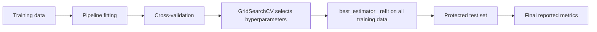
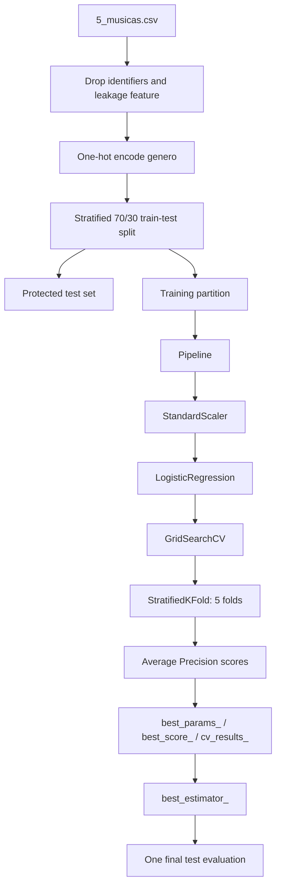

# [Class 08](): [Hyperparameter Search — GridSearchCV for Imbalanced Music-Hit Classification]()

> **Course context:** Data Science & Machine Learning — Model Evaluation, Benchmarking & Selection  
> **Institution:** Pontifical Catholic University of São Paulo (PUC-SP)  
> **School:** FACEI — Computer Science Department  
> **Programme:** BSc in Human-Centered AI & Data Science · 6th Semester · 2026  
> **Professor:** ✨ Giovani Giulio Tristão Thibes Vieira  
> **Author:** Fabiana ⚡️ Campanari  
> **Class status:** Implemented laboratory and review material

<p align="center">
  
  
  
  
  
  
</p>

<p align="center">
  <a href="<ADD_URL_HERE>"></a>
  <a href="<ADD_URL_HERE>"></a>
  <a href="<ADD_URL_HERE>"></a>
</p>

<br><br>

## [Repository Identity]()

| Field | Value |
|---|---|
| **Repository name** | `class-08-ai-ml-hyperparameter-search-grid-search` |
| **GitHub About** | GridSearchCV for leakage-safe Logistic Regression tuning, imbalanced music-hit classification, validation analysis, and test-set confirmation. |
| **Suggested topics** | `ai`, `machine-learning`, `data-science`, `python`, `scikit-learn`, `grid-search`, `gridsearchcv`, `hyperparameter-tuning`, `model-selection`, `model-evaluation`, `logistic-regression`, `imbalanced-learning`, `average-precision`, `stratifiedkfold`, `pipeline`, `data-leakage` |
| **Primary dataset** | `5_musicas.csv` |
| **Lab notebooks** | `1-class_8_Lab_Hyperparameter-Search_Grid-Search.ipynb` and `1A_class_8_Lab_Hyperparameter_Search_Grid_Search_RESPOSTAS.ipynb` |
| **Primary library** | scikit-learn |

<br><br>

## [Overview]()

This repository documents **Class 08 — Hyperparameter Search with GridSearchCV**. The class moves from evaluating a fixed model configuration to selecting a configuration systematically while protecting the final test set.

The implemented laboratory uses a music-hit classification problem in which approximately 12% of tracks are labeled as hits. A leakage-safe `Pipeline` combines `StandardScaler` and `LogisticRegression`; `GridSearchCV` then evaluates a grid over logistic-regression regularization strength `C` and `class_weight`. Because the positive class is rare, the search uses `average_precision` rather than accuracy as its primary optimization metric.

The central operational rule is:

> **Training learns, validation chooses, and the test set confirms — once.**

Grid search is exhaustive: it evaluates every parameter combination in the supplied grid, each across cross-validation folds. The class therefore addresses both the value of systematic search and its risks: computational explosion, selection optimism, leakage, metric mismatch, unstable winners, and overfitting to validation.

<br><br>

## [Table of Contents]()

- [Repository Identity](#repository-identity)
- [Overview](#overview)
- [Class Scope](#class-scope)
- [Learning Objectives](#learning-objectives)
- [Core Concepts](#core-concepts)
- [The Golden Rule](#the-golden-rule)
- [Implemented Architecture](#implemented-architecture)
- [Technology Stack](#technology-stack)
- [Dataset and Data Preparation](#dataset-and-data-preparation)
- [Pipeline and Search Space](#pipeline-and-search-space)
- [Mathematical Foundations](#mathematical-foundations)
- [Implementation](#implementation)
- [GridSearchCV Outputs](#gridsearchcv-outputs)
- [Demonstrated Results](#demonstrated-results)
- [Reading the Plateau](#reading-the-plateau)
- [Validation Overfitting Signals](#validation-overfitting-signals)
- [Metric Selection for Imbalanced Data](#metric-selection-for-imbalanced-data)
- [Advantages and Limitations](#advantages-and-limitations)
- [Responsible AI and Reproducibility](#responsible-ai-and-reproducibility)
- [Use Cases](#use-cases)
- [Recommended Production Evolution](#recommended-production-evolution)
- [Installation and Usage](#installation-and-usage)
- [References](#references)
- [Conclusion](#conclusion)

<br><br>

## [Class Scope]()

The supplied handout and completed notebook establish the following class scope:

- Distinguishing learned model parameters from user-defined hyperparameters.
- Using `GridSearchCV` as an exhaustive search over a predefined parameter grid.
- Building a leakage-safe `Pipeline` containing preprocessing and classification.
- Addressing pipeline parameters using the `step_name__parameter_name` convention.
- Using `StratifiedKFold` for an imbalanced binary classification task.
- Choosing `average_precision` as a search metric for a rare positive class.
- Reading `best_params_`, `best_score_`, `best_estimator_`, and `cv_results_` correctly.
- Identifying plateaus rather than over-interpreting tiny score differences.
- Estimating grid-search cost as combinations × cross-validation folds.
- Touching the final test set once after search completion.
- Comparing `average_precision`, accuracy, and F1 as optimization objectives.
- Recognizing signals that a large search is forcing validation data.

The supplied class material does **not** implement a web application, API, deployment environment, database, model registry, cloud service, or production monitoring. Those topics are only described as recommended future engineering work.

<br><br>

## [Learning Objectives]()

By the end of this class, the learner should be able to:

- Explain the difference between a model parameter and a hyperparameter.
- Describe why hyperparameters must be selected with validation data rather than final test data.
- Configure `GridSearchCV` over an sklearn `Pipeline`.
- Use `clf__C` and `clf__class_weight` to target hyperparameters inside a named pipeline step.
- Use stratified cross-validation in an imbalanced classification workflow.
- Explain why accuracy can be misleading when hits are rare.
- Select `average_precision`, F1, or ROC AUC according to the evaluation objective.
- Calculate the number of fits implied by a search grid.
- Interpret `best_params_`, `best_score_`, `best_estimator_`, and `cv_results_`.
- Identify a performance plateau and prefer a simpler comparable configuration.
- Evaluate the selected estimator once on the protected test set.
- Recognize signs of validation overfitting caused by an excessively large hyperparameter search.

<br><br>

## [Core Concepts]()

### [***Parameter versus hyperparameter***]()

A **parameter** is learned during model fitting. Examples include logistic-regression coefficients and decision-tree split thresholds.

A **hyperparameter** is specified before fitting and affects how learning occurs. Examples used or discussed in the class include:

- Logistic-regression `C`.
- Logistic-regression `class_weight`.
- Decision-tree `max_depth`.
- k-nearest-neighbors `k`.

The laboratory demonstrates this distinction with a decision tree. `max_depth=3` is chosen before fitting, while the feature and threshold used at the root node are learned from the data.

### [***Exhaustive grid search***]()

`GridSearchCV` evaluates every combination in a supplied grid. For the implemented Logistic Regression search:

```python
grade = {
    "clf__C": [0.01, 0.1, 1, 10, 100],
    "clf__class_weight": [None, "balanced"],
}
```

There are 5 values of `C` and 2 values of `class_weight`, giving 10 candidate configurations. Each one is evaluated through cross-validation.

### [***Selection is not final measurement***]()

`best_score_` is the best cross-validation score found during search. It is used to select a configuration, but it is not the final number to report as independent generalization performance. The selected `best_estimator_` is evaluated once on the held-out test set.

<br><br>

## [The Golden Rule]()

> **Training learns. Validation chooses. Test confirms once.**

The full parameter search operates inside cross-validation using training data. The test partition remains untouched during hyperparameter selection and is evaluated once after the selected estimator is available.



Using the test set repeatedly to choose `C`, `class_weight`, a score metric, or grid ranges would leak test information into model selection. More cross-validation folds do not repair a test set that has already influenced decisions.

<br><br>

## [Implemented Architecture]()



### [***Implemented flow***]()

1. Read the music dataset.
2. Remove identifier columns and `popularidade`, which the class identifies as leakage because it nearly determines the hit label.
3. One-hot encode the categorical `genero` feature.
4. Create a stratified 70/30 training/test split.
5. Keep the test set protected until Exercise 5.
6. Search logistic-regression hyperparameters with 5-fold stratified CV on the training data.
7. Inspect all search results and select the winning pipeline.
8. Score the fitted winning pipeline once on the test set.

<br><br>

## [Technology Stack]()

| Category | Technology | Role in the supplied materials |
|---|---|---|
| Programming | Python | Notebook implementation language |
| Data processing | Pandas | CSV loading, feature operations, result tables |
| Numerical computing | NumPy | Arrays and numerical operations |
| Visualization | Matplotlib | Demonstrated plots in the notebook workflow |
| ML framework | scikit-learn | Pipeline, splitting, search, models, and metrics |
| Preprocessing | `StandardScaler` | Fold-safe feature standardization |
| Classification | `LogisticRegression` | Main tuned classifier |
| Comparison model | `DecisionTreeClassifier` | Parameter versus hyperparameter illustration |
| Baseline model | `DummyClassifier` | Majority-class baseline for metric interpretation |
| Model selection | `GridSearchCV` | Exhaustive hyperparameter search |
| Validation | `StratifiedKFold` | Class-proportion-preserving cross-validation |
| Metrics | Average Precision, ROC AUC | Search and final evaluation measures |

<br><br>

## [Dataset and Data Preparation]()

### [***Dataset***]()

The laboratory reads `5_musicas.csv`. Each row represents a music track, and the binary target `hit` indicates a hit. The completed notebook reports:

| Dataset property | Demonstrated value |
|---|---:|
| Feature matrix after preparation | `(1050, 18)` |
| Hit prevalence | `0.122` |
| Training rows | `735` |
| Test rows | `315` |
| Hits in test set | `38` |

The supplied material does not provide the collection source, license, complete feature dictionary, or external provenance of the dataset. Those details should not be inferred.

### [***Leakage prevention***]()

The notebook removes the following columns before fitting:

```python
X = mus.drop(columns=[
    "id",
    "titulo",
    "artista",
    "popularidade",
    "hit",
])
```

The class explicitly identifies `popularidade` as leakage because it nearly determines whether a track is labeled a hit. `genero` is encoded as binary columns:

```python
X = pd.get_dummies(X, columns=["genero"])
```

### [***Protected split***]()

```python
X_tr, X_te, y_tr, y_te = train_test_split(
    X,
    y,
    test_size=0.3,
    stratify=y,
    random_state=0,
)
```

Stratification preserves the rare-hit proportion across training and test partitions. The test data is intentionally reserved until the final evaluation exercise.

<br><br>

## [Pipeline and Search Space]()

### [***Leakage-safe pipeline***]()

```python
from sklearn.pipeline import Pipeline
from sklearn.preprocessing import StandardScaler
from sklearn.linear_model import LogisticRegression

pipe = Pipeline([
    ("esc", StandardScaler()),
    ("clf", LogisticRegression(max_iter=2000)),
])
```

The whole pipeline is supplied to `GridSearchCV`, not only the classifier. This ensures that the scaler is fitted only on the training subset of each cross-validation fold. Scaling the whole training set before cross-validation would allow validation information to influence preprocessing statistics.

### [***Search grid***]()

```python
grade = {
    "clf__C": [0.01, 0.1, 1, 10, 100],
    "clf__class_weight": [None, "balanced"],
}
```

The `clf__` prefix means “set this parameter on the pipeline step named `clf`.” In sklearn pipelines, hyperparameters are addressed as:

\[
\texttt{step\_name\_\_parameter\_name}
\]

The class grid has:

\[
5 \text{ values of } C \times 2 \text{ class-weight options} = 10 \text{ combinations}
\]

### [***Stratified validation and scoring***]()

```python
from sklearn.model_selection import StratifiedKFold

cv = StratifiedKFold(
    n_splits=5,
    shuffle=True,
    random_state=0,
)
```

```python
busca = GridSearchCV(
    pipe,
    grade,
    scoring="average_precision",
    cv=cv,
)
```

The primary search score is `average_precision`. With approximately 12% positives, accuracy can be high for a model that predicts the negative class for every track. Average Precision is more aligned with ranking positive hits above non-hits.

<br><br>

## [Mathematical Foundations]()

### [***Grid size and fit cost***]()

For a grid with \(m_1, m_2, \ldots, m_p\) candidate values per hyperparameter and \(K\) cross-validation folds:

\[
N_{\text{combinations}} = \prod_{j=1}^{p} m_j
\]

\[
N_{\text{fits}} = K \times \prod_{j=1}^{p} m_j
\]

For the implemented search:

\[
N_{\text{fits}} = 5 \times 5 \times 2 = 50
\]

A hypothetical next-lab random-forest grid discussed in the notebook has five axes with 4, 5, 4, 4, and 4 values:

\[
4 \times 5 \times 4 \times 4 \times 4 = 1280 \text{ combinations}
\]

With 5 folds:

\[
1280 \times 5 = 6400 \text{ fits}
\]

This is 128 times the 50-fit Logistic Regression search.

### [***Average Precision***]()

Average Precision summarizes precision values across recall changes induced by a ranked list of predicted probabilities. It is especially useful when the positive class is uncommon because it emphasizes ranking and retrieval of positive cases rather than rewarding majority-class predictions.

A majority-class baseline may produce high accuracy while producing no useful positive ranking. The notebook demonstrates this with a dummy classifier: accuracy is 0.878 while Average Precision is 0.122, equal to the hit prevalence.

<br><br>

## [Implementation]()

### [***Environment and data loading***]()

```python
import warnings
warnings.filterwarnings("ignore")

import time
import numpy as np
import pandas as pd
import matplotlib.pyplot as plt

from sklearn.model_selection import train_test_split, GridSearchCV, StratifiedKFold
from sklearn.pipeline import Pipeline
from sklearn.preprocessing import StandardScaler
from sklearn.linear_model import LogisticRegression
from sklearn.tree import DecisionTreeClassifier
from sklearn.dummy import DummyClassifier
from sklearn.metrics import average_precision_score, roc_auc_score

mus = pd.read_csv("5_musicas.csv")
y = mus["hit"]

X = mus.drop(columns=[
    "id", "titulo", "artista", "popularidade", "hit"
])
X = pd.get_dummies(X, columns=["genero"])

X_tr, X_te, y_tr, y_te = train_test_split(
    X, y, test_size=0.3, stratify=y, random_state=0
)
```

### [***Exercise 1 — Parameter and hyperparameter***]()

```python
pipe.fit(X_tr, y_tr)
clf = pipe.named_steps["clf"]

print(f"C: {clf.C}")
print(f"class_weight: {clf.class_weight}")
print(f"coef_ shape: {clf.coef_.shape}")
```

Demonstrated output:

```text
C: 1.0
class_weight: None
coef_ shape: (1, 18)
```

`C` and `class_weight` are hyperparameters. Logistic-regression coefficients in `coef_` are learned parameters.

### [***Exercise 2 — Full GridSearchCV***]()

```python
grade = {
    "clf__C": [0.01, 0.1, 1, 10, 100],
    "clf__class_weight": [None, "balanced"],
}

busca = GridSearchCV(
    pipe,
    grade,
    scoring="average_precision",
    cv=cv,
)

busca.fit(X_tr, y_tr)

print(
    "search completed:",
    len(busca.cv_results_["params"]),
    "combinations tested",
)
```

Demonstrated output:

```text
search completed: 10 combinations tested
```

### [***Exercise 3 — Inspect the winner and the plateau***]()

```python
print("best_params_", busca.best_params_)
print(f"best_score_: {busca.best_score_:.4f}")

tab = pd.DataFrame(busca.cv_results_).sort_values(
    by="rank_test_score"
)
tab["param_clf__class_weight"] = tab[
    "param_clf__class_weight"
].fillna("None")

print(
    tab[
        [
            "param_clf__C",
            "param_clf__class_weight",
            "mean_test_score",
            "std_test_score",
        ]
    ].to_string(index=False)
)

campea = tab.iloc[0]
limite_inferior = (
    campea["mean_test_score"]
    - campea["std_test_score"]
)

dentro = tab[
    tab["mean_test_score"] >= limite_inferior
].shape[0]

print(
    "combinations within 1 standard deviation of champion:",
    dentro,
    "of",
    len(tab),
)
```

### [***Exercise 4 — Estimate the search cost***]()

```python
n_comb = len(busca.cv_results_["params"])
n_dobras = cv.get_n_splits()
n_ajustes = n_comb * n_dobras

print(
    f"current search: {n_comb} combinations × "
    f"{n_dobras} folds = {n_ajustes} fits"
)

n_floresta_comb = 4 * 5 * 4 * 4 * 4
n_floresta_total_treinos = n_floresta_comb * n_dobras

print(
    f"random forest: {n_floresta_comb} combinations × "
    f"{n_dobras} folds = {n_floresta_total_treinos} fits"
)
```

### [***Exercise 5 — Touch the test set once***]()

```python
melhor = busca.best_estimator_
proba_te = melhor.predict_proba(X_te)[:, 1]

ap_te = average_precision_score(y_te, proba_te)
auc_te = roc_auc_score(y_te, proba_te)

print(f"Test AP: {ap_te:.4f} | Test ROC AUC: {auc_te:.4f}")
print(f"best_score_ (validation): {busca.best_score_:.4f}")
```

### [***Exercise 6 — The scoring metric decides the winner***]()

```python
medias = {}

for metrica in ["average_precision", "accuracy", "f1"]:
    g = GridSearchCV(
        pipe,
        grade,
        scoring=metrica,
        cv=cv,
    ).fit(X_tr, y_tr)

    medias[metrica] = g.cv_results_["mean_test_score"]

comp = pd.DataFrame(medias)
comp.index = [
    f"C={p['clf__C']}, cw={p['clf__class_weight']}"
    for p in g.cv_results_["params"]
]

print(comp.round(3))
```

The metric passed through `scoring` is the quantity the search actually maximizes. Therefore, metric choice is a model-selection decision, not a cosmetic reporting choice.

<br><br>

## [GridSearchCV Outputs]()

| Attribute | What it is | Correct use |
|---|---|---|
| `best_params_` | Dictionary containing the configuration with the highest mean CV score | Identify the selected hyperparameter values |
| `best_score_` | Mean validation score of the selected configuration | Select configurations; do not treat as final test evidence |
| `best_estimator_` | Refit pipeline with the selected configuration | Generate predictions on the final test set |
| `cv_results_` | Full table of parameter combinations, means, deviations, and ranks | Inspect plateaus, uncertainty, and the entire ranking |

By default, `refit=True`, so `best_estimator_` is already fitted using the full training partition. It can be used directly with `.predict()` or `.predict_proba()` on the test set.

<br><br>

## [Demonstrated Results]()

### [***Search result***]()

The completed notebook reports:

| Result | Demonstrated value |
|---|---:|
| Best parameters | `{'clf__C': 1, 'clf__class_weight': None}` |
| Best internal CV Average Precision | `0.7207` |
| Number of tested combinations | `10` |
| Plateau size within one standard deviation | `10 of 10` |

The full grid results show that the leading configurations are very close relative to their fold-level standard deviations. This is a plateau: small score differences are not enough to justify a strong claim that one configuration is uniquely superior.

### [***Protected test result***]()

| Metric | Demonstrated value |
|---|---:|
| Test Average Precision | `0.7116` |
| Test ROC AUC | `0.9296` |
| Internal `best_score_` | `0.7207` |

The test AP is close to the validation `best_score_`, which the supplied class material interprets as a healthy outcome for this experiment. The reported generalization result is the score obtained on the protected test set, not the internal `best_score_`.

### [***Computational cost***]()

| Search | Demonstrated workload | Demonstrated time / comparison |
|---|---:|---|
| Logistic Regression grid | 10 combinations × 5 folds = 50 fits | Approximately 2.12 s in the completed notebook run |
| Hypothetical random-forest grid | 1,280 combinations × 5 folds = 6,400 fits | 128× larger than the demonstrated grid |

Measured runtime depends on the machine, package versions, and dataset size. Fit counts are structural consequences of the grid and CV configuration.

<br><br>

## [Reading the Plateau]()

The completed notebook found that all 10 combinations were within one standard deviation of the winning configuration. This means the observed ranking should be treated carefully.

> **A difference inside the fold-level standard deviation is not strong evidence of a meaningful difference.**

When configurations are tied within uncertainty, the class recommends preferring the simpler or easier-to-defend option. In this laboratory, the winning configuration is `C=1` with `class_weight=None`, but the result table should be examined rather than treating the top row alone as decisive truth.

<br><br>

## [Validation Overfitting Signals]()

The review material discusses five signals that a hyperparameter search may be forcing validation data rather than finding genuine improvement.

### [***1. Validation rises while Nested CV does not***]()

In the demonstrated review example using decision trees on music data, larger grids increased `best_score_` from 0.378 to 0.433 while Nested CV remained approximately flat or decreased from 0.367 to 0.359. The gap increased from 0.011 with 16 combinations to 0.074 with 196 combinations.

This indicates that the search became better at selecting favorable validation noise, not necessarily better at generalizing.

### [***2. Shuffled-label placebo test exceeds chance***]()

If labels are randomly permuted, there is no meaningful pattern to learn. Any score above chance is therefore selection luck. The review example reports Average Precision near chance with one configuration and a substantially higher AP after searching 1,960 combinations on shuffled labels.

```python
y_falso = y_tr.sample(frac=1, random_state=0).values

GridSearchCV(
    pipe,
    grade,
    cv=cv,
    scoring="average_precision",
).fit(X_tr, y_falso).best_score_
```

### [***3. The winner changes across CV seeds***]()

If the winning configuration changes frequently after only changing `random_state` in `StratifiedKFold`, the search may be selecting noise among effectively tied alternatives.

The review material contrasts a smaller logistic grid with a larger decision-tree grid. The larger grid produced 9 different winners in 10 rounds and a broad `best_score_` range, indicating unstable selection.

### [***4. Top configurations differ by less than fold variation***]()

A plateau is another warning. When ranking differences are smaller than cross-validation standard deviations, selecting one “champion” can be mostly an artifact of fold composition.

### [***5. The winner is isolated at an extreme grid boundary***]()

An extreme winner at the edge of a large search grid deserves additional scrutiny. It can signal that the search space is poorly constrained or that validation noise rewarded an unusual configuration.

### [***Recommended response***]()

When several signals occur together:

- Reduce the grid to important hyperparameters and a small number of values.
- Refine near promising regions instead of expanding all dimensions blindly.
- Use more robust validation, such as repeated stratified CV where appropriate.
- Inspect `cv_results_` and standard deviations instead of only `best_score_`.
- Measure using a protected test set or Nested CV when appropriate.

<br><br>

## [Metric Selection for Imbalanced Data]()

The dataset contains approximately 12% positive hits. Accuracy can therefore reward a trivial majority-class classifier.

The notebook demonstrates:

```python
chute = DummyClassifier(strategy="most_frequent").fit(X_tr, y_tr)

print(
    f"dummy accuracy: "
    f"{(chute.predict(X_tr) == y_tr).mean():.3f}"
)

print(
    f"dummy AP: "
    f"{average_precision_score(y_tr, chute.predict_proba(X_tr)[:, 1]):.3f}"
)
```

Demonstrated output:

```text
dummy accuracy: 0.878
dummy AP: 0.122
```

The baseline appears strong on accuracy because it predicts the majority non-hit class. Its AP equals the hit prevalence, showing that it has no useful ranking ability for hits.

| Metric | When it is relevant |
|---|---|
| Average Precision | Ranking rare positives higher than negatives; primary class metric in this lab |
| F1 | Balancing precision and recall at a classification threshold |
| ROC AUC | Ranking separation across thresholds; demonstrated on the final test set |
| Accuracy | Potentially misleading when a majority class dominates |

<br><br>

## [Advantages and Limitations]()

### [***Advantages***]()

- Exhaustively evaluates all supplied parameter combinations.
- Integrates safely with preprocessing through sklearn `Pipeline`.
- Uses stratified CV to preserve class proportions in validation folds.
- Produces a complete result table for comparative analysis.
- Automatically refits the selected configuration when `refit=True`.
- Supports metric-driven model selection through `scoring`.
- Provides a systematic alternative to manually trying values one by one.

### [***Limitations***]()

- The number of fits grows multiplicatively as new axes and values are added.
- A large grid can overfit validation through repeated selection.
- Search results depend on the defined parameter ranges and selected metric.
- `best_score_` is a validation-selection result and can be optimistic.
- Small ranking differences may not be meaningful when configurations lie on a plateau.
- Runtime measurements in the notebook are environment-specific.
- The supplied dataset is a classroom resource; external performance and domain generalization require separate evidence.

<br><br>

## [Responsible AI and Reproducibility]()

### [***Evaluation integrity***]()

Hyperparameter search can produce overly optimistic claims if validation selection and final performance measurement are confused. This class treats the protected test set as an evaluation-control mechanism: it remains isolated until the model-selection workflow is finished.

### [***Leakage control***]()

The class demonstrates two practical leakage controls:

- Remove `popularidade`, which nearly determines the target.
- Keep `StandardScaler` inside the search pipeline so that scaling statistics are fitted only on the training fold in each CV round.

### [***Reproducibility***]()

The notebook fixes `random_state=0` for the split and the stratified cross-validation splitter. This makes the demonstrated experiment repeatable. It does not prove that results generalize beyond the supplied data, score metric, or parameter grid.

### [***Data governance limitation***]()

The supplied materials do not provide source provenance, license, demographic attributes, privacy details, or collection procedures for `5_musicas.csv`. Claims about fairness, privacy compliance, representation, or real-world impact cannot be made from the available material.

<br><br>

## [Use Cases]()

### [***Demonstrated use case***]()

The implemented class use case is binary music-hit classification. A Logistic Regression pipeline is tuned to rank hit tracks over non-hit tracks using `average_precision`.

### [***Real-world application***]()

A similar workflow can be used when a binary classifier has a small, interpretable hyperparameter grid and the organization needs a transparent selection process. Examples include lead prioritization, risk-flag ranking, content triage, and equipment-alert prioritization.

These are applications of the method, not implementations contained in the supplied class repository.

### [***Future application***]()

For higher-dimensional or expensive search spaces, the next course topic, randomized search, can control the number of sampled combinations. This is discussed as the next instructional step and is not implemented in this Class 08 notebook.

<br><br>

## [Recommended Production Evolution]()

The following are **recommendations**, not implemented features in the class materials.


Recommended next steps:

- Move the notebook workflow into parameterized training scripts.
- Version the dataset, feature list, split seed, search grid, and scoring metric.
- Track `cv_results_`, runtimes, package versions, and test metrics for each experiment.
- Add unit tests for data leakage exclusions, pipeline step names, and grid keys.
- Use `RandomizedSearchCV` or other budgeted methods when exhaustive search becomes too expensive.
- Use Nested CV when tuning and evaluation must occur on the same limited dataset.
- Add calibration, threshold-selection, and subgroup-analysis procedures when the deployment task requires them.
- Define monitoring and retraining criteria only when a real deployment context exists.

<br><br>

## [Suggested Repository Structure]()

This is a **recommended structure**, not a claim that every file already exists.

```text
class-08-ai-ml-hyperparameter-search-grid-search/
├── README.md
├── README_MASTER.md
├── notebooks/
│   ├── 1-class_8_Lab_Hyperparameter-Search_Grid-Search.ipynb
│   └── 1A_class_8_Lab_Hyperparameter_Search_Grid_Search_RESPOSTAS.ipynb
├── data/
│   └── 5_musicas.csv
├── docs/
│   └── class-08-grid-search-handout.pdf
├── slides/
│   └── hyperparameter-search-grid-search-presentation.html
└── requirements.txt
```

<br><br>

## [Installation and Usage]()

The supplied notebook imports:

```text
numpy
pandas
matplotlib
scikit-learn
```

A compatible local setup is:

```bash
git clone <repository-url>
cd class-08-ai-ml-hyperparameter-search-grid-search

python -m venv .venv
source .venv/bin/activate

pip install numpy pandas matplotlib scikit-learn jupyter
jupyter notebook
```

On Windows PowerShell:

```powershell
python -m venv .venv
.venv\Scripts\Activate.ps1
pip install numpy pandas matplotlib scikit-learn jupyter
jupyter notebook
```

Open and run the completed notebook from top to bottom:

```text
1A_class_8_Lab_Hyperparameter_Search_Grid_Search_RESPOSTAS.ipynb
```

The notebook expects `5_musicas.csv` in the location referenced by:

```python
pd.read_csv("5_musicas.csv")
```

No API keys, environment variables, cloud credentials, or external services are used in the demonstrated Grid Search workflow.

<br><br>

## [References]()

- Supplied Class 08 handout: **Hyperparameter Search — Grid Search**.
- Supplied Class 08 question notebook: **Lab: Hyperparameter Search — Grid Search**.
- Supplied completed Class 08 notebook: **Lab: Hyperparameter Search — Grid Search — Answers**.
- [scikit-learn — GridSearchCV documentation](https://scikit-learn.org/stable/modules/generated/sklearn.model_selection.GridSearchCV.html).
- [scikit-learn — Pipeline documentation](https://scikit-learn.org/stable/modules/generated/sklearn.pipeline.Pipeline.html).
- [scikit-learn — StratifiedKFold documentation](https://scikit-learn.org/stable/modules/generated/sklearn.model_selection.StratifiedKFold.html).
- [scikit-learn — Average precision score documentation](https://scikit-learn.org/stable/modules/generated/sklearn.metrics.average_precision_score.html).
- Cawley, G. C., & Talbot, N. L. C. (2010). *On over-fitting in model selection and subsequent selection bias in performance evaluation*. Journal of Machine Learning Research, 11, 2079–2107.

<br><br>

## [Conclusion]()

This class transforms hyperparameter tuning from an informal trial-and-error activity into a disciplined selection procedure. The implemented workflow removes a leakage-prone feature, uses a `StandardScaler → LogisticRegression` pipeline, selects hyperparameters with 5-fold stratified Grid Search, optimizes for Average Precision under class imbalance, inspects the full result table, and evaluates the selected estimator once on a protected test set.

The demonstrated search selected `C=1` with `class_weight=None`, obtained internal Average Precision of `0.7207`, and achieved test AP of `0.7116` with ROC AUC of `0.9296`. The close validation/test values are interpreted within the class as a healthy outcome for this experiment, while the all-configuration plateau reinforces the need to inspect uncertainty rather than celebrate tiny ranking differences.

The enduring engineering lesson is concise:

> **Grid search chooses a configuration; the protected test set confirms the final claim.**

As grids grow, computation and selection bias become more important. The next evolution is to control search budgets and preserve the same separation between training, selection, and measurement.
