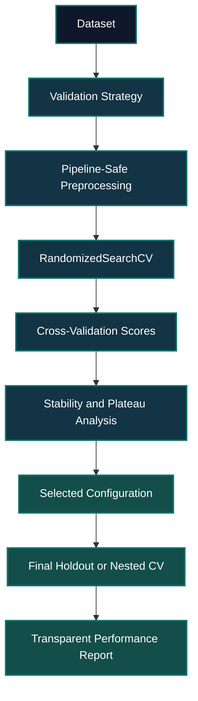

# [Class 09](): Random Search, Hyperparameter Optimization & AutoML

> **Course:** Data Science & Machine Learning — Model Evaluation, Benchmarking & Selection  
> **Institution:** Pontifical Catholic University of São Paulo — PUC-SP  
> **School:** FACEI — Computer Science Department  
> **Program:** BSc in Human-Centered AI & Data Science · 6th Semester · 2026  
> **Professor:** Giovani Giulio Tristão Thibes Vieira  
> **Author:** Fabiana Campanari

<br><br>

#

<br><br>

<p align="center">
  
  
  
</p>

<p align="center">
  
  
  
</p>

<br><br><br><br>


## [Overview]()

This repository documents **Class 09**, focused on hyperparameter optimization and responsible model selection in machine-learning workflows. The central topic is the use of **Random Search** through scikit-learn's `RandomizedSearchCV`, contrasted with Grid Search and positioned alongside conceptual introductions to Bayesian optimization and AutoML.

The class treats hyperparameter tuning as more than a computational search for the highest score. A reliable tuning workflow requires valid search spaces, pipeline-safe preprocessing, appropriate validation, metrics aligned with the problem, stability analysis, and honest final evaluation.

> **Evidence boundary:** the original PDF, notebook, scripts, and dataset were not supplied. This README documents concepts demonstrated or discussed in the available class source and provides clearly labelled **reference implementations**. It does not claim original numerical results, dataset characteristics, or executable classroom files that were not provided.

<br>

## [Table of Contents]()

1. [Learning Objectives](#learning-objectives)
2. [Class Evidence and Scope](#class-evidence-and-scope)
3. [Why Hyperparameter Search Matters](#why-hyperparameter-search-matters)
4. [Grid Search vs Random Search](#grid-search-vs-random-search)
5. [Designing Search Spaces](#designing-search-spaces)
6. [Choosing a Search Budget](#choosing-a-search-budget)
7. [Pipeline-Safe Tuning](#pipeline-safe-tuning)
8. [Evaluation and Selection](#evaluation-and-selection)
9. [Nested Cross-Validation and Holdout Testing](#nested-cross-validation-and-holdout-testing)
10. [AutoML and Bayesian Optimization](#automl-and-bayesian-optimization)
11. [Conceptual Architecture](#conceptual-architecture)
12. [Reference Implementation](#reference-implementation)
13. [Installation and Usage](#installation-and-usage)
14. [Results and Reproducibility](#results-and-reproducibility)
15. [Advantages and Limitations](#advantages-and-limitations)
16. [Responsible Evaluation](#responsible-evaluation)
17. [Future Evolution](#future-evolution)
18. [References](#references)
19. [Conclusion](#conclusion)

<br>

## [Learning Objectives]()

By the end of this class, the learner should be able to:

- Distinguish **Grid Search** from **Random Search** for hyperparameter optimization.
- Explain why Random Search can explore large search spaces efficiently under a fixed computational budget.
- Define valid parameter distributions for integer, continuous, logarithmic, and categorical hyperparameters.
- Configure `RandomizedSearchCV` with a model, a scoring metric, cross-validation, `n_iter`, and a reproducible random seed.
- Prevent data leakage by placing preprocessing and model training inside a scikit-learn `Pipeline`.
- Interpret mean validation scores, variability across folds, stable plateaus, and the limitations of `best_params_`.
- Explain why nested cross-validation or a final untouched holdout set improves final performance reporting.
- Describe AutoML as a workflow accelerator rather than a replacement for evaluation design and domain judgment.

<br>

## [Class Evidence and Scope]()

| Classification | Meaning in this repository |
|---|---|
| **Demonstrated / discussed** | Random Search, `RandomizedSearchCV`, cross-validation, Average Precision, Random Forest example context, score stability, nested CV, final holdout testing, Bayesian optimization, and AutoML concepts |
| **Reference implementation** | Copy/paste-ready code created to reflect the class concepts, not claimed to be the original classroom notebook |
| **Not provided** | Original dataset, source notebook, original Python scripts, experimental outputs, final benchmark results, and exact dependency versions |
| **Recommended** | Engineering practices that extend the lesson, such as experiment tracking, data versioning, automated tests, and monitoring |
| **Future extension** | Potential work that is not implemented in the provided class material |

No accuracy, Average Precision, runtime, parameter values, benchmark tables, or dataset claims are reported here as final classroom results because those artifacts were not supplied.

<br>

## [Why Hyperparameter Search Matters]()

Hyperparameters are values selected before or during model fitting rather than learned directly from the data. They influence model complexity, training cost, generalization, robustness, and the final decision boundary.

For a Random Forest classifier, examples include:

- `n_estimators`: number of trees.
- `max_depth`: maximum tree depth.
- `min_samples_split`: minimum number of observations required to split a node.
- `min_samples_leaf`: minimum number of observations at a terminal node.
- `max_features`: number or strategy of features considered at each split.
- `class_weight`: strategy used to compensate for class imbalance.

A hyperparameter search evaluates multiple candidate configurations under a common validation protocol. It is useful only if the protocol itself is valid: splits must match the problem, transformations must avoid leakage, and the metric must reflect the actual cost of mistakes.

<br>

## [Grid Search vs Random Search]()

### [Grid Search]()

Grid Search evaluates every combination in a manually defined parameter grid. If the search includes \(k\) hyperparameters and each hyperparameter has \(n_i\) candidate values, the number of configurations is:

\[
N_{grid}=\prod_{i=1}^{k} n_i
\]

With five parameters and five candidate values per parameter:

\[
N_{grid}=5^5=3125
\]

Using five-fold cross-validation would require:

\[
N_{fits}=3125\times5=15625
\]

This exhaustive behavior is simple to explain, but it can become expensive quickly.

### [Random Search]()

Random Search samples a fixed number of configurations from distributions rather than evaluating every point in a complete grid. In scikit-learn, this is implemented with `RandomizedSearchCV`.

| Criterion | Grid Search | Random Search |
|---|---|---|
| Search method | Every predefined combination | Random samples from distributions |
| Compute budget | Determined by grid size | Controlled explicitly by `n_iter` |
| Large search spaces | Often impractical | Usually more practical |
| Continuous variables | Must be discretized manually | Naturally represented by distributions |
| Reproducibility | Deterministic grid | Controlled with `random_state` |
| Main risk | Combinatorial growth | Missing a narrow high-performing region |

Random Search is particularly attractive when only a subset of hyperparameters strongly affects performance, when parameters operate on different scales, or when the compute budget is constrained.

<br>

## [Designing Search Spaces]()

A search method cannot compensate for an unrealistic or invalid search space. Parameter distributions should reflect parameter type, valid values, model behavior, and expected scale.

### [Integer distributions]()

Use `randint` for whole-number hyperparameters:

```python
from scipy.stats import randint

max_depth_distribution = randint(3, 31)
min_samples_leaf_distribution = randint(1, 11)
```

Possible uses include `max_depth`, `min_samples_split`, `min_samples_leaf`, and the number of estimators.

### [Uniform distributions]()

Use `uniform` for values sampled evenly across a linear interval:

```python
from scipy.stats import uniform

feature_fraction_distribution = uniform(loc=0.1, scale=0.9)
```

In SciPy, `scale` is the width of the interval, not the upper bound. The example samples values from \([0.1, 1.0]\).

### [Log-uniform distributions]()

Use `loguniform` when useful values span orders of magnitude:

```python
from scipy.stats import loguniform

regularization_distribution = loguniform(1e-2, 1e2)
```

This is often useful for learning rates, regularization strengths, and other scale-sensitive hyperparameters.

### [Categorical alternatives]()

Use a list for discrete choices:

```python
class_weight_options = [None, "balanced", "balanced_subsample"]
```

Categorical search values can represent solvers, split criteria, class-weight strategies, kernels, feature-selection alternatives, or bootstrap choices.

<br>

## [Choosing a Search Budget]()

The `n_iter` argument controls how many candidate configurations Random Search evaluates. It should be selected according to the size of the search space, the cost of each model fit, cross-validation folds, and the estimated size of promising regions.

If \(p\) is the estimated fraction of promising configurations and \(n\) independent random samples are drawn, the probability of sampling at least one promising configuration is:

\[
P(\text{at least one good configuration})=1-(1-p)^n
\]

Where:

- \(p\) represents the estimated fraction of the search space that is promising.
- \(n\) represents the number of random trials.
- \((1-p)^n\) is the probability that all trials miss the promising region.

The formula does not guarantee the optimal configuration. It provides a practical way to reason about why larger search budgets improve coverage when useful regions are small or uncertain.

<br>

## [Pipeline-Safe Tuning]()

Preprocessing must be fitted only on training data inside each cross-validation fold. Scaling, imputation, encoding, feature selection, and dimensionality reduction can leak information if they are fitted before splitting or outside a pipeline.

A safe conceptual workflow is:

```text
Raw data
   ↓
Cross-validation split
   ↓
Fit preprocessing on training fold only
   ↓
Transform training and validation fold
   ↓
Train candidate model
   ↓
Evaluate validation fold
   ↓
Aggregate scores across folds
```

Use scikit-learn `Pipeline` when preprocessing is needed:

```python
from sklearn.pipeline import Pipeline
from sklearn.preprocessing import StandardScaler
from sklearn.linear_model import LogisticRegression

pipeline = Pipeline(
    steps=[
        ("scaler", StandardScaler()),
        ("model", LogisticRegression(random_state=42)),
    ]
)
```

> Tree-based models such as Random Forest generally do not require feature scaling. The pipeline remains valuable for imputation, encoding, feature engineering, or any transformation that must be learned without seeing validation data.

<br>

## [Evaluation and Selection]()

A single highest validation score is not enough to justify a model choice. Hyperparameter optimization should consider:

- Mean cross-validation score.
- Standard deviation or variability across folds.
- Stability across random seeds when relevant.
- Simplicity and interpretability of the chosen configuration.
- Computational cost.
- Metric alignment with the problem's error costs.
- Performance plateaus rather than isolated maxima.

### [Average Precision]()

The class discusses **Average Precision (AP)** as an example metric. AP summarizes precision-recall behavior and is useful in many imbalanced binary-classification settings.

\[
AP=\sum_n(R_n-R_{n-1})P_n
\]

Where \(P_n\) is precision and \(R_n\) is recall at threshold \(n\).

| Decision priority | Potentially relevant metric |
|---|---|
| Reduce false negatives | Recall, F-beta, Average Precision, PR-AUC |
| Reduce false positives | Precision |
| Balanced class performance | Balanced accuracy, macro F1 |
| Probability ranking | ROC-AUC, Average Precision |
| Rare positive cases | Precision-recall analysis, Average Precision |

The metric must be justified by the problem. Accuracy may be inadequate when classes are highly imbalanced or error costs differ.

<br>

## [Nested Cross-Validation and Holdout Testing]()

When the same validation evidence is used both to tune hyperparameters and estimate final performance, reported performance can become optimistic.

### [Nested cross-validation]()

Nested CV separates hyperparameter selection from generalization estimation:

```text
Outer training fold
   ↓
Inner cross-validation and hyperparameter search
   ↓
Select configuration
   ↓
Refit on outer training fold
   ↓
Evaluate on outer validation fold
```

The inner loop performs selection; the outer loop estimates how the complete selection process generalizes.

### [Final holdout test set]()

A common practical alternative reserves an untouched test set:

```text
Full dataset
   ↓
Training / final-test split
   ↓
Cross-validation and tuning on training data
   ↓
Select final configuration
   ↓
Evaluate once on the untouched final test set
```

The final test set should not influence feature engineering, model-family selection, hyperparameter ranges, metric experimentation, or threshold tuning.

<br>

## [AutoML and Bayesian Optimization]()

### [Bayesian optimization]()

Bayesian optimization uses results from previous trials to guide future trials. It balances:

- **Exploration:** testing uncertain regions.
- **Exploitation:** testing regions expected to perform well.

Optuna and scikit-optimize are relevant tools discussed conceptually in the class context. No implementation with these libraries is claimed in this repository without corresponding source material.

### [AutoML]()

AutoML can automate portions of the machine-learning workflow, including:

- Preprocessing alternatives.
- Candidate-model selection.
- Hyperparameter optimization.
- Ensembling.
- Experiment organization and tracking.

AutoML does not determine whether labels are reliable, whether a split leaks information, which metric represents the real objective, whether a model is fair, or whether a deployment is safe. Human judgment remains necessary.

<br>

## [Conceptual Architecture]()

The diagram below represents the conceptual class workflow. It is not a claim of an implemented or deployed production architecture.



<br>

## [Reference Implementation]()

[***Status: reference implementation, not original classroom source code.***]()

The following implementation is a copy/paste-ready example aligned with the class topic. It supports a binary CSV dataset and can use a synthetic dataset to verify the mechanics of the workflow when no classroom dataset is available.

### [Project structure]()

```text
class-09-ai-ml-random-search-automl/
├── README.md
├── requirements.txt
├── src/
│   ├── __init__.py
│   ├── config.py
│   ├── data.py
│   ├── tune_random_search.py
│   └── train_final_model.py
├── tests/
│   └── test_pipeline.py
├── data/
│   └── README.md
└── presentation/
    └── class-09-random-search-automl-navigation-fixed.html
```

### [`requirements.txt`]()

```txt
joblib>=1.4,<2.0
numpy>=1.26,<3.0
pandas>=2.2,<3.0
scikit-learn>=1.5,<2.0
scipy>=1.13,<2.0
pytest>=8.0,<9.0
```

### [`src/config.py`]()

```python
from dataclasses import dataclass
from pathlib import Path


@dataclass(frozen=True)
class ExperimentConfig:
    random_state: int = 42
    test_size: float = 0.20
    cv_folds: int = 5
    n_iter: int = 50
    scoring: str = "average_precision"
    n_jobs: int = -1
    target_column: str = "target"
    artifacts_dir: Path = Path("artifacts")
    model_filename: str = "random_forest_random_search.joblib"
    metrics_filename: str = "metrics.json"
```

### [`src/data.py`]()

```python
from pathlib import Path

import pandas as pd
from sklearn.datasets import make_classification
from sklearn.model_selection import train_test_split

from src.config import ExperimentConfig


def load_csv_dataset(csv_path: str | Path, target_column: str):
    dataset = pd.read_csv(csv_path)

    if target_column not in dataset.columns:
        raise ValueError(
            f"Target column '{target_column}' was not found. "
            f"Available columns: {dataset.columns.tolist()}"
        )

    X = dataset.drop(columns=[target_column])
    y = dataset[target_column]

    if X.empty:
        raise ValueError("The dataset has no feature columns.")

    if y.nunique() != 2:
        raise ValueError(
            "This reference implementation expects a binary target."
        )

    return X, y


def build_synthetic_dataset(random_state: int = 42):
    X, y = make_classification(
        n_samples=2_000,
        n_features=20,
        n_informative=8,
        n_redundant=4,
        n_classes=2,
        weights=[0.75, 0.25],
        class_sep=1.0,
        flip_y=0.02,
        random_state=random_state,
    )

    feature_names = [f"feature_{index:02d}" for index in range(X.shape[1])]

    return (
        pd.DataFrame(X, columns=feature_names),
        pd.Series(y, name="target"),
    )


def split_dataset(X, y, config: ExperimentConfig):
    return train_test_split(
        X,
        y,
        test_size=config.test_size,
        stratify=y,
        random_state=config.random_state,
    )
```

### [`src/tune_random_search.py`]()

```python
from __future__ import annotations

import json
from pathlib import Path

import joblib
from scipy.stats import randint
from sklearn.ensemble import RandomForestClassifier
from sklearn.metrics import average_precision_score
from sklearn.model_selection import RandomizedSearchCV, StratifiedKFold

from src.config import ExperimentConfig
from src.data import (
    build_synthetic_dataset,
    load_csv_dataset,
    split_dataset,
)


def build_search(config: ExperimentConfig) -> RandomizedSearchCV:
    model = RandomForestClassifier(
        random_state=config.random_state,
        n_jobs=config.n_jobs,
    )

    parameter_distributions = {
        "n_estimators": randint(100, 501),
        "max_depth": randint(3, 31),
        "min_samples_split": randint(2, 21),
        "min_samples_leaf": randint(1, 11),
        "max_features": ["sqrt", "log2", None],
        "class_weight": [None, "balanced", "balanced_subsample"],
    }

    cross_validation = StratifiedKFold(
        n_splits=config.cv_folds,
        shuffle=True,
        random_state=config.random_state,
    )

    return RandomizedSearchCV(
        estimator=model,
        param_distributions=parameter_distributions,
        n_iter=config.n_iter,
        scoring=config.scoring,
        cv=cross_validation,
        n_jobs=config.n_jobs,
        random_state=config.random_state,
        refit=True,
        return_train_score=True,
        verbose=1,
    )


def run_experiment(
    csv_path: str | None = None,
    target_column: str = "target",
) -> dict:
    config = ExperimentConfig(target_column=target_column)

    if csv_path:
        X, y = load_csv_dataset(csv_path, target_column)
        dataset_source = str(Path(csv_path))
    else:
        X, y = build_synthetic_dataset(config.random_state)
        dataset_source = "synthetic dataset generated by make_classification"

    X_train, X_test, y_train, y_test = split_dataset(X, y, config)

    search = build_search(config)
    search.fit(X_train, y_train)

    probabilities = search.best_estimator_.predict_proba(X_test)[:, 1]
    holdout_average_precision = average_precision_score(
        y_test,
        probabilities,
    )

    report = {
        "dataset_source": dataset_source,
        "best_cv_average_precision": float(search.best_score_),
        "best_params": search.best_params_,
        "final_holdout_average_precision": float(holdout_average_precision),
    }

    config.artifacts_dir.mkdir(parents=True, exist_ok=True)

    joblib.dump(
        search.best_estimator_,
        config.artifacts_dir / config.model_filename,
    )

    with (config.artifacts_dir / config.metrics_filename).open(
        "w",
        encoding="utf-8",
    ) as file:
        json.dump(report, file, indent=2, ensure_ascii=False)

    print("Best CV Average Precision:", search.best_score_)
    print("Final holdout Average Precision:", holdout_average_precision)

    return report
```

### [`src/train_final_model.py`]()

```python
import argparse

from src.tune_random_search import run_experiment


def parse_arguments():
    parser = argparse.ArgumentParser(
        description="Run RandomizedSearchCV for binary classification."
    )

    parser.add_argument(
        "--csv",
        type=str,
        default=None,
        help="CSV path. If omitted, synthetic data is used.",
    )

    parser.add_argument(
        "--target",
        type=str,
        default="target",
        help="Target-column name in the CSV file.",
    )

    return parser.parse_args()


if __name__ == "__main__":
    arguments = parse_arguments()

    run_experiment(
        csv_path=arguments.csv,
        target_column=arguments.target,
    )
```

### [`tests/test_pipeline.py`]()

```python
from src.config import ExperimentConfig
from src.data import build_synthetic_dataset, split_dataset
from src.tune_random_search import build_search


def test_synthetic_dataset_has_binary_target():
    X, y = build_synthetic_dataset(random_state=42)

    assert X.shape[0] == y.shape[0]
    assert y.nunique() == 2
    assert X.shape[1] > 0


def test_train_test_split_preserves_data_volume():
    config = ExperimentConfig()
    X, y = build_synthetic_dataset(config.random_state)

    X_train, X_test, y_train, y_test = split_dataset(X, y, config)

    assert len(X_train) + len(X_test) == len(X)
    assert len(y_train) + len(y_test) == len(y)


def test_random_search_uses_expected_scoring():
    config = ExperimentConfig()
    search = build_search(config)

    assert search.scoring == "average_precision"
    assert search.n_iter == config.n_iter
    assert search.cv.n_splits == config.cv_folds
```

<br>

## [Installation and Usage]()

### [1. Create and activate a virtual environment]()

```bash
python -m venv .venv
```

```bash
# macOS / Linux
source .venv/bin/activate
```

```powershell
# Windows PowerShell
.venv\Scripts\Activate.ps1
```

### [2. Install dependencies]()

```bash
pip install --upgrade pip
pip install -r requirements.txt
```

### [3. Run with a synthetic dataset]()

This validates the end-to-end reference workflow: data generation, stratified splitting, Random Search, cross-validation, holdout evaluation, and artifact persistence.

```bash
python -m src.train_final_model
```

### [4. Run with a real CSV dataset]()

```bash
python -m src.train_final_model \
  --csv data/your_dataset.csv \
  --target target
```

For a dataset whose target column is named `liked`:

```bash
python -m src.train_final_model \
  --csv data/music_dataset.csv \
  --target liked
```

### [5. Run tests]()

```bash
python -m pytest
```

### [Generated artifacts]()

The reference implementation creates:

```text
artifacts/
├── metrics.json
└── random_forest_random_search.joblib
```

The search-stage score and final holdout score must be interpreted separately. The search score participated in hyperparameter selection; the untouched holdout result is a stronger estimate of final generalization.

<br>

## [Results and Reproducibility]()

No original classroom results were provided. Therefore, this repository does **not** claim final model quality, benchmark superiority, dataset performance, or reproduced classroom metrics.

When source materials become available, record the following information:

| Field | What to document |
|---|---|
| Dataset | Source, license, target, number of records, features, and preprocessing |
| Split strategy | Train/test split, CV method, temporal or group restrictions |
| Baseline | Untuned baseline model and metric |
| Search space | Parameter distributions and categorical choices |
| Search budget | `n_iter`, CV folds, seed, runtime, and hardware |
| Metric | Primary metric and its decision-context justification |
| Final evaluation | Nested CV or untouched holdout result |
| Stability | Mean score, standard deviation, seed sensitivity, and plateaus |
| Environment | Python and package versions |

<br>

## [Advantages and Limitations]()

### [Advantages]()

- Explicit compute control through `n_iter`.
- Efficient broad exploration compared with exhaustive grids.
- Natural treatment of continuous, integer, categorical, and log-scale parameters.
- Integration with scikit-learn pipelines, scoring functions, estimators, and cross-validation.
- Reproducibility through controlled random seeds.
- Useful baseline before more specialized optimization methods.

### [Limitations]()

- Random samples can miss narrow optimal regions.
- Poorly chosen parameter distributions can waste computation.
- Repeated model selection can overfit development decisions to validation evidence.
- Cross-validation can become computationally expensive for large datasets or costly models.
- `best_params_` does not report uncertainty, fairness, interpretability, or deployment suitability.
- AutoML can accelerate search but cannot replace rigorous data and evaluation design.

<br>

## [Responsible Evaluation]()

### [Data leakage prevention]()

- Split before fitting transformations.
- Use pipelines for preprocessing and model fitting.
- Do not fit encoders, scalers, imputers, or feature selectors on validation or final-test data.
- Use temporal splits for temporal problems.
- Use group-aware splits when observations from the same entity could leak across partitions.

### [Metric selection]()

- Match metrics to the cost of false positives and false negatives.
- Do not treat accuracy as universally appropriate.
- Use precision-recall analysis when positive cases are rare.
- Document threshold selection separately from ranking metrics.

### [Reproducibility]()

- Set `random_state` consistently.
- Track package versions.
- Store distributions and CV configuration, not only winning parameters.
- Version the dataset and document preprocessing decisions.

<br>

## [Future Evolution]()

The following is a **recommended production evolution**, not an existing implementation:

```text
Exploratory notebook
   ↓
Reproducible training script
   ↓
Versioned data and configuration
   ↓
Automated validation tests
   ↓
Experiment tracking
   ↓
Model registry
   ↓
Batch or online inference
   ↓
Monitoring, feedback, and retraining governance
```

Possible extensions:

- Add the original class notebook, dataset, and source-code files.
- Compare Random Search with a small, documented Grid Search baseline.
- Add Bayesian optimization with Optuna.
- Use nested CV for final performance estimation.
- Store experiment metadata, duration, environment, and seed.
- Add data-quality validation and automated tests.
- Add explainability and subgroup analysis when the domain requires it.
- Define deployment, monitoring, and retraining criteria only after a real use case is specified.

<br>

## [Interactive Presentation]()

The repository includes an offline, single-file interactive presentation:

```text
presentation/class-09-random-search-automl-navigation-fixed.html
```

Presentation features:

- English and Portuguese toggle.
- Visible previous and next slide controls.
- Keyboard navigation with arrows and spacebar.
- Mobile swipe navigation.
- Fullscreen support.
- Return-to-start control.
- Premium dark interface.
- Conceptual diagrams, strategy comparison, and probability explanation.

<br>

## [References]()

1. Bergstra, J., & Bengio, Y. (2012). *Random Search for Hyper-Parameter Optimization*. Journal of Machine Learning Research, 13, 281–305. http://jmlr.org/papers/v13/bergstra12a.html
2. Scikit-learn. *RandomizedSearchCV documentation*. https://scikit-learn.org/stable/modules/generated/sklearn.model_selection.RandomizedSearchCV.html
3. Scikit-learn. *Model selection and evaluation*. https://scikit-learn.org/stable/model_selection.html
4. Scikit-learn. *Pipelines and composite estimators*. https://scikit-learn.org/stable/modules/compose.html
5. Scikit-learn. *Average precision score*. https://scikit-learn.org/stable/modules/generated/sklearn.metrics.average_precision_score.html
6. SciPy. *Statistical distributions*. https://docs.scipy.org/doc/scipy/reference/stats.html
7. Snoek, J., Larochelle, H., & Adams, R. P. (2012). *Practical Bayesian Optimization of Machine Learning Algorithms*. https://arxiv.org/abs/1206.2944
8. Class source: *Aula 09 — Ciência de Dados*, PUC-SP course material, 2026.

<br>

## [Conclusion]()

Random Search offers a practical way to explore large and mixed hyperparameter spaces while respecting a defined computational budget. Its effectiveness depends on thoughtful search-space design, valid cross-validation, appropriate metrics, reproducibility controls, and transparent final reporting.

The most important lesson is that hyperparameter optimization is not simply the pursuit of the highest score. It is part of a reliable model-selection process:

```text
Problem definition
   ↓
Data and validation design
   ↓
Pipeline-safe preprocessing
   ↓
Hyperparameter search
   ↓
Stability-aware selection
   ↓
Honest final evaluation
   ↓
Reproducible reporting
```

<br><br>

<p align="center">
  <a href="https://github.com/Mindful-AI-Research">
    
  </a>
</p>
